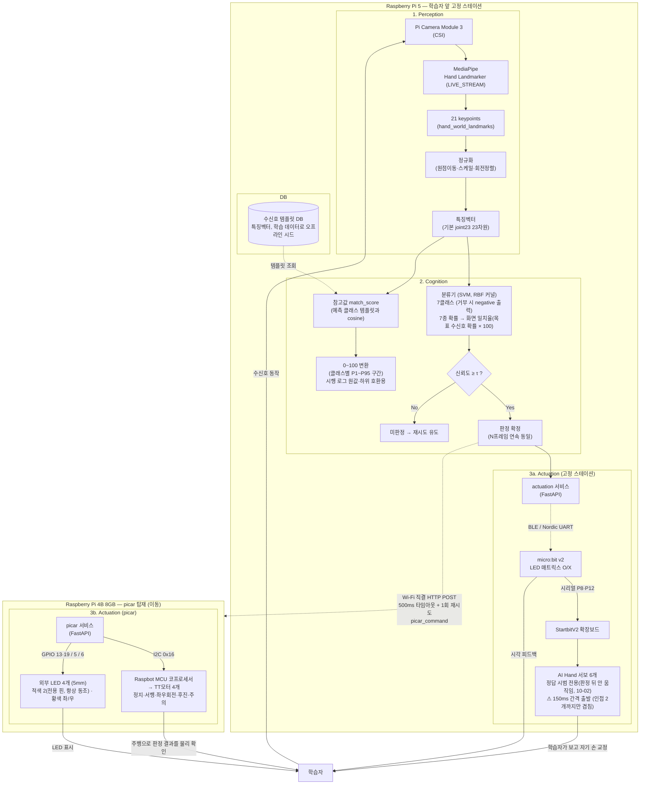

# 설계 문서 (v2.4)

> v1 대비 변경점: §3-2 picar 하드웨어 사양 신설, §4 "분야별 20종→5종" 방식을 폐기하고
> 통합 7종(+picar 동작) 확정안으로 교체, 서행/후진 손모양 충돌·우회전 오탈자 해결 반영 (2026-09-17).
> **(같은 버전 내 추가 갱신)** §1-1 하드웨어 배치 확정(카메라를 Pi Camera Module 3로, picar 제어를
> RPi5 GPIO 직결로 확정) 신설, §3-2 picar 제어 인터페이스 ⚠️ 해제 (2026-09-17).
> **(같은 버전 내 추가 갱신 2)** §2 파이프라인 방식 "결정" 칸 공식 기록 완료(랜드마크+SVM, 2026-09-18).
> **(같은 버전 내 추가 갱신 3)** §1-1 하드웨어 배치를 **RPi5(카메라 고정국) + RPi4B 8GB(picar 탑재,
> Wi-Fi 통신)로 이원화** — picar가 움직이면 카메라도 함께 이동해 학습자가 카메라를 따라가야 하는 문제를
> 해결하기 위함. §3-2 picar 제어 인터페이스도 "RPi5 GPIO 직결"에서 "RPi4B GPIO 직결 + RPi5와 Wi-Fi
> 통신"으로 정정 (2026-09-18). (→ 2026-09-21 재정정: 모터는 I2C 코프로세서 경유, LED만 GPIO — 부록 A §3)
> **2026-09-27 | 2단계 정리 (v2.1)** — §1-1·§3-2 제어 경로를 현행(BLE·I2C·RPi5 AP)으로 정정, 확인_완료 picar
> 동작을 코드에 맞춤(전부 동시 점멸), §3-2 LED·§4-1 참고 6·§5 중복을 요약+링크로 축소, 부록 A 현행값 정정.
> **2026-09-28** — §5 버튼 역할을 "web 인터페이스 이동(A/B)"에서 **확인 버튼 대용(버튼 A → `BTN:A`)**으로 바꿈.
> actuation 쪽 구현(mock 검증), web 연동은 제안 단계. §1·부록 A의 "버튼 미구현" 문구 정정.
> **2026-09-29** — 버튼 A **web 연동 구현**(시범 단계에서 actuation `GET /button` 폴링 → 확인). §1·§5 상태 표기 갱신.
> **2026-09-30** — §6 확장 부분(엣지 + 클라우드 분리 검토) 신설. 제출 범위 밖이며 현 구조를 유지한다.
> **2026-10-04 | v2.2 (송승호)** — 일치율 옛 정의(좌표 거리·템플릿 cosine) 정정 — §2 비교표, 부록 A §2 구성도·§3 모듈 경계. 현행은 분류기가 본 목표 수신호 확률 × 100(05 §10-8).
> **2026-10-04 | v2.3 (송승호)** — 제출 전 사실 정리: §2 결정 절차(프로토타입·투표)는 실행 기록이 없어 "정성 비교로 결정, 정량 비교·투표는
> 하지 않음"으로 명시, 전제 "클래스당 ~300장" → 실제 27,735건, 분류기 정량 비교는 향후 과제(05 §5-2). 부록 A §2 구성도의 참고 `match_score`
> 노드(클래스별 구간 매핑, actuation으로 가지 않음) 정정, 부록 A §5 물리 피드백 KPI 항목을 09-30 결정으로 종결(반응 시작 기준, 10-02 P95 0.089초).
> §5 버튼 A 09-29 실물 확인 반영.
> 
> **2026-10-06 | v2.4 (이동혁)** — §2 보충의 "분류기 정량 비교 안 함" 정정: 딥러닝(HandFormer EDL)과는 공개 데이터 학습·검증·시험 분할로
> 비교했다(09-23 `vision_research` `b0bd7c0`, 05 §5-2). 랜덤포레스트·kNN은 비교하지 않았다.
> 
> 관련: 01_프로젝트계획서 · 03_인터페이스계약서 · 04_데이터셋명세서
> 

> **이 문서 작성법**
이 문서는 “왜 이렇게 만들기로 했는가”를 남기는 문서입니다. 최종 결정 하나만 적지 말고, **① 무엇을 검토했는지 ② 무엇을 기준으로 골랐는지 ③ 최종 선택**을 함께 적으세요. 나중에 발표 때 “왜 이렇게 설계했나요?”란 질문에 이 문서만 보고 답할 수 있어야 합니다. 아래 `⚠️` 표시된 빈 칸은 팀 회의로 결정한 뒤 즉시 채워 넣으세요(결정을 미룰수록 뒤 문서의 빈칸도 늘어납니다).
> 

---

## 1. 왜 “피지컬 AI”인가 (핵심 아키텍처 근거)

본 프로젝트는 카메라 인식만으로 끝나지 않고, 인식 결과가 **물리적 액추에이터로 되먹임되는 닫힌 제어 루프(closed-loop)** 구조를 갖는다. 이 점이 “웹캠 앱”과 본 시스템을 구분하는 핵심 근거이다.

```
[물리 입력]  학습자 손 (실제 3D 공간)
     ↓ 센싱
[Perception] Raspberry Pi Camera Module 3(CSI) → MediaPipe Hand Landmarker → 21 keypoints
     ↓ 인지
[Cognition]  랜드마크 정규화 → 분류 + 일치율 산출 → 교육 상태머신
     ↓ 구동
[Actuation]  ① AI Hand : 정답 수신호를 물리적으로 시범 — 시범 전용, 교정 자세 제시 없음(10-02 결정) (RPi5 고정국)
             ② micro:bit : LED 매트릭스로 정오답 표시 (RPi5 고정국)
                 ※ 부저는 BLE SoftDevice 충돌(패닉 070)로 비활성화, 진행 표시는 web 화면 담당
                   (2026-09-21 실측 결정). 버튼 A는 web 확인 버튼 대용(2026-09-28, web 연동 2026-09-29 구현(스펙 §9))
             ③ picar : 수신호 의미에 맞는 실제 주행(정지·서행·좌우회전·후진) + LED로 물리적 결과 출력
                (RPi4B 8GB 탑재, RPi5와 Wi-Fi 통신 — §1-1 참고)
     ↓ 물리 출력
[물리 피드백] 학습자가 로봇 손 시범과 picar 동작을 보고 자기 손을 교정 → 다시 센싱
```

- 화면 텍스트가 아닌 **로봇 손의 물리적 시범**을 교보재로 사용. 산업 현장 수신호는 3차원 손 형상이므로 평면 디스플레이 교육은 손가락 겹침·각도 정보를 전달하지 못함.
- 인식 결과가 곧바로 물리 액추에이터로 되먹임되는 Human-in-the-loop 구조.
- 학습 흐름 요약: **AI Hand가 수신호를 시범** → 학습자가 따라 함 → **Pi Camera로 인식** → 동일 수신호로
  판정되면 **picar가 정해진 물리 동작(§4 표)으로 반응** — 이 셋의 순환이 제품의 "물리적 출력"이다.

### 1-1. 하드웨어 배치 확정 (2026-09-18, 2보드 분리로 정정)

보유 장비(AI Hand, picar, micro:bit, Raspberry Pi 5 + **신규: Raspberry Pi 4B 8GB**) 기준으로
실제 배선/역할을 확정한다.

> **검토한 대안**: 처음에는 RPi5 한 대가 카메라(Perception)와 picar 구동(GPIO)을 모두 겸하는 구조로
> 설계했다(별도 컨트롤러/통신 프로토콜이 필요 없어 지연에 유리하다는 이유).
> **문제 발견**: 그런데 picar가 실제로 주행하면 그 위에 실린 카메라도 함께 움직여, **학습자가 판정을
> 받을 때마다 카메라(=picar) 위치를 따라가서 다시 손을 보여줘야 하는 모순**이 생긴다. 카메라는
> Perception의 입력이므로 학습자 앞에 고정돼 있어야 한다.
> **최종 선택**: 카메라·AI Hand·micro:bit(학습자 앞에 고정)는 **RPi5**에, picar 구동은 **새로
> 추가한 Raspberry Pi 4B 8GB**로 물리적으로 분리하고, 두 보드는 **Wi-Fi**로 통신한다. 대신 무선
> 구간의 지연/끊김을 새로운 리스크로 관리해야 한다(08_리스크레지스터).

- **RPi5(고정)**: Pi Camera Module 3(CSI) + vision·actuation·web. AI Hand는 RPi5 직결이 아니라
  **micro:bit + StartbitV2 확장보드**가 구동하고, RPi5 ↔ micro:bit는 **BLE**(Nordic UART)다.
- **RPi4B 8GB(picar 탑재)**: picar 서비스만 실행. 모터는 **I2C 코프로세서(`0x16`)** 경유, 외부 LED 4개만 GPIO.
- 구간별 매체는 [부록 A §2.1](#21-제어-경로-요약-다이어그램-압축), 배선·핀맵은 [11_하드웨어설계서](11_하드웨어설계서.md).

> RPi5 ↔ RPi4B는 **RPi5가 Wi-Fi AP**(`192.168.50.1`)인 1:1 직결, picar 고정 IP `192.168.50.10`
> (2026-09-21 확정). 절차는 [07_네트워크설정법](07_네트워크설정법.md), 설계 근거는 [11 §6](11_하드웨어설계서.md).

---

## 2. 파이프라인 방식 (확정)

> ✅ **2026-09-18 확정.** 아래는 결정에 이르기까지의 검토 과정 기록입니다.
> 
> **어떻게 결정하나요?**
> 
> 1. 팀원 4명 각자 하루~이틀 두 방식을 짧게 프로토타입(수신호 1~2종, 데이터 20~30장 수준)으로 테스트해봅니다.
> 2. 아래 비교표의 4개 항목(데이터량/강인성/점수산출/난이도)에 대해 실제 체감한 결과를 채웁니다.
> 3. 비전공자 팀원 2명이 “내가 이걸로 구현·설명할 수 있는가”를 기준으로 투표합니다.
> 4. **결정** 칸에는 선택한 방식 + 결정 이유(어느 항목이 결정적이었는지) 1~2문장을 적습니다. “그냥 A로 했다”가 아니라 “구현 난이도 항목에서 비전공자 2명이 랜드마크 방식을 더 쉽게 느껴서 A를 선택했다”처럼 근거를 남기세요.
>
> (→ 2026-10-04 정정: 위 1~3의 프로토타입·투표 절차는 **실행한 기록이 없다**(문서·개발로그 기준). 실제로는 아래 비교표 항목에 대한
> **정성 비교로 결정**했고, 두 방식을 같은 데이터로 돌려 본 정량 비교와 투표는 하지 않았다.)

- **후보 A: 랜드마크 기반** — MediaPipe로 21개 keypoint 추출 → 정규화 → 경량 분류기(예: MLP/랜덤포레스트)
- **후보 B: 이미지 분류 기반** — 손 영역 crop → CNN 분류기 (사전학습 가중치 fine-tuning)

| 비교 항목 | 랜드마크 기반 | 이미지 분류 기반 |
| --- | --- | --- |
| 필요 데이터량 | 적음 (클래스당 ~300장으로 가능) (→ 2026-10-04 정정: 설계 당시 전제다. 실제 학습 데이터는 공개 데이터셋 3종을 변환한 **7종 27,735건** — [04 §2-2](04_데이터셋명세서.md)) | 많음 |
| 조명/배경 강인성 | 상대적으로 강함 | 약함 |
| 일치율(유사도) 점수 산출 | 좌표 거리 기반으로 직관적 (→ 2026-09-30 정정: 이 "좌표 거리 기반" 전제는 이후 **확률 기반**으로 바뀌었다 — 화면 일치율은 **분류기가 본 목표 수신호 확률 × 100**으로 재정의. 템플릿 거리 값은 7종을 가르지 못해 참고값으로만 남김 — 05 §10-8) | 별도 설계 필요 |
| 구현 난이도(비전공자 포함 팀) | 상대적으로 낮음 | 높음 |

**결정 (2026-09-18): 후보 A — 랜드마크 기반 + SVM 채택.** 비교표 4개 항목(필요 데이터량, 조명/배경
강인성, 일치율 산출, 구현 난이도) 전부에서 랜드마크 기반이 우세하다고 판단해 결정했다. 특히 **구현
난이도** 항목이 결정적이었다 — 비전공자 팀원 2명(조은수, 김지훈)을 포함한 4인 팀이 5주 안에 직접
이해·설명 가능해야 한다는 정성 목표(01_프로젝트계획서)에 이미지 분류 기반(CNN fine-tuning)보다
훨씬 부합한다. 분류기로는 SVM(RBF)을 채택했으며, 그 세부 근거는 05_모델카드 §5에 정리했다.
(→ 2026-10-04 보충: 이 결정도 정성 판단이다. ~~분류기 역시 MLP·랜덤포레스트 등과 같은 조건으로 정량 비교하지 않았고, 실제로 비교한 것은~~
~~특징 방식(63차원 좌표 대 관절 특징 23개 등)뿐이다. 분류기 정량 비교는 **향후 과제**로 남긴다~~ → **2026-10-06 정정**: 딥러닝(MLP·HandFormer EDL)과는
공개 데이터 학습·검증·시험 분할로 비교했다. 분류는 같았고 처음 보는 손 거르기는 SVM 방식이 앞서 SVM을 유지했다. 랜덤포레스트·kNN과는 비교하지 않았다 — [05 §5-2](05_모델카드.md). 결과적으로 SVM은
평가 210시도에서 오분류 0건이었다(05 §7-3).)

---

## 3. AiHand 하드웨어 제약

- 손가락 서보 5개(굽히고 펴기) + 손목 서보 1개(좌우 회전, 180°)
- **손목을 상하로 꺾는 동작은 물리적으로 구현 불가** → 모든 수신호 후보는 ①손가락 모양 ②좌우 회전 조합으로만 표현
- 연속 제스처·동적 동작 추적은 하드웨어 제약상 제외 (계획서 제외 범위 참고)

## 3-2. picar 하드웨어 사양

> §4·§4-1 기준. AI Hand의 물리적 시범에 더해, picar가 판정 결과에 따라 실제로
> 주행/점등하여 "피지컬 AI 제품의 출력"을 보여주는 두 번째 액추에이터다.

- **모터**: 전진/후진/정지, 좌회전/우회전. 속도 서행 20 / 좌·우회전·후진 40(%), 상한 50
  (2026-09-23 바닥 주행 확정 — [13 §4.5](13_picar_하드웨어_검증리포트.md))
- **LED**: 적색 2개(항상 함께 구동 → 스키마상 `red` 1채널), 황색 좌/우 — 점등/점멸/소등.
  4개 모두 외부 배선(보드 내장 LED 미사용). 핀·저항·전류는 [11 §5.3](11_하드웨어설계서.md).
- **컴퓨트 보드**: **Raspberry Pi 4B 8GB**, picar 차체에 탑재 (2026-09-18 추가 확정, §1-1 참고)
- **제어 인터페이스**: RPi4B가 **I2C 코프로세서(`0x16`)로 모터**를, **GPIO로 외부 LED**를 구동하고,
  RPi5의 교육 상태머신은 **Wi-Fi로 picar_command를 RPi4B에 전송**한다(03_인터페이스계약서 §5-2).
  RPi4B 분리 경위는 §1-1. (종전 "RPi4B GPIO 직결" 기술은 2026-09-21 정정 — [11 §5.2](11_하드웨어설계서.md))
- picar는 손목 상하 꺾기와 무관하게 **모터·LED 조합만으로 7종 수신호의 의미를 표현**하므로, AiHand의 손목 회전 제약과는 독립적인 제약 조건을 가짐

## 4. 수신호 확정안 (통합 7종 + picar 동작)

> 기존 v1의 "분야별 20개 후보 → 5종 선정" 방식은 **폐기**하고,
> 산업·건설 현장에서 공통으로 쓰이는 **크레인 작업표준신호지침 기반 신호 5종 + 자체 지정 2종 = 7종**으로
> 통합했다. 더 이상 "분야 선택" 단계가 없고, 이 7종(+negative)이 곧 최종 커리큘럼이다.
>
> **일치도 기호**: 🟢 일치(표준과 동일) · 🟡 근사(의미는 같으나 동작이 변형됨) · 🔴 충돌(표준에서 이미 다른 의미로 쓰여 안전상 재검토 필요)

| # | 수신호 | AiHand 표현 | picar 동작 | 출처 | 일치도 |
| --- | --- | --- | --- | --- | --- |
| 1 | 정지 | 다섯 손가락 펴기 + 정면 | 정지 + 양쪽 적색 LED 점등 | 크레인작업표준신호지침(고용노동부고시 제8호) | 🟡 |
| 2 | 서행 | 검지+중지 펴기 + 정면 | 감속 + 양쪽 황색 LED 점멸 | SafeChem EHS Platform, 「크레인 신호수 수신호 표준 완벽정리」(2025) | 🔴 |
| 3 | 좌회전 유도 | 엄지 펴기 + 검지 펴기 | 좌측 황색 LED 점멸 + 좌회전 주행 | 크레인작업표준신호지침(고용노동부고시 제8호) | 🟡 |
| 4 | 우회전 유도 | **엄지 펴기 + 소지 펴기** (2026-09-20 변경) | 우측 황색 LED 점멸 + 우회전 주행 | 크레인작업표준신호지침(고용노동부고시 제8호) | 🟡 |
| 5 | 확인/완료 | **다섯 손가락 모두 접기(주먹)** (2026-09-20 변경) | 정지 + 적색·황색 LED 전부 동시 점멸(2초 후 자동 소등) — "번갈아 점멸"은 스키마를 확장하지 않기로 해 채택 안 함(2026-09-27 결정, [13 §7.2](13_picar_하드웨어_검증리포트.md) #4) | SafeChem EHS Platform, 「크레인 신호수 수신호 표준 완벽정리」(2025) | 🔴 |
| 6 | 후진 | 검지만 펴기 | 후진 주행 | 자체 지정 (공식 표준 없음) | - |
| 7 | 주의 | 소지(새끼손가락)만 펴기 | 정지 + 양쪽 황색 LED 점멸 | 자체 지정 (공식 표준 없음) | - |
| —(negative) | 손 없음/애매한 자세 — 출력 전용 reject 라벨(학습 클래스 아님) | - | - | - | - |

### 4-1. 표준 원문 동작 대조

> 위 표의 "일치도"가 어떤 근거로 매겨졌는지 보여주는 대조표다. **표준이 규정한 실제 몸동작**과
> AiHand 표현이 어떻게 다른지를 남긴다 — 발표에서 "표준을 그대로 재현한 것이 아니라 재해석한
> 시안"임을 설명할 때 이 표가 근거가 된다.
> (종전 `수신호에 따른 picar 동작.md`의 내용으로, 2026-09-22 이 문서로 흡수됐다.)

| # | 수신호 | 공식 표준 동작 | 출처 | 일치도 |
| --- | --- | --- | --- | --- |
| 1 | 정지 | 양팔을 수평으로 벌려 손바닥을 운전자 쪽으로 보이며 고정 | 크레인작업표준신호지침(노동부고시 제8호, 2001.1.9., 고용노동부, law.go.kr [별표1]) | 🟡 |
| 2 | 서행 | 반대 손을 가슴 앞에서 수평으로 흔듦 (**단독 사용 금지**, 주신호와 결합 필수) | SafeChem EHS Platform, 「크레인 신호수 수신호 표준 완벽정리」(2025) *(표준 원문 [별표1])* | 🔴 |
| 3 | 좌회전 유도 | 왼팔을 수평으로 내밀어 손바닥을 진행 방향으로 원을 그림 | 크레인작업표준신호지침(노동부고시 제8호) | 🟡 |
| 4 | 우회전 유도 | 오른팔로 수평 원을 그려 우측 지시 | 크레인작업표준신호지침(노동부고시 제8호) | 🟡 |
| 5 | 확인/완료 | 머리 위에서 큰 원을 한 바퀴 그리고 가슴 앞에서 X 표시 (표준상 "작업종료") | SafeChem EHS Platform, 「크레인 신호수 수신호 표준 완벽정리」(2025) *(표준 원문 [별표1])* | 🔴 |
| 6 | 후진 | — (공식 표준 없음, 자체 지정) | 자체 지정 | - |
| 7 | 주의 | — (공식 표준 없음, 자체 지정) | 자체 지정 | - |

**참고 사항**

1. 🔴로 표시된 “서행”, “확인/완료”는 크레인 표준상 이미 다른 방식(반대 손 흔듦, 머리 위 큰 원+가슴 앞 X)으로 정의돼 있어 AiHand 표현과 실제 표준 동작이 다르다는 뜻이다. 발표/결과보고서에서 "표준을 그대로 재현한 것이 아니라 AiHand 하드웨어에 맞게 재해석한 시안"임을 명시해야 한다.
2. ~~#2 서행과 #6 후진의 AiHand 표현이 동일한 문제~~ → **해결됨**: 후진의 AiHand 표현이 "검지+중지 펴기"에서 "검지만 펴기"로 재설계되어 서행(검지+중지)과 구분됨 (2026-09-17 갱신 반영).
3. ~~#4 우회전 유도 picar 동작 원문 오탈자~~ → **해결됨**: "왼쪽으로 회전한다"가 "오른쪽으로 회전한다"로 정정되어 우회전 유도와 방향이 일치함.
4. 손목 좌우 회전 서보는 이번 7종 설계에서는 사용하지 않는다(모든 신호가 "정면" 기준, 손가락 조합만으로 구분). 하드웨어 구조상 손목 서보 자체는 유지하되, 현재 범위에서는 구동하지 않음.
5. **#4·#5 손모양 변경 (2026-09-20, 팀 승인)** — 데이터 확보 과정에서 두 항목을 바꿨다
   (`services/data/README.md` 근거):
   - **우회전 유도: 엄지+약지 → 엄지+소지.** 약지만 단독으로 펴는 동작은 힘줄 구조상 사람이 안정적으로
     재현하기 어렵다. 학습자가 따라 하지 못하는 손모양은 교육 도구로서 의미가 없다.
   - **확인/완료: 엄지만 펴기(따봉) → 주먹.** 공개 데이터셋에 "따봉" 대응 클래스가 없어 학습 데이터를
     확보할 수 없었다.
   - 두 항목 모두 원래부터 표준과 충돌(🔴)하거나 재해석 시안이던 항목이라, 표준 정합성 측면에서 새로
     잃는 것은 없다. AiHand는 손가락을 펴짐/굽힘 2단계로만 제어하므로(§3) 변경 후에도
     그대로 표현 가능하다 — 실제 각도는 펌웨어 제스처 G1~G7이 정한다(손가락별 가동범위는 [11 §4.3](11_하드웨어설계서.md)).
6. **혼동 위험 쌍** — 손가락 하나 차이인 **확인 완료(주먹)→주의**, **후진→서행**, **주의↔우회전 유도**가
   주된 혼동 쌍이다. **손모양 재설계는 하지 않기로 했고**(2026-09-21, [archive/회의자료_안건3_손모양거리계산표.md](archive/회의자료_안건3_손모양거리계산표.md)),
   대신 특징을 관절 각도·거리(**joint23**, 기본값)로 바꿔 대응했다. 손 방향 축(`landmark63+orient6`)은 보류.
   건수·정답률 등 수치는 [05_모델카드 §3-5·§4·§9](05_모델카드.md)가 단일 출처다.

---

## 5. micro:bit 역할 정의

| 기능 | micro:bit 활용 | 비고 |
| --- | --- | --- |
| 시범 확인 (판정 시작) | 버튼 A → `BTN:A` | 학습자가 키보드 없이 "준비됨"을 알림 — web 확인 버튼·스페이스바 **대용**(2026-09-28). actuation `GET /button`(mock 검증)과 web 폴링(시범 단계에서만, 2026-09-29, 단위 테스트) 구현 — ~~실물 미검증~~ 2026-09-29 실물 확인(시범 뒤 누르면 판정 시작, 시범 도중·판정 중 누름은 무시 — 15 R3). BLE가 끊기면 입력이 사라지므로 스페이스바를 항상 함께 둔다(03 §5-3·§7) |
| 정·오답 피드백 | 5×5 LED 매트릭스 (O/X, 1초 — 화살표 없음) | 시각 피드백 |
| PC/RPi 연동 | **BLE (Nordic UART Service)** | ⚠️ 2026-09-21 정정 — 아래 참고 |

> ⚠️ **USB 시리얼 → BLE로 정정 (2026-09-21)** — v2의 하드웨어 UART 1개를 서보 컨트롤러가 점유해 BLE로 전환.
> **부저는 쓰지 않는다**(BLE와 `music` 병용 시 패닉 070, LED로 대체). 프로토콜은 [03 §5-3](03_인터페이스계약서.md),
> 하드웨어 근거는 [11 §4.5·§4.7](11_하드웨어설계서.md).
>

---

## 6. 확장 부분 — 엣지 + 클라우드 분리 (검토만, 제출 범위 밖)

> 2026-09-30 검토. **제출(10/08)까지는 현 구조(RPi5 한 대에서 판정·제어·웹 화면)를 유지한다.**
> 이 절은 제품화할 때의 확장 방향을 기록한다.

**① 검토한 안:** RPi5에서 웹 서버를 빼고, 영상과 이벤트를 클라우드로 보내 브라우저가 클라우드에만 접속하는 구조.

| 위치 | 맡는 일 | 이유 |
| --- | --- | --- |
| **엣지 (RPi5)** — 반드시 남김 | 카메라, MediaPipe·SVM 판정, 상태머신, AI Hand(BLE)·picar(Wi-Fi) 제어, micro:bit 버튼 A | 판정 지연 ≤1초·물리 피드백 ≤2초 KPI는 클라우드 왕복을 견디지 못한다. picar 정지 같은 안전 동작이 인터넷 상태에 좌우되면 안 된다 |
| **클라우드** — 옮길 대상 | 웹 화면(정적 호스팅), 실시간 이벤트 채널(MQTT 또는 Supabase Realtime 등), 영상 중계(WebRTC 미디어 서버), 결과 DB | 화면·기록·모니터링은 지연에 덜 민감하다 |

- **영상은 WebRTC로 보낸다**(지연 약 0.2~0.5초). HLS는 수 초가 걸려 따라 하기 교육에 맞지 않는다.
- 기기는 밖으로 내보내기만 하고, 기기 토큰과 TLS로 인증한다.

**② 판단 기준 — 장단점**

| 장점 | 단점 |
| --- | --- |
| 여러 교육장의 상태·기록·통계를 한곳에서 관리하고, 화면은 기기를 건드리지 않고 일괄 갱신한다 | **인터넷이 필수가 된다.** 교육장 인터넷은 미확인이라, 끊겼을 때 쓸 로컬 화면이 따로 필요하다 |
| 기기가 외부 접속을 받지 않아 공격받을 입구가 줄어든다 | 영상과 이벤트가 클라우드를 돌아오므로 학습자가 보는 반응이 늦어진다 |
| 웹 서버 부담이 빠진다(RPi5 열 스로틀링 이력 — [08](08_리스크레지스터.md)) | **RPi5에는 H.264 하드웨어 인코더가 없어** CPU로 인코딩하며, MediaPipe와 CPU를 나눠 쓴다. 저해상도로 운용하고 실측이 필요하다 |
| 담당자가 원격으로 여러 스테이션을 동시에 볼 수 있다 | **학습자 얼굴 영상이 교육장 밖으로 나간다.** 동의·보관·암호화에 대한 법적 검토가 필요하다(현 구조는 영상이 기기 밖으로 나가지 않는다) |
| | 미디어 서버·TURN 서버 운영비, 스테이션당 약 1~2Mbps 대역폭, 재연결 처리가 추가된다 |

**③ 결론 (확장 방향)**
- 판정과 장치 제어는 **엣지에 둔다.**
- 기록과 모니터링은 **클라우드로 보낸다.** 현재 CSV 로그로 남기는 결과를 중앙 DB로 올리는 것이 첫 단계다.
- 영상은 **교육장 안에서만 보여 준다.** 원격 모니터링이 필요할 때만 저해상도로 보낸다.

---

## 부록 A. 시스템 구성도 (구 시스템\_구성도\_초안.md)

> 📌 **2026-09-27 문서 정리로 이 문서에 흡수했다.** 종전 시스템\_구성도\_초안.md(v5, 2026-09-22)의 내용을
> 옮기고 **2026-09-27 현행값으로 정정**했다(특징 차원·분류 클래스·진행 표시·서보 구동·전원·노이즈 실측).
> 제목 단계만 한 칸씩 내렸고, 안의 `§n`은 이 부록 안의 절이다. §4 변경 이력은 당시 기록 그대로 둔다.
> 물리 설계(배선·전원·통신)는 `11_하드웨어설계서`가 단일 출처이며, 충돌 시 그쪽을 따른다.


**팀명**: 심기일전 · **최초 작성일**: 2026-09-18 (W2)
**최종 갱신**: 2026-09-22 (W3) · **갱신자**: 송승호 (하드웨어·로봇동작 R)

---

### 1. 문서 목적

기존 v1(분야 선택 4개 도메인 + micro:bit 버튼 순환 구조)은 폐기하고 통합 7종 수신호 + picar 물리 출력
구조(v2)로 바꿨었습니다. v3은 **컴퓨트 보드 배치를 2대로 분리**한 변경을 반영했습니다: picar가
움직이면 그 위의 카메라도 함께 이동해 학습자가 카메라를 따라가야 하는 문제가 있어, **Raspberry Pi 5
(카메라·AI Hand·micro:bit, 고정)** 와 **Raspberry Pi 4B 8GB(picar 탑재, 이동)** 로 나누고 **Wi-Fi**로
연결했습니다.

이번 **v4는 실제 제어 경로를 실물 기준으로 정정**합니다. v3까지의 다이어그램은 "RPi5가 서보를 직결
구동하고 micro:bit와 USB 시리얼로 통신하며 picar 모터를 GPIO로 돌린다"고 그려져 있었는데, 실제
구현은 **세 가지 모두 다릅니다**(§3 하단 정정표). 구현·실측으로 확정된 경로로 교체했습니다.

**v5(2026-09-22)**: RPi4B와 카메라가 입수되어 **전 부품 보유** 상태가 됐습니다. 부품 대기용으로
두었던 §6 임시 구성을 폐지했습니다.

> ⚠️ 이 문서는 **논리 구성도**입니다. 배선·핀 번호·전원 계통 등 물리 설계는
> `11_하드웨어설계서.md`가 단일 출처이며, 충돌 시 그쪽이 우선합니다.

---

### 2. 전체 구성도



> (2026-10-04 정정) 그림의 옛 "일치율 산출(cosine similarity vs DB 템플릿)" 노드는 **참고 `match_score`** 다. 학습자 화면의 일치율은
> 2026-09-30부터 분류기가 판정 결과에 싣는 7종별 확률(`class_probabilities`) 중 **목표 수신호 값 × 100**이며 web이 고른다([05 §10-8](05_모델카드.md)).
> 참고 `match_score`는 예측 클래스 기준이라 오답에도 높게 나올 수 있어 화면에 쓰지 않고, 0~100 변환도 "percentile 매핑"이 아니라 그 클래스 학습 표본의
> P1~P95 구간에 선형으로 옮기는 방식이다([03 §4](03_인터페이스계약서.md), 05 §10-8). 예전 그림의 "match_score → actuation" 화살표는 지웠다 —
> actuation `/result`에 실리는 값은 web이 계산한 화면 일치율이고, actuation은 이 값을 micro:bit로 보내지 않는다(03 §5-3).

#### 2.1 제어 경로 요약 (다이어그램 압축)

| 구간 | 매체 | 비고 |
| --- | --- | --- |
| RPi5 → micro:bit | **BLE (Nordic UART Service)** | USB 시리얼 아님. micro:bit v2의 하드웨어 UART가 1개뿐이라 AI Hand 서보 초기화 시 USB 시리얼이 죽어 BLE로 전환 (2026-09-21) |
| micro:bit → AI Hand 서보 | 확장보드 경유 시리얼(P8·P12) | RPi5가 서보를 직접 잡지 않는다 |
| RPi5 → picar | **Wi-Fi 1:1 직결** (RPi5가 AP) | 고정 IP — RPi5 `192.168.50.1`, picar `192.168.50.10` |
| picar → 모터 | **I2C 슬레이브 `0x16`** | GPIO 직결 아님. Raspbot MCU가 PWM을 대신 만든다 |
| picar → LED | GPIO 4핀 (BCM 13·19 / 5 / 6) | 외부 LED만 GPIO 직결. 적색 2개는 전용 핀이지만 스키마상 `red` 1채널 |

---

### 3. 모듈 경계 설명

| 모듈 | 담당 하드웨어/SW | 입력 | 출력 |
| --- | --- | --- | --- |
| Perception | Pi Camera Module 3(CSI) + MediaPipe LIVE_STREAM (**RPi5**, 고정) | 프레임 | 정규화 특징벡터 (기본 joint23 23차원 — 05 §3-5) |
| Cognition - 분류 | SVM(RBF) (RPi5) | 특징벡터 | 클래스(7종, 거부 시 negative) + confidence |
| Cognition - 일치율 | ~~Cosine similarity (RPi5)~~ (→ 2026-09-30 정정: 분류기 확률 중 목표 수신호 값 × 100, web이 계산 — 05 §10-8. 템플릿 cosine은 참고 `match_score`) | 판정 결과 `class_probabilities` (참고값은 특징벡터 + DB 템플릿) | 0~100점 |
| DB | 로컬/경량 DB (RPi5) | (오프라인) 학습 데이터로 템플릿 시드 | 템플릿 조회 |
| Actuation - AI Hand | 서보 6개 — **micro:bit + StartbitV2 확장보드가 구동** (RPi5 직결 아님) | 판정 결과 | 수신호 물리 시범 |
| Actuation - micro:bit | LED 매트릭스 + 버튼 A(확인 대용) — **RPi5와 BLE(NUS)로 통신** | 판정 결과 / 버튼 입력 | O/X 표시 (진행 표시는 web 담당), `BTN:A` 알림 |
| Actuation - picar | 모터 — **I2C 코프로세서(`0x16`) 경유** / 외부 LED 4개 — RPi4B GPIO 직결 | 판정 결과 (RPi5로부터 Wi-Fi 수신) | 수신호 의미에 맞는 실제 주행 + LED (05_모델카드, 02_설계문서 §4 참고) |

> 🔴 **v3에서 정정된 3건** — 아래는 v3 표의 기술이 실물과 달랐던 부분입니다. 옛 문서·발표자료를
> 참조할 때 주의하십시오.
>
> | v3 기술 (틀림) | v4 정정 (실물) | 확인 경로 |
> | --- | --- | --- |
> | AI Hand 서보 "RPi5 직결" | micro:bit + 확장보드가 구동 | `11_하드웨어설계서.md` §4.1 |
> | micro:bit "USB 시리얼" | **BLE (NUS)** | 같은 문서 §4.5 · 실물 검증 완료 |
> | picar 모터 "GPIO 직접 구동" | **I2C `0x16` 코프로세서** | 같은 문서 §5.2 · §5.5.2 |

---

### 4. 변경 이력

**v4 → v5 (2026-09-22)**

- **폐지**: §6 1차 구현 임시 구성 — **RPi4B·카메라 입수로 전제 소멸**. 전 부품 보유 상태가 되어
  §2 정식 구성으로 바로 진행한다.
- **유지**: picar 전원 계통 분리와 헤더 5V 백피드 확인은 보드와 무관하게 유효하므로 남긴다.

**v3 → v4 (2026-09-22)**

- **정정**: 제어 경로 3건을 실물 기준으로 교체 (§3 정정표 참고) — AI Hand 서보 구동 주체, micro:bit
  통신 매체, picar 모터 제어 방식. v3 다이어그램은 셋 다 실제와 달랐다.
- **확정 반영**: RPi5 ↔ picar 링크를 **공유기 없는 1:1 무선 직결(RPi5가 AP) + 고정 IP**로 확정
  (`11_하드웨어설계서.md` §6.1, 2026-09-21).
- **추가**: §2.1 제어 경로 요약표 — 다이어그램만 보고 매체를 오해하는 것을 막기 위함.
- **추가**: §6 1차 구현 임시 구성 (`11_하드웨어설계서.md` §1.4) — **v5에서 폐지됨**.
- **주의 문구**: 물리 설계의 단일 출처는 `11_하드웨어설계서.md`임을 명시.

**v2 → v3 (2026-09-18)**

- **분리**: picar 컴퓨트 보드를 **RPi5에서 RPi4B 8GB로 분리**. picar가 주행하면 카메라(RPi5에 고정)도
  함께 이동해버려 학습자가 카메라 앞을 벗어나는 문제를 해결하기 위함 (02_설계문서 §1-1).
- **변경**: RPi5 → picar 통신을 "같은 프로세스 내 GPIO 함수 호출"에서 **"Wi-Fi(HTTP POST) 네트워크
  호출"**로 정정 — 03_인터페이스계약서 §5-2 참고. 타임아웃 500ms + 1회 재시도, 실패 시 picar
  없이 진행(§7 폴백).
- **해소**: "RPi5 한 대가 카메라 추론 + picar 모터 제어를 동시 수행 → 리소스 경합" 리스크는 보드
  분리로 자연히 해소됨 (08_리스크레지스터).
- **신규 리스크**: RPi5↔RPi4B Wi-Fi 통신 지연/끊김 (08_리스크레지스터 참고).

**v1 → v2**

- **삭제**: 분야 선택 단계(micro:bit 버튼 순환, 산업→건설→농업→수중) — 통합 7종 단일 커리큘럼으로 전환하면서 더 이상 필요 없음
- **삭제**: Cognition의 "분야별 라벨 매핑" — 분류기는 이제 분야 구분 없이 7종+negative만 판정
- **추가**: Actuation에 **picar** — AI Hand의 물리적 시범에 더해, picar가 실제 주행 동작(정지/서행/좌회전/우회전/후진/주의)과 LED로 판정 결과를 보여주는 두 번째 물리 출력 채널
- **삭제(2026-09-18)**: 사용자 대상 **수신호 등록(실시간 추가)** 기능/등록 모드 — 경량 분류기(SVM)는 학습
  시점에 고정된 클래스만 예측 가능해 재학습 없는 실시간 등록이 불가능함. DB 템플릿은 이제 학습 데이터로
  **오프라인 시드**되며, 런타임에는 조회만 발생 (03_인터페이스계약서 §6 참고)
- **유지**: Perception→Cognition→Actuation 폐루프 구조 자체, DB 템플릿 조회 흐름

---

### 5. 확정지어야 할 사항

- [x]  ~~picar ↔︎ RPi5 제어 인터페이스~~ → **정정: RPi4B가 I2C 코프로세서(`0x16`)로 모터를, GPIO로
  외부 LED를 구동하고 RPi5와는 Wi-Fi로 통신**하는 구조로 확정 (02_설계문서 §1-1,
  03_인터페이스계약서 §5-2, `11_하드웨어설계서.md` §5.2 — 2026-09-18 결정 / 2026-09-21 구현)
- [x]  ~~RPi5 한 대가 카메라 추론 + picar 모터 제어를 동시 수행 시 리소스 경합~~ → **해소**: 보드
  분리로 RPi5는 카메라 추론만 전담 (2026-09-18)
- [x]  ~~RPi5 ↔ RPi4B Wi-Fi IP 구성(고정 IP 또는 mDNS) 확정~~ → **공유기 없이 RPi5를 AP로 띄우는
  1:1 무선 직결 + 고정 IP**로 확정 (RPi5 `192.168.50.1`, picar `192.168.50.10`). 발표장 공용 Wi-Fi
  같은 통제 밖 변수를 시연 경로에서 제거하기 위함 — `11_하드웨어설계서.md` §6.1 (2026-09-21)
- [x]  ~~"서행"과 "후진"의 AiHand 표현이 동일~~ → 후진을 "검지만 펴기"로 재설계하여 해결 (2026-09-17)
- [x]  ~~"우회전 유도" picar 동작 오탈자~~ → "오른쪽으로 회전한다"로 정정 완료 (2026-09-17)
- [x]  picar 전원 계통 — **차체 배터리 단일 계통**(헤더 5V로 RPi4B 급전, 2026-09-22 확정).
  헤더 5V 급전 중 **USB-C 어댑터 동시 연결 금지**. 수치·배선 규칙은 [11 §7.1](11_하드웨어설계서.md).
- [x]  ~~모터 노이즈가 RPi4B의 Wi-Fi 모듈에 영향을 주는지~~ → **2026-09-23 벤치 실측 통과**
  ([11 §7.1.2·§7.1.3](11_하드웨어설계서.md))
- [x]  micro:bit와 picar가 판정 결과를 동시에 받을 때의 지연/동기화 처리 (물리 피드백 지연 P95 ≤ 2.0초 KPI,
  03_인터페이스계약서 §5-4) — picar는 이제 Wi-Fi를 거치므로 지연 편차가 더 커질 수 있음.
  → ~~**KPI 정의 자체에 재검토 요청이 올라가 있음**: "완료" 기준으로 측정하면 … 약 3.0초로 달성 불가 … **팀 검토 대기**~~
  → **2026-09-30 회의 결정으로 종결**: 물리 피드백 지연은 **반응 시작**(picar·micro:bit가 명령을 받았다고 응답한 시점 중 늦은 쪽,
  `feedback_ms`)으로 판정하고 완료는 병기한다(CR-12, [회의안건_KPI측정방법](proposals/회의안건_KPI측정방법.md) 안건 3). 장치 호출은
  `/picar` → `/result` → `/command` → `/progress` 순서(2026-09-28 `c8f1fd3`). **2026-10-02 실측 P95 0.089초**(정답 91시도, 95% 상한 0.262초,
  참고 완료 1.089초 — [06 §2-1·§2-3](06_테스트·평가리포트.md)). 측정 기준은 [03 §5-4](03_인터페이스계약서.md)
- [x]  picar 주행 지속 시간 및 스키마 `duration_ms` 추가 여부 → **미채택**(2026-09-27): 필드 추가 없이
  picar 자동 정지(`PICAR_MOTION_DURATION_S`, 기본 2초)로 운용 — `picar_주행시간_스키마_변경안.md` 결정 1

---

### 6. ~~1차 구현 임시 구성~~ — 폐지 (2026-09-22)

**RPi4B(8GB)와 Pi Camera Module 3가 입수되어 전 부품 보유 상태가 됐습니다.** §2 정식 구성으로
바로 진행합니다.

한때의 구성(기록): RPi4B 미도착 기간에 picar를 RPi5에 올리고 고정 스테이션은 PC가 대행(USB 웹캠)
하려 했습니다. 상세와 폐지 경위는 `11_하드웨어설계서.md` §1.4.

> ⚠️ 당시 "폐지 대상이 아님"으로 남겼던 **전원 계통 분리**는 같은 날 **차체 배터리 단일 계통으로 번복**됐습니다
> (§5, [11 §7.1](11_하드웨어설계서.md)). 지금 지킬 규칙은 "헤더 5V 급전 중 USB-C 어댑터 동시 연결 금지"입니다.
