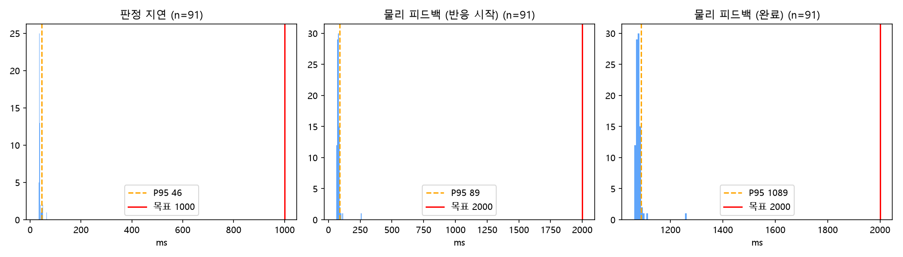

# 테스트 기록 · 평가 리포트 (KPI 7개 측정 완료)

> 관련: 05_모델카드 · 12_AI비전_진행보고서 · 16_통합테스트_KPI_CI(측정 정의·집계 규칙)
>
> **v3.13 (2026-10-03, 송승호)**: 기술 부채 정리 반영 — §1-3에 10-03 발견 결함 4건(picar 자동 정지 타이머 경쟁, web Docker 기동 실패, vision 손상 번들 재로드, 고정 버전 테스트 무한 대기) 행 추가,
> §2-5에 자동 테스트·운영 기반과 KPI 재측정이 필요한 과제 추가. 판정·지연 수치 변경 없음.
>
> **v3.12 (2026-10-03, 송승호)**: §2-2에 미판정 하위 집단 표 추가(수신호별·손 방향별 비율과 95% CI — 후진 20%, 우기울임 11.1%, 후진 × 우기울임 5/9).
> τ 민감도·확률 보정은 [05 §8-2·§10-5](05_모델카드.md), 자원 모니터 결과는 [17 §10](17_실물실행_스크립트_사용법.md) 측정 기록 표. 수치 변경 없음.
>
> **v3.11 (2026-10-03, 송승호)**: 심사 지적 대비 정정 — §2-1 치명 오분류를 16 §5.7 규칙대로 "잠정 달성"(상한 11.4%)으로, 오분류율 "통계적으로 확정"을 "달성(시도 독립 가정)"으로 고침. §2-3 "원래 정의로도 2.0초 안" 문구를 "picar 주행 제외 완료 기준"으로 정정(01 원래 정의는 picar 포함이라 구조상 초과, CR-12), 95% 상한 = 최댓값(n=91) 각주 추가. §2-4 "처음 보는 사람" → "학습에 쓰지 않은 팀원", 사람별 95% 구간 병기. §1-1 RPi5 최고 온도를 시행 구간 값 68.6°C로(70.8°C는 첫 시도 전), 메모리 평균·최대 구분. 판정·지연 수치는 그대로.
>
> **v3.10 (2026-10-03, 송승호)**: 제출용 정리 — 빈 양식에서 남은 작성 안내 문단 삭제, §1-2 제목 정정, §1-3 표를 최신순으로 정렬하고 10-02 루트 전체 테스트 실패·10-03 코드 리뷰 2행 추가. 수치 변경 없음.
>
> **v3 (2026-09-22)**: 종전 `06_테스트기록_v2.md`와 `07_평가리포트_v2.md`를 **한 문서로 통합**했다.
> 둘 다 빈 템플릿인 데다 §1(원본 로그) → §2(집계·해석)로 곧장 이어지는 짝 문서라, 분리해 두면
> 같은 날 같은 표를 두 파일에 나눠 적게 된다. **1부 = 원본 로그, 2부 = 집계와 결론**이다.
>
> **v3.9 (2026-10-02, 송승호)**: **온라인 최종 KPI(지연 2개) 반영** — §1-1 환경, §1-2 시행 로그 요약, §1-3 이슈 3건 추가(vision `/reset` 직전 판정 잔류 · picar 첫 명령 지연 · 서보 휴식 기준 미준수)·09-28/09-25 행 갱신, §2-1 지연 2행과 달성 표기 규칙([16 §5.7](16_통합테스트_KPI_CI.md)), §2-2 온라인 참고 혼동행렬, §2-3 지연 분포·슬로모션 교차 확인, §2-4 온라인 행, §2-5. 측정 정의는 09-30 회의 + 10-01 결정 D1~D6([16 §5](16_통합테스트_KPI_CI.md)). 원본 [`results/kpi_online_20261002/`](results/kpi_online_20261002/).
>
> **v3.8 (2026-09-30, 이동혁)**: **오프라인 최종 KPI(판정 성능 5개) 반영** — §1-1 환경, §2-1 요약 5행, §2-2 혼동행렬, §2-4 인물 단위,
> §2-5 향후 과제. 팀원 3명 210시도(RPi5 CSI), 공식 3연속. 지연 2개(온라인)는 비워 둔다. 원본 [`results/kpi_offline_final_20260930.json`](results/kpi_offline_final_20260930.json).
>
> **v3.7 (2026-09-29)**: §1-3 09-29 두 행 — 재수정(`cb8a25b`) 실물 재검증 통과.
>
> **v3.6 (2026-09-29)**: §1-3 09-29 두 행 — 1차 수정이 실물에서 해결되지 않아 재작성한 내용 반영. 시행 로그 `outcome`에 `timeout` 추가.
>
> **v3.5 (2026-09-29)**: ⑥ web 전 구간 실물 재시험(쿨러 없이) 통과 반영 — §1-3의 판정 타이밍·SC-04 두 행을 ✅ 재시험 통과로 갱신, 재시험 중 발견한 신규 결함 2건(SC-04 재시도 버튼 무동작, 시도 횟수 무제한 — 당일 수정, 실물 재검증 대기) 추가.
>
> **v3.4 (2026-09-29)**: 산출물 갱신(pm 점검) — §1-3 web 판정 타이밍 행에 화면 ①-b `edb5da9`(송승호 대행, `dev` 미병합) 반영. 2026-09-29부터 조은수 사정으로 web 프론트엔드는 송승호가 대행하며, 조은수 몫 나머지(이 문서 2부 KPI 집계 포함)는 재배정 팀 결정 대기.
>
> **v3.3 (2026-09-29)**: web 백엔드 병합(`c8f1fd3` → `dev` `1da641b`) 반영 — §1-3 web 이슈 5행 조치 갱신, §1-2 미판정 행 미기록 주의.
>
> **v3.2 (2026-09-28)**: §1-3 담당 정정(web 백엔드 = 이동혁, 14 §8) · 테스트·docker·KPI 방법 점검에서 나온 이슈 7건 추가. KPI 측정 방법의 미결 사항(판정 지연 기준점, 오답 포함 여부, 치명 오분류 정의, 확정 경로 등)은 [회의안건_KPI측정방법](proposals/회의안건_KPI측정방법.md), 집계 규칙 초안은 [16 §5.7](16_통합테스트_KPI_CI.md). §2-4 표 틀(팀원 train/val 대 외부인 test)이 04 §4와 다른 점은 안건 6 — 06 담당(조은수)이 고친다.
>
> **v3.1 (2026-09-27)**: 2단계 정리 — §1-3 쿨러 미조치 명시, 누락 이슈 3건(BLE 연결 timeout · web 본문 `status` 미확인 · picar LED 잔류) 추가, web 판정 타이밍 행을 스펙 링크로 축약, 물리 피드백 지연 측정 기준 미확정 비고.
>
> 📌 판정 성능 5개는 **오프라인 최종 측정**(팀원 3명 210시도, 2026-09-30 이동혁)으로 채웠다 — 상세·해석은 [05 §7-3](05_모델카드.md)·
> [12 §13-8](12_AI비전_진행보고서.md). 지연 2개와 1-2 시행 로그는 **온라인 최종 시행**(web, 2026-10-02 송승호)으로 채웠다.
>
> 📌 **picar 하드웨어 검증(I2C·LED·전원·무선)은 `13_picar_하드웨어_검증리포트.md`가 다룬다.**
> 이 문서는 분류 정확도·혼동행렬 등 **판정 성능**이 대상이라 성격이 달라 분리했다.

---

# 1부 — 테스트 기록

목적: 각 테스트 시행의 원본 로그를 남겨 2부(혼동행렬·지연분포)의 근거 데이터로 사용.

## 1-1. 테스트 환경

| 항목 | 내용 |
| --- | --- |
| 테스트 일시 | **오프라인 판정 성능**: 촬영 2026-09-29 20:27~20:57(KST), 계산 2026-09-30 · **온라인 지연**: 2026-10-02 17:50~18:02(13회차 91시도), 재확인 18:58~19:00(2회차 14시도, vision `/reset` 수정 `5208157` 뒤) |
| 테스트 대상자 (subject) | 오프라인: 팀원 3명 ext01~03(이동혁 제외) — **평가 전용, 학습 미사용**. 외부인 없음(ext03 9/22 촬영분은 폐기, 05 §7-3) · 온라인: 팀원 1명, 사원 코드 `SS-00003`(로그인해서 진행, `LOG_SUBJECT` 미사용 — 10-01 D5) |
| 하드웨어 구성 | RPi5 + **Raspberry Pi Camera Module 3(CSI)**, `record_dataset.py`로 테이크마다 3프레임(랜드마크는 RPi5에서 추출). 오프라인 계산이라 micro:bit·AI Hand·picar는 관여하지 않음 · 온라인: RPi5(vision·actuation·web) + micro:bit(BLE) + AI Hand + RPi4B picar(RPi5 AP 경유 Wi-Fi), 모두 실물(`mock=False`, CSV `mocked` 전부 `False`) |
| 소프트웨어 버전 | 판정: `evaluate_kpi.py`(운영 `classify.predict` 경로) · scikit-learn 1.9.1 · numpy 2.5.2 · 모델 번들 `joint23`(23차원), `trained_at` 2026-09-22T12:56Z, C=10·gamma=scale, `critical_weight` 10, 게이트 P10 · τ 0.75 · N=3 — 전체 메타데이터는 결과 JSON `model` · 온라인: 실행 코드 `fa3720f`(두 보드 동일 — RPi5는 로컬 병합 `a48d687`, 차이는 기록 파일 `aihand_log.md`뿐), 같은 모델 번들(클래스별 일치율 보정 2026-09-30 적용, `/health` 확인) |
| 온라인 측정 조건 | 선풍기 켬(액티브 쿨러 대신), 라이브 영상 켬(시청자 1), picar 바퀴 띄움, `scripts/rpi/monitor.py` 켬. 시작 직전(17:46) RPi5 65.3°C `0x0` · RPi4B 37.9°C `0x0` · picar I²C 정상·최대 속도 50. 시행 구간(17:50~18:02) RPi5 최대 68.6°C(모니터 시작 직후 17:49 최대 70.8°C)·스로틀링 없음·판정 fps 평균 29.9(27 미만 0.2%)·메모리 평균 1,286MB / 최대 1,362MB(스왑 0) — 원본 [`monitor_20261002_174755.csv`](results/kpi_online_20261002/monitor_20261002_174755.csv) — [17 §10](17_실물실행_스크립트_사용법.md) |

> **소프트웨어 버전을 왜 남기나요?** 학습(Colab)과 추론(RPi5)의 scikit-learn 버전이 어긋나면 같은
> 모델도 다르게 동작할 수 있어서, 나중에 "그때는 됐는데 지금은 안 된다"를 추적하려면 이 값이 필요합니다
> (05_모델카드 §6-1). 값은 `curl http://localhost:8001/health` 한 줄로 전부 확인됩니다.

## 1-2. 시행 로그

> **web 자동 기록 (2026-09-28)**: web이 판정 확정마다 CSV 1행을 남긴다 — 열 정의는 [proposals/web_판정_타이밍_스펙 §7](proposals/web_판정_타이밍_스펙.md)
> (아래 표의 열 + 장치별 응답 시간·본문 `status`·대상자). 반응 시작(`feedback_ms`)과 완료(`feedback_done_ms`) 지연을 둘 다 남긴다.
> 2026-09-28 구현(`c8f1fd3`) — `services/web/logs/web_trials_<기동시각>.csv`. 대상자는 `LOG_SUBJECT`가 있으면 그 값, 없으면 로그인한
> 학습자의 사원 코드(이번 측정은 사원 코드 — 10-01 D5). 집계는 `services/web/scripts/aggregate_kpi.py`(16 §5.8).
> ⚠️ `below_tau`/OOD(미판정)는 화면 안내만 하고 **행을 쓰지 않는다**(14 D10) — 09-30 회의 결정대로 **미판정률은 오프라인 값만 쓴다**.

**온라인 최종 시행 (2026-10-02 17:50~18:02, `SS-00003`, 13회차 × 7종 = 91시도)** — 원본 [`web_trials_20261002_174547.csv`](results/kpi_online_20261002/web_trials_20261002_174547.csv)(91행 27열),
집계 [`kpi_report.md`](results/kpi_online_20261002/kpi_report.md). 91시도 모두 첫 시도 정답, picar·micro:bit·AI Hand 응답 실패 0건, 시범 실패 0건.

| 수신호 | 시도 | 정답 | 판정 지연 중앙/최대(ms) | 물리 피드백 시작 중앙/최대(ms) | 완료 중앙/최대(ms) | match_score 중앙 |
| --- | --- | --- | --- | --- | --- | --- |
| 정지 | 13 | 13 | 37 / 47 | 76 / 262 | 1076 / 1262 | 81 |
| 서행 | 13 | 13 | 36 / 65 | 77 / 87 | 1077 / 1087 | 98 |
| 좌회전_유도 | 13 | 13 | 37 / 41 | 75 / 83 | 1075 / 1083 | 93 |
| 우회전_유도 | 13 | 13 | 37 / 46 | 74 / 87 | 1074 / 1087 | 94 |
| 확인_완료 | 13 | 13 | 36 / 50 | 77 / 113 | 1077 / 1113 | 92 |
| 후진 | 13 | 13 | 36 / 49 | 76 / 89 | 1076 / 1089 | 92 |
| 주의 | 13 | 13 | 37 / 39 | 78 / 90 | 1078 / 1090 | 98 |
| **합계** | **91** | **91** | **37 / 65** | **76 / 262** | **1076 / 1262** | |

- 장치별 중앙값: picar 31ms · micro:bit 76ms(호출 순서상 picar 포함) · AI Hand 정답 자세 883ms · 시범 819ms. 확인 → 판정 확정(`listen_ms`) 중앙 265ms.
- 최댓값 262ms(정지)는 **web 기동 후 첫 시도 한 건**(picar 209ms) — §1-3 10-02 행. 나머지 90건의 picar는 25~40ms.
- **재확인 (18:58~19:00, 2회차 14시도, vision `/reset` 수정 뒤)** — [`web_trials_20261002_185604.csv`](results/kpi_online_20261002/web_trials_20261002_185604.csv): 14/14 정답, 판정 지연 33~47ms,
  물리 피드백 시작 61~87ms(첫 시도만 240ms — 같은 현상), 완료 1.06~1.09초. 수정 뒤에도 지연 수치는 같다. 1회차는 슬로모션 교차 확인용으로 촬영(§2-3).

> **물리 피드백 지연 측정 기준 — ✅ 확정**(09-30 회의 안건 3 + 10-01 D1·D2): **반응 시작(`feedback_ms`)으로 판정**하고 완료(`feedback_done_ms`)와
> 손 기준 보수적 상한(`vision_latency_ms` + 200ms + `feedback_ms`)을 병기한다. 모수는 **정답 행만**(오답 행은 picar를 부르지 않는다). 판정 지연도 정답 행만(안건 2·D3).
> 시행 로그가 시작·완료를 둘 다 남겨 결정 뒤 다시 잴 필요가 없었다. 정의 상세 [16 §5](16_통합테스트_KPI_CI.md).

## 1-3. 이슈/실패 기록

> 계획서 정성 목표: "시도와 실패 과정을 구체적으로 기록하여 결과보고서에 반영". 최신순(같은 날은 발견 순)이다.

| 일자 | 현상 | 원인 추정 | 조치 |
| --- | --- | --- | --- |
| 2026-10-03 | (코드 리뷰) ① `aihand_test.py`가 G1~G7 라벨을 picar 데모 메뉴 순서(`aihand_picar_demo.SIGNALS`)에서 가져와, 메뉴 순서가 바뀌면 물리 지연 점검 로그에 다른 G 번호가 경고 없이 찍힐 수 있음 ② 모델 교체(`swapped_bundle`) 테스트가 경로 복원만 확인 | ① 10-02 리팩토링에서 목록을 한 곳으로 모으며 생긴 숨은 결합 ② 테스트 공백 | ✅ `876bbf1` — `/command` 응답의 `gesture`와 라벨을 대조해 다르면 경고, 순서 일치 테스트, 원래 번들 재로드 테스트. KPI 측정값 영향 없음(측정은 web 경로, 당시 두 순서 동일) |
| 2026-10-03 | (기술 부채 분석) ① picar 정지·주행 요청이 겹치면 **새 주행이 자동 정지되지 않을 수 있음**, 주행 중 서비스를 끄면 모터가 계속 돎 ② web Docker 이미지가 기동하자마자 종료(`docker compose up` mock 통합 불가, 09-30부터) ③ vision 번들이 손상되면 프레임마다 다시 읽고 traceback ④ 고정 버전(Python 3.11) 환경에서 vision `test_preview`가 끝없이 기다림 | ① `/picar`가 스레드풀에서 병렬로 도는데 자동 정지 타이머 생성·취소에 잠금이 없음, 종료 시 정지 처리 없음 ② `members.py`의 `.env` 경로 `parents[3]`이 이미지 안 경로(`/app/backend/`)에서 `IndexError` — pytest에서는 이 코드를 건너뛰어 안 잡힘 ③ 읽기 실패를 기억하지 않음 ④ 테스트가 JPEG 인코더(OpenCV·Pillow)가 있다고 가정 | ① `899f6ba` 주행·정지·타이머를 한 잠금으로, 종료 시 정지·LED 소등(실물 미검증) ② `f0393b0` ③ `f0393b0` 파일이 바뀔 때까지 다시 읽지 않음 ④ `c55ea15` 인코더가 없으면 건너뜀. 판정·피드백 타이밍은 그대로, 전체 320개 통과(3.11·3.13) — [15](15_개발로그.md) 10-03 항목 |
| 2026-10-02 | (vision, 지연 측정 중 발견) 확인 버튼 → 판정 확정(`listen_ms`)이 **8·18ms**인 행 2/91 — 새 프레임 3장(약 0.1초)이 쌓이기 전에 확정됨. 확인 직후 web이 **확인 전 손모양으로 내린 판정**을 읽음 | vision `/reset`이 N프레임 누적만 비우고 `/latest`의 직전 판정은 남겼다. 판정 계산 도중 `/reset`이 오면 그 결과가 다시 쓰이는 경합도 있었다 | ✅ `5208157` — `/reset`이 직전 판정도 "누적 중"으로 초기화, 리셋 전에 읽거나 캡처된 프레임 결과는 버림. 테스트 4개(`services/vision/tests/test_reset.py`). 2행을 빼도 지연 P95·95% 상한·최댓값 동일 → **재측정 불필요**. 재확인 회차에서 미리 든 시도 216·265ms(정상 범위). 실물 `curl` 확인(리셋 직후 `/latest`가 `awaiting_consecutive_frames`) 진행 중 |
| 2026-10-02 | (picar) web 기동 후 **첫 `/picar` 응답만** 191~209ms(나머지 25~40ms) — 10-02 두 기록 모두 | 첫 LED 명령 때 `gpiozero` 임포트·핀 초기화로 추정(`services/picar/src/controller.py:272-281`). 51초를 쉰 뒤의 첫 명령은 27ms라 Wi-Fi 절전은 아님(07 절전 꺼짐) | ⬜ 송승호 — picar 기동 때 LED를 미리 초기화(전부 끄기)하는 안. KPI 영향 없음(목표 2.0초 대비 0.26초, 95% 상한에 이미 반영) |
| 2026-10-02 | (측정 조건) 서보 휴식 기준(D4: 2회차마다 휴식, 연속 35동작 이하)을 지키지 못함 — 13회차를 11.5분에 진행, 휴식은 6회차 뒤 1번(약 2분) → 쉬지 않은 구간 약 84·98동작 | 진행 중 휴식 누락 | 고장·BLE 끊김 없음. 측정 조건으로만 기록. 서보 발열·떨림 점검 권장, 시연 운영 규칙에 휴식 포함 |
| 2026-10-02 | (테스트) 저장소 루트에서 전체 `pytest`를 돌리면 실패 5건 — 서비스 폴더에서 따로 돌리면 통과 | web 정적 폴더가 작업 폴더 기준 상대경로, vision `test_reset`이 `import app`으로 먼저 올라간 다른 서비스의 `app` 모듈을 집음 | ✅ `8b6eebb` — 파일 기준 경로, 경로로 적재. 10-03 루트 전체 **253개 통과**(actuation 30 · picar 45 · vision 55 · web 113 · portal 10) — [15](15_개발로그.md) 10-02~03 항목 |
| 2026-09-29 | (web, ⑥ 재시험 중 발견) SC-04에서 카메라가 계속 손을 못 잡으면 "재시도" 버튼을 눌러도 판정 단계로 못 돌아감 | 자동 복귀는 손이 다시 보여야만 동작. 화면 "재시도" 버튼은 상태를 다시 조회만 할 뿐 실제로는 아무 것도 하지 않는 no-op이었음 | 1차 수정(판정 단계로 강제 복귀)은 실물에서 실패 — 손이 카메라 밖이라 3초 뒤 다시 SC-04. → **재작성**: 재시도 → 시범 단계 + AI Hand 재시범, 입력은 화면 버튼·Space·micro:bit A(14 §2·§7). 회귀 테스트 6건 — ✅ 2026-09-29 실물 재검증 통과(`cb8a25b`) |
| 2026-09-29 | (web, ⑥ 재시험 중 발견) 시도 횟수 상한이 없어 한 수신호에서 오답이 계속되면 검정이 끝나지 않음 | `_session["attempts"]`는 세기만 하고 상한 검사가 없었음 | `MAX_ATTEMPTS_PER_SIGNAL=3`(최초 1회+재시도 2회) 도입 — 초과 시 재시범 없이 다음 수신호로, `given_up` 표시. 1차 수정만으로는 below_tau/OOD만 나오는 경우 판정이 끝나지 않아 상한이 무의미 → **판정 제한시간 10초 초과 시 `timeout`으로 시도 1회**(14 §2·§7). ⚠️ 시행 로그 `outcome`에 `timeout` 값이 새로 생긴다(KPI 집계 시 오답과 구분). 회귀 테스트 5건 — ✅ 2026-09-29 실물 재검증 통과(`cb8a25b`) |
| 2026-09-28 | (테스트 점검) 새 테스트를 넣으면 기존 테스트가 불안정해질 원인 6가지 — import 시점 중복 실행, 고정 sleep, 셸 환경변수 의존, 전역 상태 누수, `sys.modules` 순서 의존, 수동 스크립트 수집 | 테스트 파일 작성 방식 | ✅ 테스트 파일만 수정, 역순 실행·환경변수 변경에도 통과 확인(`a8f7640`) — [16 §1.2](16_통합테스트_KPI_CI.md) |
| 2026-09-28 | (코드 점검) web: vision이 JSON이 아닌 응답을 주면 폴링 스레드가 죽는다 | `state_machine.py`가 `ValueError`를 잡지 않음 | ✅ 2026-09-28 이동혁 `c8f1fd3` — 비JSON 응답은 그 폴링만 건너뜀 ([16 §1.3](16_통합테스트_KPI_CI.md), 08) |
| 2026-09-28 | (코드 점검) 그 밖의 결함 3건 — web `/latest` 호출에 타임아웃 없음(기본 5초), actuation이 BLE 명령 회신을 보낸 명령과 대조하지 않음(늦은 `OK{n}` 오귀속), vision landmark `x` 키 누락 시 `KeyError` | 예외·타임아웃·대조 처리 없음 | web 타임아웃 ✅ 2026-09-28 `c8f1fd3`(0.5초) · ⬜ vision 이동혁, actuation 송승호(고칠지 결정) — [16 §1.3](16_통합테스트_KPI_CI.md) |
| 2026-09-28 | (코드 점검) picar: `{"led":"on"}`처럼 형식이 틀린 요청에 HTTP 500 | `controller.execute`가 `led`를 dict로 가정 | ⬜ 송승호 — [13 §5 #9](13_picar_하드웨어_검증리포트.md) |
| 2026-09-28 | (docker 점검) mock 스택은 뜨지만 판정이 한 번도 일어나지 않음 — 3.0초 뒤 SC-04 | mock 카메라가 손 미검출만 발행 | 설계상 한계. mock 통합에는 판정 주입(stub vision)이 필요 — [16 §2.3](16_통합테스트_KPI_CI.md) |
| 2026-09-28 | (docker 점검) picar 이미지 빌드가 매우 느림 | 빌드 폴더에 SD 카드 이미지 14.9GB(`reference/`, gitignore 대상) | ✅ `services/picar/.dockerignore` 추가 → 258MB로 빌드 |
| 2026-09-28 | (KPI 방법 점검) 판정 지연 `latency_ms`가 마지막 프레임 하나의 처리 시간만 담는다 / 오프라인 `evaluate_kpi.py`가 운영(3연속)과 다른 최빈값 규칙 | 측정 기준점 미정의, 문서("같은 방식")와 코드 불일치 | ✅ 결정 — 오프라인 공식 규칙 **3연속**(최빈값은 참고, 09-29), 판정 지연 기준점은 **현행(마지막 프레임) + 한계 명시**(09-30, 스키마 변경 없음). 한계와 보수적 상한은 §2-3 — [회의안건_KPI측정방법](proposals/회의안건_KPI측정방법.md) 안건 1·7 |
| 2026-09-25 | (web) 학습자가 AI Hand를 보기도 전에 오답 처리됨 | web이 수신호 시작 시 시범을 하지 않고, 시범 직후 곧바로 판정. 정답 직후엔 이전 손모양이 새 수신호의 오답으로 잡힘 | 2026-09-27 확인 버튼 방식으로 스펙 확정 — [proposals/web_판정_타이밍_스펙](proposals/web_판정_타이밍_스펙.md). 구현 백엔드 이동혁(①-a)·화면 조은수(①-b → 2026-09-29 조은수 사정으로 송승호 대행), 인수 테스트 22개 선작성(2026-09-28, 송승호) — [14 §8](14_web_구현보고서.md). ✅ 백엔드 2026-09-28 `c8f1fd3`, 화면 2026-09-29 `edb5da9`(`dev` 병합 `db4cd41`) — **✅ 2026-09-29 ⑥ 전 구간 실물 재시험 통과**(쿨러 없이) |
| 2026-09-25 | (web) 손을 잠깐 내리면 SC-04(카메라 인식 실패)로 전환 | 손 미검출 15회 연속(약 3초)이면 SC-04 — 시범을 보거나 정답 연출을 보는 동안에도 셈 | ✅ 2026-09-28 `c8f1fd3`(시범 단계에서는 미검출을 세지 않음) — **✅ 2026-09-29 ⑥ 실물 재시험 통과**. 손을 다시 올리면 SC-03 자동 복귀 정상 동작 확인. 단, 카메라가 계속 손을 못 잡는 경우의 수동 탈출은 위 09-29 행 참고 |
| 2026-09-25 | RPi5 86.2°C, `get_throttled=0xe0008` | 방열 부족(CPU 37%로 부하는 낮음). 85°C부터 클럭 제한 → 판정 fps 저하 가능 | 🟡 쿨러 대신 **선풍기**로 측정 — 10-01 17분 최대 76.3°C, 10-02 KPI 측정 최대 70.8°C, 둘 다 `0x0`([17 §10](17_실물실행_스크립트_사용법.md)). 선풍기 없이 86.2°C였으므로 **시연·측정 때 선풍기 필수**. 쿨러 장착 여부는 결정 대기(11 §10 #7, 16 §6.1 #11) |
| 2026-09-25 | (web) picar `partial`(I2C 실패)·actuation `timeout` 응답을 성공으로 집계 | `_post_with_retry`가 HTTP 200이면 본문 `status`를 확인하지 않음 | ✅ 판정 기준(2026-09-28, [03 §5-5](03_인터페이스계약서.md)) → 구현 이동혁 `c8f1fd3`(③) — 본문 실패는 재시도 없이 기록, 단위 테스트 통과·실물 미검증 |
| 2026-09-25 | (web) 정지 계열 명령 뒤 picar LED가 다음 명령까지 켜진 채 남음 | LED를 끄는 시점이 정의되지 않음 | ✅ 2026-09-28 picar 자동 소등(LED를 켠 명령 뒤 2초, `PICAR_LED_HOLD_S`)으로 해결, 단위 테스트 통과 — 실물 확인 대기 ([13 §5 #8](13_picar_하드웨어_검증리포트.md)) |
| 2026-09-25 | picar 주행 명령 1/72 `motor_i2c_failed` (`speed 50`) | 모터 전류가 클 때 I2C 노이즈 | 재시도 추가 여부 결정 대기 (13_picar_하드웨어_검증리포트 §5 #7) |
| 2026-09-23 | AI Hand: micro:bit가 스캔에는 잡히는데 BLE 연결만 timeout | RPi5에서 다른 창의 `bluetoothctl scan on`이 켜져 있음(`Discovering: yes`) | 기동 전 `bluetoothctl show \| grep Discovering` → `no` 확인, timeout 로그에 안내 추가 (`services/actuation/README.md` 문제 해결 표) |
| 2026-09-23 | AI Hand: `result` 직후 명령이 1424ms 지연 | micro:bit 수신 핸들러 안에서 LED 표시 `pause` + `showLeds` 기본 400ms | 펌웨어 LED 백그라운드화 → 2026-09-25 36~39ms 확인 (11_하드웨어설계서 §4.5) |
| 2026-09-23 | picar `speed 50`에서 끝날 때 정지 안 됨 | 정지 쓰기 전에 자동 정지 타이머를 취소 → 쓰기 실패 시 안전망 소멸 | 순서 반전 + 정지 재시도 3회 → 2026-09-25 재시행 정상 정지 (13 §4.1 #11) |

---

# 2부 — 평가 리포트

1부의 원본 로그를 집계해 KPI 결론을 낸다. 판정 성능 5개는 오프라인 `evaluate_kpi.py`(210시도), 지연 2개는 web 시행 로그를
`services/web/scripts/aggregate_kpi.py`(91시도)로 계산했다 — 집계 규칙은 [16 §5.7·§5.8](16_통합테스트_KPI_CI.md).

## 2-1. 요약

| 지표 | 목표값 | 실측값 | 달성 여부 |
| --- | --- | --- | --- |
| 정답률 | ≥ 92% | **95.2%** (200/210, 95% CI 91.5~97.4%) | ✅ 잠정 달성 (하한 91.5%가 목표선 아래) |
| 오분류율 | ≤ 3% | **0.0%** (0/210, 95% 상한 1.8%) | ✅ 달성 (상한 1.8% < 3% — 210시도를 서로 독립으로 볼 때. 실제로는 3명 × 70시도로 묶여 있다) |
| 미판정률 | ≤ 5% | **4.8%** (10/210, 95% CI 2.6~8.5%) | ✅ 잠정 달성 (여유 1건, 상한 8.5%) |
| Macro F1 | ≥ 0.90 | **0.974** | ✅ |
| 치명 오분류 | 0건 | **0건** (정지 30시도, 95% 상한 11.4%) | ✅ 잠정 달성 (관측 0건, 상한 11.4%가 목표선 위) |
| 판정 지연 (P95) | ≤ 1.0초 | **0.046초** (온라인 정답 91시도, P95 95% 상한 0.065초) | ✅ |
| 물리 피드백 지연 (P95) | ≤ 2.0초 (반응 시작 기준 — 09-30 회의) | **0.089초** (정답 91시도, 95% 상한 0.262초) · 참고: 완료 기준 1.089초 · 손 기준 상한 0.335초 | ✅ |

> 판정 성능 5개 = **오프라인, 공식 규칙 3연속**(참고 최빈값: 96.7% · 0.0% · 3.3% · 0.982 · 0건). 오프라인 3연속은 운영보다 엄격한 하한이다
> (촬영 도구는 0.15초 간격 3장, 운영은 26fps로 확정될 때까지 본다 — 05 §7-3).
>
> 지연 2개 = **온라인, 2026-10-02**(§1-1·§1-2). 모수는 정답 행만, P95는 최근접 순위. 지연의 "달성"은 **P95의 95% 신뢰 상한(순서통계량)이
> 목표 이하**일 때다 — 표본이 59개 이상이어야 계산된다(91개 → 계산됨, 10-01 D4).
>
> **달성 표기 규칙**([16 §5.7](16_통합테스트_KPI_CI.md)): 점추정이 목표를 만족해도 95% 구간이 목표선을 넘으면 "잠정 달성"으로 적는다 —
> 정답률·미판정률·치명 오분류가 해당한다. 치명 오분류는 목표가 0건이라 관측 0건이어도 상한(11.4%)이 목표를 넘는다 — 상한을 3% 아래로
> 내리려면 정지만 약 125시도가 필요하다(Wilson, 05 §7-3과 같은 계산). 표본을 늘리면(예: 1명 70시도 추가) 구간이 좁아진다(§2-5).
>
> 온라인 91시도의 판정 성능(정답 100%·오분류 0%·치명 0건, 정지 13시도)은 **참고치**다 — web 로그는 below_tau·OOD를 기록하지 않아 미판정이
> 구조적으로 0이 되고, 정지 13시도로는 치명 0건 주장의 상한이 22.8%다. 판정 성능 5개의 공식 값은 오프라인(210시도)이다.

## 2-2. 혼동행렬 (Confusion Matrix)

> 1부의 시행 로그를 집계하여 작성. 특히 "정지" 신호가 다른 신호로 오판정된 사례(치명 오분류)는 별도 강조.

**오프라인 최종 (팀원 3명 210시도, 3연속)** — 치명 오분류 칸("정지" 행의 대각선 밖)은 **0**, 오분류 칸도 전부 0이다.

| 정답 \ 판정 | 정지 | 서행 | 좌회전_유도 | 우회전_유도 | 확인_완료 | 후진 | 주의 | 미판정 |
| --- | --- | --- | --- | --- | --- | --- | --- | --- |
| **정지** | **30** | · | · | · | · | · | · | · |
| **서행** | · | **29** | · | · | · | · | · | 1 |
| **좌회전_유도** | · | · | **30** | · | · | · | · | · |
| **우회전_유도** | · | · | · | **30** | · | · | · | · |
| **확인_완료** | · | · | · | · | **27** | · | · | 3 |
| **후진** | · | · | · | · | · | **24** | · | 6 |
| **주의** | · | · | · | · | · | · | **30** | · |

- 대각선 밖은 "미판정" 열뿐이다(10건, 전부 소속 게이트 — 7건이 우기울임). 원인·해석은 [05 §7-3](05_모델카드.md).
- **미판정은 일부 수신호·방향에 몰려 있다** (2026-10-03 집계, 원본 결과 JSON `takes[].cls/orientation/reject`) — 전체 4.8%는 목표 안이지만
  하위 집단으로 나누면 목표 5%를 크게 넘는 곳이 있다.

  | 구분 | 미판정 / 시도 | 비율 | 95% CI |
  | --- | --- | --- | --- |
  | 후진 | 6 / 30 | **20.0%** | 9.5~37.3% |
  | 확인_완료 | 3 / 30 | 10.0% | 3.5~25.6% |
  | 서행 | 1 / 30 | 3.3% | 0.6~16.7% |
  | 정지 · 좌회전_유도 · 우회전_유도 · 주의 | 0 / 30씩 | 0% | 0~11.4% |
  | 손 방향: 우기울임 | 7 / 63 | **11.1%** | 5.5~21.2% |
  | 손 방향: 좌기울임 | 2 / 63 | 3.2% | 0.9~10.9% |
  | 손 방향: 정면 | 1 / 84 | 1.2% | 0.2~6.4% |
  | (교차) 후진 × 우기울임 | 5 / 9 | 56% | — |

  미판정 10건 중 7건은 3프레임이 모두 게이트에 막혔고, 3건은 1~2프레임만 막혀 3연속을 채우지 못했다. 운영에서 뜻하는 바: 후진을 오른쪽으로
  기울여 하면 절반 이상이 "다시 해 주세요"를 받는다. 시연에서는 손을 정면으로 들라고 안내하고, 개선은 §2-5(개발용 데이터로 조정 → 새 평가 데이터로 재측정)대로 한다.
- **온라인 (참고, 2026-10-02 91시도)**: 7종 × 13시도 전부 대각선(정지 13/13), 오분류·치명 0. 미판정 열은 web 로그에 기록되지 않아 구조적으로 0 —
  참고치([§2-1 주석](#2-1-요약)). 그림 [`confusion_web.png`](results/kpi_online_20261002/confusion_web.png).

## 2-3. 지연 분포

> 판정 지연, 물리 피드백 지연 각각의 분포(히스토그램) — P95 계산 근거 명시

**온라인 최종 (2026-10-02, 정답 91시도)** — 원본 [`kpi_report.md`](results/kpi_online_20261002/kpi_report.md) §2-3, 그림 [`latency_web.png`](results/kpi_online_20261002/latency_web.png)

| 항목 | n | 최소 | 중앙값 | P95 | P95 95% 상한 | 최대 | 목표 |
| --- | --- | --- | --- | --- | --- | --- | --- |
| 판정 지연 `vision_latency_ms` | 91 | 33 | 37 | **46** | 65 | 65 | ≤ 1000 |
| 물리 피드백 반응 시작 `feedback_ms` | 91 | 62 | 76 | **89** | 262 | 262 | ≤ 2000 |
| (참고) 물리 피드백 완료 `feedback_done_ms` | 91 | 1062 | 1076 | 1089 | 1262 | 1262 | — |
| (참고) 손 기준 상한 = 판정 지연 + 200 + 반응 시작 | 91 | 298 | 313 | 335 | 500 | 500 | — |

(단위 ms. P95 = 정렬 뒤 ⌈0.95·n⌉번째 값. 95% 상한 = 진짜 P95가 이 값 이하라고 95% 신뢰로 말할 수 있는 순서통계량. n=91이면 이 상한은
91번째 값, 곧 최댓값과 같다 — 반응 시작의 262ms는 web 기동 직후 첫 시도 1건(picar 첫 명령 209ms, §1-3)이고, 이 건을 빼면 최댓값은 113ms다)

**각 값이 잰 구간과 빠진 구간** — 01의 정의("손 정지 시점부터")보다 좁게 잰다. 그래서 목표 대비 수치가 매우 작다.

| 값 | 잰 구간 | 빠진 구간 |
| --- | --- | --- |
| 판정 지연 | 연속 판정을 확정한 **마지막 프레임 1장의 캡처 → 판정** | ① 3프레임 연속을 채우는 시간(약 0.07초) ② web 폴링 대기(0~0.2초) ③ 손을 멈춘 뒤 인식이 안정될 때까지(측정 불가) |
| 물리 피드백 시작 | web 판정 확정 → picar·micro:bit가 **명령을 받았다고 응답** | 판정 지연 전체, 실제 동작이 끝나는 시점 |
| 물리 피드백 완료 | web 판정 확정 → AI Hand 정답 자세 완료 또는 micro:bit LED 1초 중 늦은 쪽(picar 주행 제외) | 판정 지연 전체 |
| 손 기준 상한 | 판정 지연 + 폴링 대기 최대 200ms + 반응 시작 — 위 ①·③을 뺀 보수적 추정 | ①·③ |

- 손 정지 → 동작 완료의 **사전 추정**은 약 1.2~1.4초(손 기준 0.1~0.3초 + 완료 1.09초, 16 §4.3)였고, 아래 슬로모션 실측은 **약 1.11~1.24초**다.
  둘 다 **picar 주행을 뺀 완료 기준**이다. 01의 원래 정의("가장 늦게 완료되는 시점")에는 picar 주행이 들어가는데, 주행 자체가 약 2초(자동 정지)라
  그 정의로는 구조상 목표 2.0초를 넘는다 — 그래서 09-30 회의에서 반응 시작으로 판정하기로 했다(CR-12). 09-25 web 없는 데모(판정 39~72ms,
  반응 시작 25~47ms)와도 같은 수준이다.
- 판정 지연 기준점은 09-30 회의 결정대로 **현행(마지막 프레임) + 이 한계를 명시**한다(스키마 변경 없음).
- ✅ **외부 영상 교차 확인 (2026-10-02, 재확인 1회차 7시도)** — 휴대폰 240fps 슬로모션(1프레임 4.17ms)으로 손·micro:bit LED·picar·AI Hand를 한 화면에 찍고,
  `scripts/pc/number_frames.ps1`로 프레임 번호를 새겨 셌다. 원본 [`slowmo_frames_20261002.csv`](results/kpi_online_20261002/slowmo_frames_20261002.csv)(같은 시도의 CSV 값 포함).

  | 수신호 | 손 정지 → picar | 손 정지 → LED | **반응 시작**(늦은 쪽) | 손 정지 → 판정 확정(추정) |
  | --- | --- | --- | --- | --- |
  | 정지 | 58 | 142 | **142** | −98 |
  | 서행 | 67 | 150 | **150** | 70 |
  | 좌회전_유도 | 75 | 142 | **142** | 72 |
  | 우회전_유도 | 79 | 142 | **142** | 69 |
  | 확인_완료 | 71 | 138 | **138** | 62 |
  | 후진 | 150 | 112 | **150** | 40 |
  | 주의 | 200 | 238 | **238** | 176 |
  | 중앙 (최소~최대) | 75 (58~200) | 142 (112~238) | **142 (138~238)** | 69 (−98~176) |

  (단위 ms. "판정 확정 추정" = 손 정지 → LED에서 CSV의 `microbit_ms`(판정 확정 → micro:bit 응답)를 뺀 값)
  - **손 정지 → 반응 시작은 0.14~0.24초**로, 시스템 기록값의 손 기준 상한(P95 0.335초)보다 모두 짧다 — 상한이 실제로 보수적임을 확인했다.
  - **손 기준 판정 지연은 대부분 0.04~0.08초**(새 프레임 3장 약 0.07초 + 계산 시간과 맞음), 최대 0.18초 — 목표 1.0초에 크게 여유. 정지의 −0.1초는 손이
    눈으로 완전히 멈추기 전에 시스템이 자세를 알아본 경우다. "손 정지" 프레임을 사람이 고르므로 ±0.1초 정도 흔들릴 수 있다.
  - picar가 LED보다 먼저 반응했다(7회 중 6회) — 장치 호출 순서(`/picar` → `/result`)와 같다.
  - **손 정지 → 물리 피드백 완료**는 판정 확정 추정 + CSV `feedback_done_ms`로 **약 1.11~1.24초**(추정) — picar 주행을 뺀 완료 기준으로 목표 2.0초 안이다(01의 원래 정의는 picar 주행까지 넣어 구조상 초과 — CR-12).
    영상의 AI Hand 프레임(F3·F4)은 판정 전 **시범 동작**을 잰 것이다(보이는 움직임 0.23~0.78초). 정답 뒤 AI Hand는 **움직이지 않는다** —
    actuation이 시범과 정답 자세를 구분하지 않고 같은 제스처 `G{n}`을 보내고(`services/actuation/src/aihand/controller.py:39-46`), 펌웨어는 시범 뒤 자세를
    그대로 두기 때문이다. CSV의 `aihand_ms`(약 0.88초)는 펌웨어가 손가락 5개를 150ms 간격으로 지시하는 시간(`aihand_control.ts:58-69`)이지 보이는 움직임이 아니다.
    **완료 기준값은 영향 없음** — 측정 105행 전부 완료가 "micro:bit 응답 + LED 1초"로 정해졌고 AI Hand 쪽으로 정해진 행은 0이다.

## 2-4. 인물 단위(subject-wise) 성능 비교

> 데이터셋 명세서의 subject-wise split 검증: 팀원(train/val) 대비 외부인(test)의 정답률 차이 확인 — 과적합 여부 판단

| 대상 | 정답률 | 비고 |
| --- | --- | --- |
| ~~팀원 (train/val)~~ → 공개 데이터 (학습 분포) | 88.68% | 세션 단위 5겹 교차검증(05 §9). 모델은 **공개 데이터로만** 학습했다 |
| ~~외부인 (test)~~ → 팀원 3명 (평가 전용, 학습에 쓰지 않음) | **95.2%** (3연속) | 자체 촬영은 학습에 쓰지 않았다 — 학습 건수 27,735 = 공개 데이터 수 |
| ext01 / ext02 / ext03 | 97.1% / 94.3% / 94.3% | 95% CI 90.2~99.2% / 86.2~97.8% / 86.2~97.8%. 미판정 2.9% / 5.7% / 5.7%, 오분류 전원 0% |
| (참고) 온라인 `SS-00003` — 팀원 1명 | 100% (91/91) | 지연 측정용. 미판정을 기록하지 않아 판정 성능 비교에는 쓰지 않는다. 온라인 ID는 사원 코드라 오프라인 ext01~03과 체계가 다르다 |

> 과적합 판단: 학습에 쓰지 않은 팀원 3명 사이 차이는 2.8%p이고 오분류는 전원 0%다. 다만 한 사람당 70시도라 사람별 95% 구간이 크게 겹쳐,
> 이 차이로 사람 간 편차를 단정할 수는 없다. 평가자가 모두 시스템을 아는 팀원이라 처음 배우는 사람의 성능은 검증하지 않았다(외부인 촬영분은 폐기 — §1-1, 05 §7-3). 공개 데이터보다 높은 이유(데이터 난이도 — ASL 사진 vs 안내 보고
> 수행)는 [12 §8-3](12_AI비전_진행보고서.md). ⚠️ 원래 표 틀(팀원 train/val 대 외부인 test)은 04 §4와 맞지 않아 안건 6에서 고치기로 한 항목 — 위는 실제 분할 기준으로 채웠다.

## 2-5. 개선 사항 및 향후 과제

- (2026-09-30, 오프라인 KPI) **기울인 손 과차단** — 미판정 10건 중 7건이 우기울임, 후진 20%·확인_완료 10%. 팀원이 학습 데이터보다 엄지를 더
  펴는 경향 + 기울기. 개선(기울기 보정·게이트 재조정)은 **개발용 데이터로 조정 → 새 평가 데이터로 재측정**(이번 210시도로 조정하면 오염).
- (2026-09-30) 미판정률 여유 1건·정답률 하한 91.5% — 결과보고서에 신뢰구간 병기. 표본을 늘리면(예: 추가 1명 70시도) 구간이 좁아진다.
- (2026-09-30) "7종 아닌 자세" 오탐지율은 이번 촬영에 없어 미측정(이전 105시도 19%) — 게이트를 풀면 함께 나빠지는 지표라 같이 잰다.
- (2026-10-02, 온라인 지연) **판정 지연 기록값의 범위 한계** — 마지막 프레임 1장만 잰다(§2-3). 슬로모션 교차 확인(§2-3: 손 기준 판정 지연 대부분 0.04~0.08초)으로 보완했고, 필요하면 향후 판정 결과에 "연속 판정 첫 프레임 캡처 시각"을 선택 필드로 추가해 손 기준 지연을 직접 잰다(16 §5.6 #1, 스키마 변경이라 이번에는 하지 않음).
- (2026-10-02) **picar 첫 명령 지연**(약 0.2초) — picar 기동 때 LED를 미리 초기화하면 시연 첫 동작도 빨라진다(§1-3).
- (2026-10-02) **온라인 미판정률** — web이 below_tau·OOD를 기록하지 않아 온라인 미판정률은 낼 수 없다(09-30 결정: 오프라인만). 필요하면 향후 안내 문구가 뜰 때도 행을 남긴다.
- (2026-10-02, 슬로모션) **정답·재시범 때 AI Hand가 움직이지 않음** — 정답 자세와 재시범이 시범과 같은 제스처라, 시범 이후에는 AI Hand가 보이는 피드백을 주지 않는다(§2-3). → ✅ **그대로 둔다**(2026-10-02 송승호 결정) — AI Hand는 **시범 전용**이고, 정답·오답 피드백은 micro:bit O/X와 picar가 맡는다. 정답 자세를 다른 동작으로 바꾸면 서보 동작이 늘어나 정격 초과 서보에 부담이 된다.
- (2026-10-02) **서보 휴식** — 이번 측정은 휴식 기준을 지키지 못했다(§1-3). 시연·반복 측정 운영 규칙에 "2회차마다 휴식"을 넣는다.
- (2026-10-03, 기술 부채 정리) **자동 테스트·운영 기반** — 고정 버전(Python 3.11)에서 처음 전부 통과(320개)했고 CI 설정(`.github/workflows/ci.yml`)을 추가했다. 남은 것은 GitHub 첫 실행(저장소 관리자의 Actions 허용), docker compose 통합 테스트 job, 프런트엔드 JS 테스트, systemd 자동 재시작의 실물 검증이다.
- (2026-10-03) **KPI 재측정이 필요한 과제** — ① web이 actuation을 기다리는 시간(`/command` 1.5초, `/result`·`/progress` 0.5초)을 actuation이 micro:bit 회신을 기다리는 시간(2.0초)과 맞추기 ② 학습 데이터 추출(`services/data`, MediaPipe 0.10.14)과 실행(`services/vision`, 1.x)의 버전 통일. ①은 물리 피드백 지연, ②는 판정 성능이 바뀌므로 각각 다시 잰다([15](15_개발로그.md) TODO "기술 부채").
