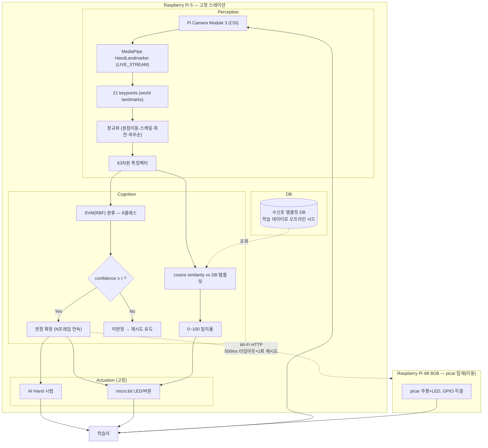

# PRD — SafeSign PhysicalAI (심기일전)

> 이 문서는 01~09번 문서(계획서·설계문서·인터페이스계약서·데이터셋명세서·모델카드·리스크레지스터·화면목록)와
> `수신호에 따른 picar 동작.md`, `시스템_구성도_초안.md`를 종합해, **개발 착수를 위해 한 곳에서 볼 수 있도록
> 정리한 제품 요구사항 문서**입니다. 각 절 끝에 근거 문서를 표기했으니, 세부 사항은 해당 문서를 참고하세요.
>
> **작성일**: 2026-09-17 · **기준 문서 버전**: 01_v4, 02_v2, 03_v2, 04_v2, 05_v3, 06_v2, 07_v2, 08(무버전), 09_v2
>
> **2026-09-18 갱신**: 보유 하드웨어(AI Hand·picar·micro:bit·RPi5) 확정 배치 반영 — 카메라는
> Raspberry Pi Camera Module 3(CSI), picar는 RPi5가 GPIO로 직접 구동. MediaPipe 실행 모드를
> `VIDEO`→`LIVE_STREAM`으로 변경(개발 편의보다 실시간 성능 우선). §1.3, §3.3~3.4, §4, §11 갱신.
>
> **2026-09-18 갱신 2**: 경량 분류기(SVM) 채택에 따라 **수신호 등록(관리자, SC-08) 기능을 범위에서
> 제외** — 고정 클래스만 예측 가능한 분류기 구조상 재학습 없는 실시간 등록이 성립하지 않음. §2.1, §3.1,
> §3.6(삭제), §4, §7, §8, §11 갱신. 현재 우선순위는 인식→판정→Actuation **입력-출력 파이프라인 검증**이며,
> 웹 화면 상세 디자인은 그 이후로 미룸 (09_화면목록_v2 참고).
>
> **2026-09-18 갱신 3**: §11.2의 확정 필요 항목 7건 중 6건을 결정하여 §11.1로 이동 — 파이프라인 방식
> 공식 기록, 카메라 해상도/FPS(1920×1080@60fps Binned), micro:bit 프로토콜(115200baud, RESULT/PROGRESS/BTN,
> ACK 없는 self-healing 정책), τ=0.75·N=3프레임·서보각도 초기값(하드웨어 제약 근거), SC-07 세션 이어하기
> 미구현, Macro F1 신호 7종만 평균. **picar 전원 계통 분리 여부만** 카메라·picar 미도착으로 구현 담당자의
> 실물 테스트로 남겨둠(§11.2).
>
> **2026-09-19 갱신 5 (vision 구현 + 라이브러리 최신화)**: vision 서비스 실제 구현(정규화·SVM 추론·
> 모델 번들 로딩·Colab 학습 노트북·웹캠 확인 도구) 완료에 맞춰, 구현 중 확인된 라이브러리 현황을
> 문서에 반영 — mediapipe 1.x에서 레거시 `solutions` API 제거(폴백 재설계), `SVC(probability=True)`
> deprecated(`CalibratedClassifierCV`로 대체), **학습/추론 scikit-learn 버전 정합 제약**을 §7에 추가.
> 상세는 05_모델카드_v3 §3-1·§6-1, 08_리스크레지스터 참고.
>
> **2026-09-18 갱신 4 (하드웨어 보드 분리)**: picar가 주행하면 그 위 카메라도 함께 이동해 학습자가
> 카메라를 따라가야 하는 문제를 발견 — **Raspberry Pi 4B 8GB를 추가**해 picar 전용 컨트롤러로 분리하고,
> **Raspberry Pi 5는 카메라·AI Hand·micro:bit(고정 스테이션)만 전담**하도록 변경. 두 보드는 **Wi-Fi
> (HTTP, 500ms 타임아웃+1회 재시도)** 로 통신하며, 실패 시 picar 없이 진행(§7 폴백과 동일 철학).
> §1.3, §3.5, §4, §5, §7, §11 갱신. 부수 효과로 "RPi5 리소스 경합" 리스크가 해소됨.

---

## 1. 제품 개요

**SafeSign**은 산업 현장 안전 수신호를 교육하는 **피지컬 AI 제품**이다. 학습자가 카메라 앞에서 수신호를
따라 하면, 시스템이 이를 인식·채점하고 그 결과를 **AI Hand(로봇 손)**, **picar(주행 로봇)**,
**micro:bit(LED/버튼)** 세 가지 물리 장치로 피드백한다. 인식 결과가 화면 텍스트가 아니라
실제 로봇의 움직임으로 나타난다는 점이 이 제품을 "웹캠 앱"과 구분 짓는 핵심이다.

**폐루프 구조**:

```
AI Hand가 수신호 시범 → 학습자 손동작 → Pi Camera Module 3(Perception) → MediaPipe 랜드마크
  → 정규화 → SVM 분류 + 일치율 산출(Cognition) → 교육 상태머신
  → AI Hand 재시범/교정 · picar 주행+LED · micro:bit LED 매트릭스(Actuation) → 학습자가 보고 교정
```

*(근거: 01_프로젝트계획서_v4 §추진배경, 02_설계문서_v2 §1, 시스템_구성도_초안.md)*

### 1.1 추진 배경

- 산업 현장 작업자마다 안전 수신호 표현이 달라 소통 오류 → 안전사고 위험
- 기존 교육(영상 시청, 인쇄물)은 학습자의 이해도를 객관적으로 측정하기 어려움
- 로봇 손의 반복 시범 + 정량 지표(정답률 등)로 체계적 교육·평가 체계 구축 필요

*(근거: 01_프로젝트계획서_v4 §추진 배경과 목적)*

### 1.2 왜 지금 이 설계인가 (아키텍처 변경 이력)

기존 초안(v1)은 산업/건설/농업/수중 4개 분야, 분야별 5개 후보(총 20개)에서 학습자가 micro:bit 버튼으로
분야를 고른 뒤 그 분야의 5종을 학습하는 구조였다. 이번 개발 착수 시점에 다음과 같이 **단순화·확장**되었다:

- **분야 선택 폐지 → 통합 7종 단일 커리큘럼**: 산업/건설 현장에서 공통으로 쓰이는 크레인 작업표준신호지침
  기반 신호 5종 + 자체 지정 2종(후진, 주의) = 7종으로 통합. 더 이상 분야를 고르지 않는다.
- **picar 추가**: AI Hand의 손 모양 시범에 더해, **picar가 실제로 주행하고 LED를 점등/점멸**해 판정
  결과를 물리적으로 보여주는 두 번째 Actuation 채널이 추가되었다.

*(근거: 시스템_구성도_초안.md, 02_설계문서_v2 §4, `수신호에 따른 picar 동작.md`)*

### 1.3 하드웨어 배치 확정 (보유 장비 기준, 2026-09-18 2보드 분리로 정정)

> **왜 보드를 2개로 나눴나**: 처음에는 RPi5 한 대가 카메라와 picar 구동을 모두 겸했다. 그런데 picar가
> 실제로 주행하면 그 위의 카메라도 함께 움직여, **학습자가 판정을 받을 때마다 카메라를 따라 이동해서
> 다시 손을 보여줘야 하는 모순**이 생긴다. 그래서 카메라·AI Hand·micro:bit(학습자 앞 고정)는 **RPi5**,
> picar 구동은 새로 추가한 **Raspberry Pi 4B 8GB**로 분리하고 **Wi-Fi**로 연결했다.

| 장비 | 연결/배치 | 역할 |
| --- | --- | --- |
| Raspberry Pi 5 | 학습자 앞 **고정** 스테이션 | Perception(카메라 추론) + Cognition(분류) + AI Hand/micro:bit 구동 |
| Raspberry Pi Camera Module 3 | CSI (15핀 → 22핀 변환 케이블 → RPi5 CAM/DISP 포트) | 학습자 손 촬영 (범용 USB 웹캠 아님) |
| AI Hand | RPi5에 서보 연결 | 수신호 시범(먼저 보여줌) / 오답 시 교정 자세 재시범 |
| micro:bit | USB 시리얼로 RPi5 연결 | LED 매트릭스 O/X 표시, 버튼 입력 |
| **Raspberry Pi 4B 8GB (신규)** | **picar 차체에 탑재, 이동** | picar 모터/LED를 GPIO로 직접 구동. RPi5와 **Wi-Fi(HTTP)** 로 통신 |
| picar | RPi4B가 직접 구동 | RPi5의 명령을 Wi-Fi로 받아 물리 동작(§3.2 표) 수행 |

**제품 동작 순서**: ① AI Hand가 수신호를 시범 → ② 학습자가 따라 함 → ③ Pi Camera Module 3로 인식 →
④ 동일 수신호로 판정되면 RPi5가 Wi-Fi로 명령을 보내 **picar가 §3.2 표의 정해진 동작으로 물리적으로
반응**(+micro:bit LED 표시). picar는 학습자 앞에서 벗어나 움직여도 카메라 위치는 그대로 고정된다.

*(근거: 02_설계문서_v2 §1-1)*

---

## 2. 목표 및 성공 지표 (KPI)

### 2.1 정량 목표

| 지표 | 목표값 | 정의 |
| --- | --- | --- |
| 대상 수신호 종류 | **7종 + negative 1종 = 8클래스** | §3.2 표 참고 |
| 정답률 (Accuracy) | ≥ 92% | 정답 판정 수 / 전체 시도 수 × 100 |
| 오분류율 | ≤ 3% | 다른 수신호로 오판정 / 전체 시도 수 × 100 |
| 미판정률 (Reject) | ≤ 5% | 신뢰도 임계값(τ) 미달로 보류 / 전체 시도 수 × 100 |
| Macro F1 | ≥ 0.90 | **신호 7종 기준 평균** (negative 제외 — 05_모델카드_v3 §7-1 근거) |
| 치명 오분류 | 0건 | "정지"가 다른 클래스로 판정된 건수 (별도 집계) |
| 판정 지연 (P95) | ≤ 1.0초 | 손 정지 시점 → 시스템 판정 확정까지 |
| 물리 피드백 지연 (P95) | ≤ 2.0초 | 손 정지 시점 → **AI Hand + picar + micro:bit 중 가장 늦게 완료되는 시점**까지 |

> 정답률+오분류율+미판정률 = 100%로 배타적 정의. 지연 지표는 평균이 아닌 P95.
> KPI 재계산(클래스 수 8 확정 기준) 근거·목표 테스트 시행 규모(약 240~320회)는 05_모델카드_v3 §7-1·7-2 참고.

*(근거: 01_프로젝트계획서_v4 §목표와 KPI, 03_인터페이스계약서_v2 §5-4, 05_모델카드_v3 §7)*

### 2.2 정성 목표

- 비전공자 팀원도 담당 파트를 이해하고 발표에서 직접 설명 가능
- 팀 전체가 "문제 정의 → 구현 → 평가" 흐름을 스스로 설명 가능
- 시도와 실패 과정을 구체적으로 기록해 결과보고서에 반영

*(근거: 01_프로젝트계획서_v4 §목표와 KPI)*

---

## 3. 기능 요구사항

### 3.1 학습 흐름 (User Flow)

09_화면목록_v2 기준, 분야 선택 없는 단일 커리큘럼 흐름:

```
SC-01 랜딩 → SC-02 교육 시작 확인(수신호 7종 안내) → SC-03 수신호 시범/인식(핵심, ×7 반복)
  ├─ 정답: SC-03a 오버레이 → 다음 수신호 반복 → 전체 완료 시 SC-05
  ├─ 오답: SC-03b 오버레이 → SC-03 재시도
  └─ 인식 실패: SC-04 안내 → SC-03 복귀
→ SC-05 학습 완료/집계 → SC-06 수료증 발급 → (다시 학습) SC-02 또는 종료

예외: SC-07 중간 이탈 재접속(이어서/처음부터)
```

> 관리자 화면(구 SC-08 신규 수신호 등록)은 없다 — 경량 분류기(SVM) 채택으로 수신호 등록 기능
> 자체가 범위에서 빠졌기 때문 (§3.2, §8 참고). 현재 학습자 화면 SC-01~SC-07만 존재한다.

| 화면ID | 요약 | 비고 |
| --- | --- | --- |
| SC-01 | 랜딩(시스템 소개) | 필수 |
| SC-02 | 교육 시작 확인(수신호 7종 목록 미리보기) | 필수, 구 SC-02(분야선택)는 폐지 |
| SC-03 (+03a/03b) | 수신호 시범/인식 핵심 화면 — AiHand 시범 + picar 동작 + 카메라 인식 + match_score | 필수 |
| SC-04 | 카메라 인식 실패 안내 | 필수(예외) |
| SC-05 | 학습 완료/집계 | 필수 |
| SC-06 | 수료증 발급 | 필수 |
| SC-07 | 중간 이탈 재접속 (세션 이어하기 미구현, 항상 처음부터) | 필수(예외) |

*(근거: 09_화면목록_v2 전체 — 화면 상세 디자인은 파이프라인 입출력 검증 이후 별도 진행 예정)*

### 3.2 인식 대상 수신호 (통합 7종 + negative)

| # | 수신호 | AiHand 표현 | picar 동작 | 출처/일치도 |
| --- | --- | --- | --- | --- |
| 1 | 정지 | 다섯 손가락 펴기 + 정면 | 정지 + 양쪽 적색 LED 점등 | 크레인표준 · 🟡 |
| 2 | 서행 | 검지+중지 펴기 + 정면 | 감속 + 양쪽 황색 LED 점멸 | 크레인신호수표준 · 🔴 |
| 3 | 좌회전 유도 | 엄지+검지 펴기 | 좌측 황색 LED 점멸 + 좌회전 주행 | 크레인표준 · 🟡 |
| 4 | 우회전 유도 | 엄지+약지 펴기 | 우측 황색 LED 점멸 + 우회전 주행 | 크레인표준 · 🟡 |
| 5 | 확인/완료 | 엄지만 펴기 + 정면 | 적색·황색 LED 번갈아 2회 점멸 후 소등 | 크레인신호수표준 · 🔴 |
| 6 | 후진 | 검지만 펴기 | 후진 주행 | 자체 지정 |
| 7 | 주의 | 소지(새끼손가락)만 펴기 | 정지 + 양쪽 황색 LED 점멸 | 자체 지정 |
| 8 (negative) | 손 없음/애매한 자세 | - | - | - |

> 🟡 근사(의미는 같으나 동작이 변형됨) · 🔴 충돌(표준상 이미 다른 의미로 쓰임 — 재해석 시안임을 발표 시 명시).
> 손목 좌우 회전 서보는 이번 7종 판별에는 사용하지 않음(모든 신호가 "정면" 기준, 손가락 조합만으로 구분).

*(근거: 02_설계문서_v2 §4, `수신호에 따른 picar 동작.md`)*

### 3.3 Perception (인식)

- 카메라: **Raspberry Pi Camera Module 3** (CSI, 15핀→22핀 변환 케이블로 RPi5 직결 — 범용 USB 웹캠 아님)
- 입력: **1920×1080 @ 60fps (Binned Mode)** 확정 (03_인터페이스계약서_v2 §2). MediaPipe 추론은 매 프레임
  그대로 돌리지 않고 `LIVE_STREAM` 콜백이 소화 가능한 속도로 서브샘플링/축소 권장 — 실제 처리율은 실측 필요
- MediaPipe **Tasks API `HandLandmarker`**, **`LIVE_STREAM` 모드**(비동기 콜백), `num_hands=1`
  - **왜 `LIVE_STREAM`인가**: 이 제품은 개발 편의보다 실시간 처리 성능이 우선인 피지컬 AI 제품이다.
    `VIDEO`(동기 루프)는 추론이 끝날 때까지 다음 프레임 캡처가 막히지만, `LIVE_STREAM`은 캡처와 추론을
    분리해 카메라 FPS를 더 살릴 수 있다. 대신 프레임 타임스탬프를 단조 증가로 직접 관리하고, 콜백↔상태머신
    간 스레드-세이프 큐/락이 필요하다 (05_모델카드_v3 §3-2).
- `hand_world_landmarks`(실세계 3D, 카메라 거리 변화에 강함) 채택
- 출력: 21 keypoints × (x,y,z) → `landmark_frame` 스키마

*(근거: 05_모델카드_v3 §3, 03_인터페이스계약서_v2 §2~3)*

### 3.4 Cognition (판정)

- **정규화**: 원점이동(손목 기준) → 스케일 정규화(손목-중지MCP 거리) → 회전정렬(손목→중지MCP 축 정렬) →
  좌우손 반전(Left면 x좌표 미러링) → **63차원 벡터**
- **분류기**: MediaPipe Hand Landmarker(동결, 재학습 안 함) + **SVM(RBF 커널)** — 8클래스(7종+negative) 분류
  - 채택 근거: 저차원(63d)+소량데이터(클래스당 ~300장) 조건에서 MLP/랜덤포레스트 대비 과적합 위험 낮고 튜닝 용이
- **일치율(match_score)**: 63차원 벡터 vs DB 템플릿 cosine similarity → 0~100 percentile 매핑 (분류 결과와 분리 설계)
- **판정 안정화**: 프레임 단위 판정이 아닌 **N프레임 연속 동일 클래스**일 때 확정. 초기 기본값 **N=3**
  (RPi5 CPU 추론 성능 가정 근거, 05_모델카드_v3 §8-0 — 실물 도착 후 재검증).
  `LIVE_STREAM` 콜백에서 스레드-세이프 큐(deque)로 최근 클래스를 누적해 판단
- **판정 임계값 τ**: confidence < τ → `is_reject=true`. 초기 기본값 **τ=0.75** (하드웨어 제약 근거,
  05_모델카드_v3 §8-0). 최종 확정 절차 — 검증셋 확률 수집 → τ 그리드 탐색 →
  "정지" 치명오분류 0건 최우선 필터 → 나머지 KPI 동시 만족 → 미판정률 최소값 채택 (05_모델카드_v3 §8-1)

*(근거: 05_모델카드_v3 §3~§8, 02_설계문서_v2 §2)*

### 3.5 Actuation (물리 출력)

| 채널 | 트리거 | 동작 | 근거 |
| --- | --- | --- | --- |
| AI Hand | `command: demo \| correct_pose` | 손가락 서보 5개 + 손목 서보 1개로 정답 수신호 시범/교정 자세 제시. 서보 각도 초기값(펴짐 170°/굽힘 10°/손목중립 90°) 확정, 실물 캘리브레이션 전 잠정 | 02_설계문서_v2 §3, 03_인터페이스계약서_v2 §5-1 |
| picar | `command: stop\|slow\|turn_left\|turn_right\|reverse\|caution\|complete` | **RPi5 → RPi4B 8GB Wi-Fi(HTTP POST, 500ms 타임아웃+1회 재시도)** — RPi4B가 모터(전진/후진/정지/좌우회전/속도2단) + LED(적색×2, 황색×2)로 수신호 의미를 주행으로 표현 | 02_설계문서_v2 §1-1·§3-2, 03_인터페이스계약서_v2 §5-2 |
| micro:bit | 판정 결과(OK/NG + match_score), 진행 표시 | USB 시리얼 115200baud, `RESULT`/`PROGRESS`/`BTN` 메시지 + `HELLO`/`READY` 핸드셰이크(확정) — 5×5 LED 매트릭스 O/X 표시, A/B 버튼으로 웹 화면 이동 | 02_설계문서_v2 §5, 03_인터페이스계약서_v2 §5-3 |

- **물리 피드백 지연**: 손 정지 시점 → (AI Hand 완료 + picar 완료 + micro:bit 표시 완료) 중 **가장 늦은 시점**까지 P95 ≤ 2.0초
- **picar Wi-Fi 통신 장애 시(확정)**: 500ms 타임아웃 + 1회 재시도 후 picar 없이도 AI Hand + micro:bit만으로 교육 흐름을 계속 진행(보조 출력으로 간주) — 03_인터페이스계약서_v2 §7
- **micro:bit 통신 장애 시**: 화면 폴백 UI로 정오답 표시

*(근거: 03_인터페이스계약서_v2 §5, §7)*

### 3.6 (범위 제외) 수신호 등록

> ⚠️ **범위에서 제외됨 (2026-09-18).** 랜드마크 기반 **SVM 분류기**는 학습 시점에 고정된 클래스만
> 예측하므로, 사용자가 실시간으로 신규 수신호를 추가해 "재학습 없이 즉시 인식"하게 하는 기능은
> 이 구조와 맞지 않는다(규칙/유사도 기반 시스템이었다면 가능했을 것). 관리자 전용 등록 화면(구 SC-08)도
> 함께 제외한다. 상세 근거는 03_인터페이스계약서_v2 §6, 05_모델카드_v3 §5-2 참고.

---

## 4. 시스템 아키텍처



**서비스 분리(개발 담당 매핑)**: `services/vision`(Perception+Cognition, RPi5) · `services/actuation`(AI
Hand+micro:bit, RPi5) · `services/picar`(picar GPIO 제어, **RPi4B 8GB**) · `services/web`(프론트+교육
상태머신) · `services/data`(수집 스크립트+템플릿 DB) — 5개 Docker 컨테이너로 분리 개발 후
`docker-compose up`으로 로컬 통합.

> **실제 배포 환경**: `vision`과 `actuation`은 실물 RPi5 한 대에서, `picar`는 **별도의 Raspberry Pi 4B
> 8GB**에서 돈다(§1.3). `services/actuation`이 picar_command를 보낼 때는 같은 프로세스 호출이 아니라
> **`services/picar`의 HTTP 엔드포인트를 Wi-Fi로 호출**해야 한다 (03_인터페이스계약서_v2 §5-2). 로컬
> 개발 시에는 docker-compose 네트워크로 이 Wi-Fi 구간을 흉내 낸다.

*(근거: 시스템_구성도_초안.md, 역할 및 책임표.md, 02_설계문서_v2 §1-1)*

---

## 5. 인터페이스 요약 (상세는 03_인터페이스계약서_v2)

**Perception → Cognition** (`landmark_frame`): `timestamp, hand_detected, landmarks[21]{id,x,y,z}`

**Cognition → 상태머신** (`judgment_result`): `predicted_class, confidence, match_score(0~100), is_reject, latency_ms`

**상태머신 → AI Hand**: `command(demo|correct_pose), target_signal, servo_angles{thumb,index,middle,ring,pinky,wrist_rotation}`

**상태머신 → picar**: `command(stop|slow|turn_left|turn_right|reverse|caution|complete), target_signal, motor{action,speed}, led{red,yellow_left,yellow_right}`
— **RPi5 → RPi4B 8GB로 Wi-Fi(HTTP POST) 전송**, 타임아웃 500ms + 1회 재시도, 실패 시 picar 없이 진행 (§1.3, 03_인터페이스계약서_v2 §5-2)

**상태머신 ↔ micro:bit** (USB 시리얼): `RESULT:OK|NG:<match_score>\n` / `BTN:A|B|AB\n`

모든 필드명은 코드 변수명과 그대로 일치시킬 것 (파트 분업 시 통합 오류 방지).

*(근거: 03_인터페이스계약서_v2 전체)*

---

## 6. 데이터 요구사항

- **클래스**: 8개 (수신호 7종 + negative) — 2개 클래스 이상 중복 손 모양 없음(서행/후진 충돌은 해결됨)
- **수집 규모**: 클래스당 ~300장, 총 8 × 300 = **2,400장**
- **분할**: **subject-wise split 강제** — Train/Val은 팀원 4명, Test는 외부인 1~2명(팀원 데이터와 절대 미겹침)
- **촬영 기간**: W3 전반(09.16~09.20, 추석 연휴 전 완료)
- **촬영 환경/변인**: 평범한 실내 조명 + 단순 배경 기준, 거리 2~3단계·각도 ±15도 권장
- **저장 형식**: 원본(이미지+촬영자ID+라벨) → 전처리 후 랜드마크 21keypoint×(x,y,z) JSON/CSV — ⚠️ 폴더 구조 확정 필요
- **라이선스**: 공개 데이터셋 없음 → 자체 수집. NC 데이터셋은 파이프라인 검증용으로만, 최종 모델 미포함

*(근거: 04_데이터셋명세서_v2 전체)*

---

## 7. 비기능 요구사항

| 항목 | 요구사항 |
| --- | --- |
| 판정 지연 | P95 ≤ 1.0초 |
| 물리 피드백 지연 | P95 ≤ 2.0초 (AI Hand·picar·micro:bit 중 최댓값 기준) |
| 통신 방식 | micro:bit ↔ RPi5: USB 시리얼 고정(BLE 미사용, 페어링 리스크 회피). RPi5 ↔ RPi4B(picar): **Wi-Fi(HTTP)**, 500ms 타임아웃+1회 재시도 |
| 장애 대응 | micro:bit/picar 통신 두절 시에도 학습 흐름이 끊기지 않도록 화면 폴백 UI 필수 |
| 설명 가능성 | 비전공자 팀원도 이해 가능한 수준의 모델/파이프라인 복잡도 유지 (SVM 채택 근거) |
| 학습/추론 환경 정합 | 분류기 학습(Colab)과 추론(RPi5)의 **scikit-learn 버전이 일치**해야 함 — 불일치 시 joblib 모델이 깨지거나 조용히 다르게 동작. 번들 metadata와 기동 시 경고로 감지 (05_모델카드_v3 §6-1) |
| 인식 조건 | 평범한 실내 조명/단순 배경 전제 — 악조건(역광, 암실, 장갑 등)은 범위 제외 |

*(근거: 01_프로젝트계획서_v4 §목표와 KPI·제외범위, 03_인터페이스계약서_v2 §7)*

---

## 8. 범위 (Scope)

**포함(필수)**
- 통합 7종 수신호 선정 + AI Hand 로봇 손동작 설계, picar 물리 동작 출력
- 시범→연습→평가→피드백 4단계 학습 흐름, 오답 재시도 로직, 학습 기록
- 정량 지표 측정·로그 분석, 일치율(0~100) 표시
- micro:bit 기반 물리 입출력 피드백

**포함(부가, 여유 시)**
- 신분 확인 모듈(QR/바코드 로그인, 직군별 커리큘럼 분기) — W4 이후

**제외**
- **수신호 등록(신규 수신호 실시간 추가) 기능** — 경량 분류기(SVM)는 학습 시점에 고정된 클래스만
  예측 가능해 재학습 없는 실시간 등록이 성립하지 않음 (2026-09-18 결정)
- 연속 제스처·동적 동작 추적, 음성 안내, 다중 객체/사용자 동시 인식
- 악조건(역광·암실·야간·장갑) 인식, 전신/음성 신호 인식
- 모델 신규 학습(from scratch) — 사전학습 가중치+경량 분류기 재학습까지만

*(근거: 01_프로젝트계획서_v4 §범위)*

---

## 9. 마일스톤

| 구분 | 기간 | 주요 내용 |
| --- | --- | --- |
| W1+W2 | 09.04~09.16 | 문제정의, 설계, 파이프라인/데이터프로토콜 확정, 수신호 7종 확정, **PRD 완성(본 문서)** |
| W3 전반 | 09.16~09.20 | 데이터 수집 완료 (추석 연휴 전) |
| W3 후반 | 연휴 후~09.27 | 분류기 학습·통합, picar 하드웨어 연동 |
| W4 | 09.28~10.04 | 테스트·보완, KPI 실측(05_모델카드_v3 §7-3), 멘토링 피드백 반영 |
| W5 | 10.05~10.07 | 최종 결과물·발표 준비 |
| 제출/발표 | 10.08 / 10.12 | 발표자료·시연영상·결과보고서 / 팀 시연+개인 역할 설명 |

*(근거: 01_프로젝트계획서_v4 §주요 산출물 및 마일스톤)*

---

## 10. 역할 분담 (RACI 요약)

| 업무 | 송승호 | 이동혁 | 조은수 | 김지훈 |
| --- | --- | --- | --- | --- |
| 요구사항·범위 | R | A | C | R |
| 데이터 수집 | A | C | I | R |
| 하드웨어·로봇 동작(AI Hand, picar) | R | A | I | C |
| 파이프라인·판정 로직 | A | R | C | I |
| 웹 | C | A | R | I |
| 성능측정 | A | C | R | I |
| 보고·최종 제출 | R | R | R | R |

*(근거: 역할 및 책임표.md)*

---

## 11. 리스크 및 미해결 이슈

### 11.1 해결된 이슈
- ~~"서행"·"후진" AiHand 표현 동일~~ → 후진을 "검지만 펴기"로 재설계해 해결
- ~~"우회전 유도" picar 동작 원문 오탈자~~ → "오른쪽으로 회전한다"로 정정 완료
- ~~카메라 기종/연결 방식 미정~~ → **Raspberry Pi Camera Module 3, CSI 직결**로 확정 (2026-09-18)
- ~~picar 제어 인터페이스 미정~~ → ~~RPi5 GPIO 직결~~ **(2026-09-18 재정정) RPi4B 8GB GPIO 직결 +
  RPi5와 Wi-Fi(HTTP) 통신** — picar가 움직이면 카메라도 함께 이동하는 문제를 발견해 컴퓨트 보드를
  분리함 (§1.3, §11.1 하단 "하드웨어 보드 분리" 항목 참고)
- ~~MediaPipe 실행 모드 미정(VIDEO vs LIVE_STREAM)~~ → **`LIVE_STREAM`** 채택, 실시간 성능 우선 (2026-09-18)
- ~~수신호 등록 기능 포함 여부~~ → **범위에서 제외** — 경량 분류기(SVM)는 고정 클래스만 예측 가능해
  재학습 없는 실시간 등록이 불가능함, 관리자 화면(구 SC-08)도 함께 제거 (2026-09-18)
- ~~파이프라인 방식 "결정" 칸 공식 기록 미비~~ → **랜드마크+SVM 공식 확정**, 결정일자·사유 02_설계문서_v2
  §2에 기록 완료 (2026-09-18)
- ~~카메라 해상도/FPS 미정~~ → **1920×1080 @ 60fps (Binned Mode)** 확정 (03_인터페이스계약서_v2 §2, 2026-09-18)
- ~~micro:bit 시리얼 프로토콜 상세 미정~~ → **확정** — 115200 baud, `RESULT`/`PROGRESS`/`BTN` 메시지,
  `HELLO`/`READY` 핸드셰이크, ACK 없는 self-healing 에러 정책(왕복 확인 대신 상태 재전송으로 복구) 채택
  (03_인터페이스계약서_v2 §5-3, 2026-09-18)
- ~~τ, N프레임, 서보 각도 초기값 미정~~ → **초기 기본값 확정**: τ=0.75, N=3프레임(RPi5 CPU 추론 성능
  가정 근거), 서보는 펴짐=170°/굽힘=10°/손목중립=90° 이진 스킴 (05_모델카드_v3 §8-0, 03_인터페이스계약서_v2
  §5-1, 2026-09-18) — ⚠️ 카메라/AiHand 실물 도착 후 재검증 필요, 개발 착수를 막지는 않음
- ~~SC-07 세션 이어하기 구현 여부~~ → **미구현으로 결정** — 지금은 입력-출력 파이프라인 검증이 우선이라
  세션 저장/복원은 만들지 않고, 재접속 시 항상 처음부터 시작 (09_화면목록_v2, 2026-09-18)
- ~~Macro F1 계산 범위(negative 포함 여부)~~ → **신호 7종만 평균, negative 제외**로 최종 확정
  (05_모델카드_v3 §7-1, 2026-09-18)
- ~~picar가 카메라와 함께 이동하는 문제~~ → **Raspberry Pi 4B 8GB를 추가**해 picar 전용 컨트롤러로
  분리, RPi5(카메라 고정)와는 **Wi-Fi(HTTP)** 로 통신하도록 확정 (02_설계문서_v2 §1-1, 2026-09-18)
- ~~RPi5 한 대의 카메라 추론+picar 제어 리소스 경합 우려~~ → 보드 분리로 **자연 해소** (2026-09-18)

### 11.2 구현 중 실물로 판단 예정 (개발 착수를 막지 않음)
| 이슈 | 비고 |
| --- | --- |
| picar 전원 계통 분리 여부(모터 노이즈가 RPi4B 자체 Wi-Fi 모듈에 영향 주는지) | 큰 노이즈는 없을 것으로 예상하나, 카메라·picar가 아직 도착 전이라 지금은 검증 불가. picar 하드웨어 연동을 실제로 구현하는 담당자가 조립 후 직접 측정해 판단 (시스템_구성도_초안.md §5, 08_리스크레지스터) |
| RPi5 ↔ RPi4B Wi-Fi IP 구성(고정 IP/mDNS) | 실물 네트워크 구성 후 확정 — 개발 착수 자체는 막지 않음(로컬 개발은 docker-compose 네트워크로 대체) |

### 11.3 상시 추적 리스크
전체 목록은 08_리스크레지스터.md 참고 (좌/우회전 유도 혼동 가능성, picar 신규 하드웨어 통합 등 확인 중/미착수 항목 포함).

---

## 12. 참고 문서 색인

| 문서 | 용도 |
| --- | --- |
| 01_프로젝트계획서 | 배경·목표·KPI·범위·마일스톤 |
| 02_설계문서 | 아키텍처 근거, 파이프라인 비교, 하드웨어 제약, 수신호 확정안 |
| 03_인터페이스계약서 | 모든 모듈 간 메시지 스키마 |
| 04_데이터셋명세서 | 클래스 정의, 수집 규모/프로토콜, 분할 기준 |
| 05_모델카드 | MediaPipe 구성, 모델 채택 근거, τ 절차, KPI 재계산 |
| 06_테스트기록 / 07_평가리포트 | W4 실측 로그·결과 (현재 템플릿) |
| 08_리스크레지스터 | 상시 갱신 리스크 목록 |
| 09_화면목록 | 화면 단위 UX 흐름 |
| 수신호에 따른 picar 동작 | 7종 수신호 원본 근거 자료 |
| 시스템_구성도_초안 | 구성도 다이어그램(v2) |
| 역할 및 책임표 | RACI |
