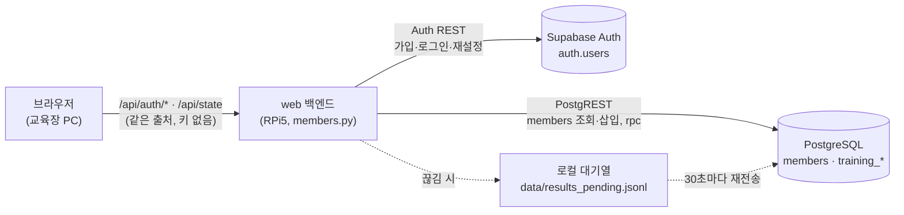
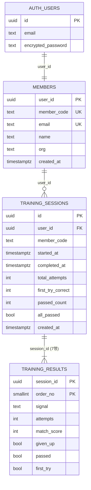

# DB 설계서 — 회원 · 학습 결과 (Supabase)

**팀명**: 심기일전 · **작성**: 이동혁 · **최초 작성**: 2026-09-30 · **버전** v1.6
**대상 코드**: `services/web/supabase/schema.sql`(스키마 원본) · `services/web/backend/members.py`(저장·인증) ·
`services/web/backend/state_machine.py`(저장 시점) · 설정 절차: [`services/web/supabase/README.md`](../services/web/supabase/README.md)

> **이 문서의 범위**: 학습자 회원 정보와 **회원별·수신호별 학습 결과(합격/불합격)** 를 어디에, 어떤 필드로, 언제, 어떻게 안전하게
> 저장하는가. KPI 측정용 시행 로그(판정 한 번 = CSV 1행)는 DB가 아니라 교육장 CSV다 — [판정 타이밍 스펙 §7](proposals/web_판정_타이밍_스펙.md).

---

## 0. 한눈에

| 질문 | 답 |
| --- | --- |
| 어디에 저장하나 | **Supabase**(PostgreSQL 15 + Auth). 키가 없으면 교육장 기기의 로컬 파일(로컬 모드) |
| 누가 DB에 접근하나 | **서버만** — 교육장 web 백엔드 + 회사 사이트 portal 백엔드(2026-09-30, 읽기 전용 조회 + 가입) — service_role 키. 브라우저는 DB에 직접 붙지 않는다 |
| 무엇을 저장하나 | 회원(회원코드·이메일·이름·소속), 학습 회차, **회차의 수신호 7종별 시도 횟수·일치율·합격 여부** |
| 무엇을 저장하지 않나 | 카메라 영상, 손 좌표, 판정 한 번 한 번의 기록(→ CSV), 비밀번호 원문(→ Supabase Auth가 해시로 보관) |
| 언제 저장하나 | 7종을 모두 마쳐 SC-05로 넘어가는 순간 1회 (자동) |
| 인터넷이 끊기면 | 로컬 대기열에 쌓았다가 30초마다 재전송. 같은 회차가 두 번 저장되지 않는다 |
| 연결 상태 (2026-09-30) | 팀 Supabase 프로젝트 연결 — 테이블 3개·뷰·`save_training_session`·`last_outcome`·`last_predicted` 열 확인(읽기만). 키는 루트 `.env`(git 제외) |
| SQL 실행 검증 (2026-09-30) | 실제 **PostgreSQL 16**(내장형, Supabase `auth`·역할 흉내)에서 `schema.sql` — 수정 전 버전 → 현재 버전 업그레이드 · 재실행 · web 실제 기록과 불합격(오답·시간 초과) 저장 · 중복 재전송 무시 · 합격 수 계산 · 뷰 · `anon` 차단 **전부 통과** — 근거: [15](15_개발로그.md) "2026-09-29 ~ 30 · vision web" 항목의 "(9/30 추가) 김지훈 `1fc35c5` 연동 확인 + SQL 첫 실제 실행", [12 §13-9](12_AI비전_진행보고서.md) |
| 교육장 ↔ 회사 사이트 실제 연동 (2026-10-04) | ✅ **송승호 실물 확인** — RPi5에 루트 `.env`를 두고, 회사 사이트에서 가입한 계정으로 교육장에서 7종 완료 → 회사 사이트 내 정보에 회차 기록·수료증 표시 정상([19 §8](19_회사웹사이트.md)) |

## 1. 구성



- 교육 스테이션은 1대 1이라 "지금 로그인한 학습자" 하나를 web 프로세스가 들고 있다(`members.current_member()`).
  브라우저에는 토큰·키가 없다.
- 회원 기록은 **교육을 시작한 학습자**(`/api/start` 시점)에게 저장된다 — 도중에 로그아웃·다른 사람 로그인이 있어도 섞이지 않는다.
- **(2026-09-30) 회사 사이트 `services/portal`** — 같은 DB에 붙는 두 번째 백엔드(RPi5 없이 회사 서버에서 상시 운영).
  회원가입·로그인·찾기는 web과 같은 `members.py` 저장소를 쓰고, 학습 기록은 **본인 행만 읽는다**(`list_sessions` =
  `training_sessions?user_id=eq.…&select=*,training_results(*)`). **스키마 변경 없음.** 여러 사람이 동시에 쓰므로 로그인은
  전역 학습자가 아니라 사람마다 서명된 쿠키다 — [services/portal/README.md](../services/portal/README.md).

## 2. 테이블



### 2-1. `members` — 회원 1명당 1행

| 필드 | 타입 | 제약 | 내용 |
| --- | --- | --- | --- |
| `user_id` | uuid | PK, → `auth.users(id)` 삭제 시 함께 삭제 | 로그인 계정 ID |
| `member_code` | text | UNIQUE, 기본값 | **회원코드 `SS-00001`** — 시퀀스 `member_code_seq`가 가입 순서대로 부여(동시 가입에도 겹치지 않음). 화면·안내 문구 표기는 **"사원 코드"**(2026-10-01 `faa3fa9`, 열 이름은 그대로) |
| `email` | text | UNIQUE | 이메일(소문자) — 로그인 아이디 |
| `name` | text | NOT NULL | 이름(최대 30자, 앱에서 검사) |
| `org` | text | | 소속(선택, 최대 50자) |
| `created_at` | timestamptz | 기본 now() | 가입 시각 |

### 2-2. `training_sessions` — 7종을 끝까지 학습한 1회차당 1행

| 필드 | 타입 | 내용 |
| --- | --- | --- |
| `id` | uuid PK | 회차 ID — **web이 만들어 보낸다**. 재전송해도 같은 ID라 한 번만 저장된다 |
| `user_id` | uuid → `members` | 학습한 회원 |
| `member_code` | text | 회원코드(조회 편의) |
| `started_at` | timestamptz | 교육 시작(`/api/start`) |
| `completed_at` | timestamptz | 7종 완료 |
| `total_attempts` | integer | 7종 시도 횟수 합 |
| `first_try_correct` | integer | 첫 시도에 합격한 수신호 수 |
| `passed_count` | integer | **합격한 수신호 수 (0~7)** — 저장 함수가 결과 행에서 계산 |
| `all_passed` | boolean | **7종 모두 합격** |
| `created_at` | timestamptz | DB 저장 시각(오프라인 대기 후 저장되면 완료 시각보다 늦다) |

### 2-3. `training_results` — 회차의 수신호 1종당 1행 (회차마다 7행)

| 필드 | 타입 | 내용 |
| --- | --- | --- |
| `session_id` | uuid → `training_sessions` | PK 일부 |
| `order_no` | smallint | 커리큘럼 순서 1~7, PK 일부 |
| `signal` | text | 정지 · 서행 · 좌회전_유도 · 우회전_유도 · 확인_완료 · 후진 · 주의 |
| `attempts` | integer | 이 수신호 시도 횟수(1~3) |
| `match_score` | integer | 일치율 0~100 = **분류기가 본 목표 수신호 확률 × 100**(05 §10-8). 불합격이면 마지막 시도의 값 |
| `given_up` | boolean | 시도 상한(3회)을 넘겨 다음으로 넘어갔는가 |
| **`last_outcome`** | text | **마지막 시도가 어떻게 끝났는가** — `correct` · `wrong` · `timeout`. §3의 불합격 두 사유("3회 모두 오답"과 "시간 초과")가 `given_up` 하나로는 구분되지 않아 추가(2026-09-30, 김지훈) |
| **`last_predicted`** | text | **마지막 시도에 인식된 수신호** — 틀렸을 때 학습자가 실제로 무엇을 한 것으로 읽혔는가. `좌회전_유도`↔`후진`·`우회전_유도`↔`주의`는 엄지 하나로 갈려(10_PRD §3.2) 이 값이 있어야 "무엇을 어떻게 틀렸는가"를 결과보고서에 쓸 수 있다. 미검출이거나 7종 분포 밖이면 빈 값이다(vision이 미판정 때 붙이는 출력 전용 라벨 `negative`는 저장하지 않는다). 시간 초과로 끝나면 마지막 프레임의 추정을 남기므로, τ 미달로 끝난 경우 목표 수신호 이름이 들어갈 수 있다. 자세는 맞았지만 확신이 부족했다는 뜻이다 |
| **`passed`** | boolean, **생성 열** | **합격 = `not given_up`** — DB가 계산하므로 `given_up`과 어긋날 수 없다 |
| `first_try` | boolean, 생성 열 | 첫 시도 합격 = `attempts = 1 and not given_up` |

## 3. 합격 · 불합격 기준

| 결과 | 조건 | 화면(SC-05) |
| --- | --- | --- |
| **합격** | 시도 상한 **3회 안에 정답** | 초록 "합격" |
| **불합격** | 3회 모두 오답 또는 시간 초과(판정 한 번 10초)로 다음 수신호로 넘어감 | 주황 "불합격" |

> **"3회 · 10초"는 어디서 정했나**: 2026-09-29 ⑥ web 전 구간 실물 재시험에서 시도 횟수 상한이 없어 검정이 끝나지 않는 결함이 나와,
> `MAX_ATTEMPTS_PER_SIGNAL`=3(최초 1회 + 재시도 2회)과 판정 제한시간 `JUDGING_TIMEOUT_S`=10초(넘기면 `timeout`도 시도 1회)를 넣었다 —
> 커밋 `cb8a25b`(실물 재검증 통과), [14 §7](14_web_구현보고서.md) 09-29 행·§2 SC-03b, [proposals/web_판정_타이밍_스펙.md](proposals/web_판정_타이밍_스펙.md) §6 완료 기준. DB의 합격 기준은 이 상한을 그대로 따른다.

**정답**의 조건은 모델 쪽에서 이미 엄격하다 — 목표 수신호 확률 ≥ τ(0.75), 소속 게이트 통과, 3프레임 연속(05 §10-6~10-9).
그래서 합격에 일치율 점수 기준을 따로 두지 않는다. 기준이 바뀌면 `training_results.passed`의 생성식 한 곳만 고친다.

## 4. 조회용 뷰 — `member_signal_status` (회원별 · 수신호별 합격 현황)

회원 한 명이 수신호마다 몇 번 합격·불합격했고 가장 최근 결과가 무엇인지 한 줄로 본다.

| 열 | 내용 |
| --- | --- |
| `member_code`, `name`, `signal` | 누구의 어떤 수신호인가 |
| `sessions` | 이 수신호를 학습한 회차 수 |
| `passed_sessions` · `failed_sessions` | 합격 · 불합격 회차 수 |
| `last_passed` | **가장 최근 회차의 합격 여부** |
| `last_completed_at` | 가장 최근 학습 시각 |
| `best_match_score` | 합격했을 때의 최고 일치율 |
| `ever_first_try` | 첫 시도에 합격한 적이 있는가 |

`security_invoker = true`로 만들어, 뷰를 통해 권한을 우회할 수 없다(anon·authenticated는 뷰도 조회 불가).

```sql
-- 한 회원의 수신호별 현황
select signal, sessions, passed_sessions, failed_sessions, last_passed, best_match_score
from member_signal_status where member_code = 'SS-00001' order by signal;

-- 수신호별로 불합격이 많은 순 (교육 내용 보완용)
select signal, sum(failed_sessions) as fails, sum(sessions) as total
from member_signal_status group by signal order by fails desc;
```

## 5. 저장 흐름

| 시점 | 무엇을 | 코드 |
| --- | --- | --- |
| 회원가입 | Auth 관리자 API로 **인증 완료 계정** 생성(교육장에서 인증 메일을 볼 수 없으므로) → `members` 행 삽입(회원코드 부여). 회원 행을 못 만들면 Auth 계정을 되돌린다 | `SupabaseStore.signup` |
| 로그인 | Auth 비밀번호 로그인 → `members` 조회(없으면 만들어 채움) | `SupabaseStore.login` |
| `/api/start` | 이 회차의 학습자를 고정 | `state_machine.start` |
| 7종 완료(SC-05 진입) | `rpc/save_training_session` **한 번** — 회차 1행 + 결과 7행 + 합격 수 계산을 **한 트랜잭션**으로 | `members.save_session_results` |
| 끊김(연결·타임아웃·5xx) | `data/results_pending.jsonl`에 쌓고 30초마다 재전송. SC-05에 "연결되면 자동 저장" | `flush_pending` |
| 거부(4xx) | `data/results_rejected.jsonl`에 오류와 함께 보관(보통 `schema.sql` 미실행) | 〃 |
| 게스트 · 로컬 모드 | 회원 DB에 올리지 않고 `data/results_local.jsonl`에만 | 〃 |
| (회사 사이트) 내 정보 · 수료증 | **읽기만** — 본인 회차와 수신호 결과. 7종 전 과정을 마친 회차가 있으면 수료 | `SupabaseStore.list_sessions` · `services/portal` |

## 6. 보안

### 6-1. 접근 경로와 키

- **브라우저는 Supabase에 직접 접근하지 않는다.** 화면 코드에는 URL·키가 없고, 모든 호출은 web 백엔드를 거친다.
- **service_role 키는 RPi5 환경변수에만** 둔다(git·화면·로그에 나오지 않는다). anon/publishable 키를 잘못 넣으면 기동 때 오류 로그로 알린다.
- **RLS를 켜고 anon·authenticated에는 권한을 주지 않는다**(테이블·뷰·함수 모두 revoke). service_role만 RLS를 우회한다.
  anon 키가 새어도 아무것도 읽을 수 없다.
- 저장 함수는 `set search_path = public`으로 고정했다(다른 스키마의 같은 이름 객체로 바꿔치기 방지 — Supabase 보안 권고).

### 6-2. 계정 보호

| 위협 | 대응 | 코드 |
| --- | --- | --- |
| 비밀번호 무차별 대입 | 로그인 실패 **5회/10분 → 그 이메일·접속 주소를 10분 잠금** | `LOGIN_LIMIT` |
| 약한 비밀번호 | **8자 이상 + 영문과 숫자 포함**, 최대 72자 (화면·서버 둘 다 검사) | `_validate_password` |
| 가입 여부 캐내기 | 로그인 실패는 "이메일 또는 비밀번호가 맞지 않습니다" 하나로. 비밀번호 찾기는 **가입 여부와 관계없이 같은 안내** | `password_request` |
| 인증 코드 추측 | 코드 입력 실패 5회/10분 잠금, 코드 요청 3회/10분 제한(메일 발송 남용 방지) | `VERIFY_LIMIT` · `RESET_LIMIT` |
| 아이디 찾기 남용 | 이름 + 회원코드가 **둘 다** 맞아야 하고, **가린 이메일**(k***@example.com)만 보여 준다. 10회/10분 제한 | `find_id` |
| 큰 입력으로 서버 괴롭히기 | 요청 본문 길이 상한(Pydantic), 화면 입력 `maxlength` | `SignupBody` 등 |
| 공용 PC에 로그인이 남음 | 교육 중이 아닐 때 **5분 입력이 없으면 자동 로그아웃**, 끝내기 = 로그아웃. 교육 화면(SC-03·SC-04)에서는 입력이 없어도 활동으로 보고 5분은 교육이 끝난 뒤부터 센다(2026-10-01 `faa3fa9` — micro:bit A로만 확인하면 SC-05에 들어가자마자 로그아웃돼 결과표·수료증을 못 보던 결함) | `main.js` |

### 6-3. 웹 화면

- **보안 헤더**(모든 응답): `Content-Security-Policy`(같은 출처 스크립트만, 외부 프레임 금지 `frame-ancestors 'none'`),
  `X-Frame-Options: DENY`, `X-Content-Type-Options: nosniff`, `Referrer-Policy: no-referrer`, `Permissions-Policy`.
  `/api/*` 응답은 `Cache-Control: no-store`(회원 정보가 브라우저 캐시에 남지 않게).
- 화면에 넣는 문자열은 모두 이스케이프한다(`main.js` `esc`) — 이름 칸에 HTML을 넣어도 실행되지 않는다.
- 화면으로 내보내는 회원 정보(`/api/state`·`/api/auth/*`의 `member`)는 `member_code`·`name`·`org`·`guest`만이다 — **이메일은 넣지 않는다**
  (2026-10-01 `faa3fa9`). `/api/state`는 인증 없이 0.4초마다 나가서 같은 망의 누구나 지금 학습자의 이메일을 읽을 수 있었다.
  회사 사이트 `/api/me`는 본인 쿠키로만 자기 이메일을 받는다.
- CORS는 설정하지 않는다(같은 출처만).

### 6-4. 한계 (알고 쓰기)

- **교육장 LAN은 HTTP다.** PC ↔ RPi5 구간에서 로그인 비밀번호가 암호화되지 않는다(RPi5 ↔ Supabase 구간은 HTTPS).
  시연처럼 직결 케이블·폐쇄망이면 위험이 작지만, 공용망에 둔다면 `uvicorn --ssl-keyfile/--ssl-certfile`로 HTTPS를 켠다.
- 시도 제한은 web 프로세스 메모리에 있다 — web을 재시작하면 초기화된다(스테이션 1대 전제).
- 로컬 모드 회원 파일은 scrypt 해시 + 권한 600(POSIX)이지만, 기기를 가진 사람은 읽을 수 있다 — 개발·리허설용이다.

### 6-5. 대기열 파일 손상 (2026-10-01 `faa3fa9`)

- `data/*.jsonl`에서 **깨진 줄**(저장 중 전원이 끊겨 반쪽만 남은 끝 줄, JSON 객체가 아닌 줄)은 건너뛰고 `<파일>.bad`에 덧붙여 옮긴 뒤,
  원래 파일을 정상 줄만으로 다시 쓴다(오류 로그를 남긴다). 예전에는 한 줄이 깨지면 오류가 `/api/state`까지 올라가, 파일을 지우기
  전에는 재시작해도 교육 화면 전체가 500으로 멈췄다.
- 대기 건수(`store.pending`)는 처음 한 번만 파일에서 세고 이후는 **메모리 카운터**로 답한다 — `/api/state`가 0.4초마다 묻는 값이라
  매번 파일을 읽지 않는다. 대기열을 바꾸는 쓰기·재작성 때 함께 고친다.
- `/api/state`는 회원 저장 상태를 못 읽어도 500을 내지 않는다(`_store_status_safe` → `{"backend": "unknown", "pending": null, "last_save": null}`).

## 7. 아이디 · 비밀번호 찾기

| 기능 | 흐름 |
| --- | --- |
| **아이디(이메일) 찾기** | 이름 + 회원코드(`SS-00001`) → 둘 다 맞으면 **가린 이메일** 표시 |
| **비밀번호 찾기** | ① 이메일 입력 → Supabase Auth가 **6자리 인증 코드 메일** 발송 ② 교육장 화면에 코드 + 새 비밀번호 → `verify(type=recovery)` 확인 뒤 비밀번호 변경 → 새 비밀번호로 로그인 |

- **메일 속 링크 대신 코드 방식인 이유**: 링크는 사용자가 휴대폰에서 열게 되는데, 교육장 서버는 인터넷 밖에서 열리지 않는다.
  코드는 휴대폰에서 읽고 교육장 화면에 입력하면 끝난다.
- **Supabase 설정 필요**: Auth → Email Templates → *Reset Password* 본문에 `{{ .Token }}`(6자리 코드)을 넣는다. 기본 메일 발송은
  시간당 몇 통으로 제한되므로 실제 운영은 SMTP를 연결한다(`supabase/README.md` §1).
- **로컬 모드**: 메일을 보낼 수 없어 코드를 **서버 로그에만** 찍는다(개발·리허설용, 10분 유효, 한 번만 사용).

## 8. 로컬 모드 · 파일

| 파일 (`services/web/data/`, git 제외) | 내용 |
| --- | --- |
| `members_local.json` | 로컬 모드 회원(회원코드·이메일·이름·소속·scrypt 해시) |
| `results_local.jsonl` | 로컬 모드·게스트 결과 (회차 1줄, 수신호별 `passed` 포함) |
| `results_pending.jsonl` | Supabase 전송 대기열 |
| `results_rejected.jsonl` | Supabase가 거부한 결과(원인 확인용) |
| `<위 파일>.bad` | 읽다가 걸러 낸 깨진 줄(원인 확인용, 2026-10-01 — §6-5) |

## 9. 개인정보 · 보관

- 저장하는 개인정보: 이메일 · 이름 · 소속(선택). 비밀번호는 원문이 아니라 Supabase Auth가 해시로만 보관한다. 학습 결과는 회원코드(화면 표기 "사원 코드")로 묶인다.
- 영상·손 좌표는 저장하지 않는다(라이브 영상은 교육장 안에서만 흐른다).
- **보관 기한**: §9-1 양식의 보관 기간 칸(발표 2026-10-12 후 [ N ]일, 팀 결정 대기)에 적은 날짜까지 보관하고, 그날 Supabase 프로젝트의 회원·기록을 지우거나
  프로젝트를 삭제한다. 그 전이라도 본인이 요청하면 지운다(§9-1 "삭제 요청·문의"). (2026-10-04: 예전 문구 "시연·평가가 끝나면 지운다"를 §9-1 양식과 맞춤)
- **게스트·로컬 모드 결과**(`results_local.jsonl`, §8)는 교육장 기기에만 남는다. 시연 뒤 지울지는 §9-1 "정해서 채울 것" 표의 "게스트 결과 삭제" 칸에서 정한다(③ 참관자 안내 문구는 "시연이 끝나면 지웁니다").
- `service_role` 키가 새면 즉시 재발급한다.

### 9-1. 개인정보 수집·이용 안내 양식 (초안, 2026-10-04)

가입 화면(교육장 web 회원가입, 회사 사이트 `#/signup`)에 띄울 문구다. **`[ ]` 칸은 팀이 정해서 채운다**(보관 기한·삭제 담당·연락처).
화면에 넣는 작업은 별도다(08 "회사 사이트 공개" 행).

**① 가입 화면 전문 (펼쳐 보기)**

> **개인정보 수집·이용 안내**
>
> SafeSign 교육 키트(팀 심기일전)는 회원 가입과 교육 기록을 위해 아래와 같이 개인정보를 수집·이용합니다.
>
> | 항목 | 내용 |
> | --- | --- |
> | 수집 항목 | (필수) 이메일, 이름, 비밀번호 · (선택) 소속 · (교육 중 자동 생성) 사원 코드, 교육 회차별 수신호 7종의 시도 횟수·일치율·합격 여부 |
> | 수집·이용 목적 | 회원 확인과 로그인, 교육 결과 기록·조회, 수료증 발급·재발급 |
> | 보관 기간 | **[ 2026-10-__ ]까지** (프로젝트 발표 2026-10-12 후 [ N ]일). 기간이 지나면 지체 없이 삭제합니다 |
> | 저장 위치 | 클라우드 데이터베이스 Supabase([ 서버 지역 ]). 비밀번호는 원문이 아니라 암호화(해시)된 값으로만 저장합니다 |
> | 저장하지 않는 것 | 카메라 영상과 손 관절 좌표는 저장하지 않습니다. 화면의 라이브 영상은 교육장 안에서만 보입니다 |
> | 동의 거부 | 동의하지 않을 수 있습니다. 동의하지 않으면 가입 없이 **게스트로 교육을 체험**할 수 있지만, 교육 기록 저장과 회사 사이트 수료증 재발급은 이용할 수 없습니다 |
> | 삭제 요청·문의 | [ 담당자 이름 ] · [ 연락처(이메일) ] — 보관 기간 전이라도 요청하면 삭제합니다 |
>
> ☐ 위 내용을 확인했으며 개인정보 수집·이용에 동의합니다. **(필수)**

**② 화면이 좁을 때 쓰는 요약본 (체크박스 옆 한 줄 + "자세히" 링크로 ①)**

> ☐ (필수) 이메일·이름·비밀번호를 회원 확인과 교육 기록·수료증 발급에 쓰며, **[ 2026-10-__ ]**에 삭제합니다. 영상은 저장하지 않습니다. [자세히]

**③ 시연·발표 참관자 안내 (10-12 체험용, 화면 옆 안내문)**

> 체험은 **로그인 없이 "게스트로 시작"**으로 하실 수 있습니다. 게스트 체험은 이름·이메일을 받지 않고, 결과는 이 기기 안에만 남았다가 시연이 끝나면 지웁니다.
> 수료 기록을 남기고 싶으신 분만 회원 가입해 주세요(가입 시 위 안내에 동의가 필요합니다).

**정해서 채울 것**

| 칸 | 정할 내용 | 비고 |
| --- | --- | --- |
| 보관 기한 | 삭제 날짜(예: 발표 후 7일) | 이 날짜에 Supabase 회원·기록 삭제 또는 프로젝트 삭제(위 §9) |
| 삭제 담당·연락처 | 담당자 1명과 이메일 | Supabase 키 관리(이동혁) 또는 회사 사이트 수정 담당(김지훈) 중 지정 |
| 서버 지역 | Supabase 프로젝트의 리전 | Supabase 대시보드 Project Settings에서 확인 |
| 게스트 결과 삭제 | 시연 뒤 교육장 기기의 `results_local.jsonl` 삭제 여부 | ③ 문구와 맞출 것 |

## 10. 변경 이력

| 버전 | 날짜 | 내용 |
| --- | --- | --- |
| v1.6 | 2026-10-04 | 근거 보강 — §0 SQL 실행 검증(PostgreSQL 16)의 근거 위치(15 9/30 항목·12 §13-9) 링크, §0에 **교육장 ↔ 회사 사이트 실제 연동 실물 확인**(2026-10-04 송승호, 19 §8) 행. §3 합격 기준 "3회·10초"의 결정 출처(`cb8a25b`, 14 §7, 판정 타이밍 스펙). §9 보관·삭제 문구를 §9-1 양식(보관 기간 칸·삭제 요청·게스트 결과)과 맞춤. 스키마 변경 없음(송승호) |
| v1.6 | 2026-10-04 | §2-3 `last_predicted` 정의를 코드와 맞춤(김지훈) — 시간 초과 때 `negative`가 저장되던 것을 빈 값으로(`state_machine.py`), τ 미달 시간 초과는 목표 수신호 이름을 남긴다는 뜻을 명시. 회귀 테스트 2건 (`test_state_machine.py`). 스키마 변경 없음. 08 2026-10-02 신규 행 해결 |
| v1.5 | 2026-10-04 | 10-01 web 결함 수정(`faa3fa9`) 반영 — §2-1 화면 표기 "사원 코드", §6-2 교육 중 자동 로그아웃 정지, §6-3 `member`에서 이메일 제거, **§6-5 대기열 파일 손상**(깨진 줄 `.bad` 격리·대기 건수 메모리 카운터·`_store_status_safe`), §8 `.bad` 파일. 스키마 변경 없음(송승호) |
| v1.4 | 2026-10-04 | §9-1 개인정보 수집·이용 안내 양식 초안 추가(가입 화면 전문·요약본·참관자 게스트 안내) — 보관 기한·삭제 담당·서버 지역은 빈칸, 화면 반영은 별도(송승호) |
| v1.3 | 2026-09-30 | §0에 연결 상태·SQL 실행 검증(PostgreSQL 16) 추가, 키는 루트 `.env`(이동혁). 회사 사이트 상세는 [19_회사웹사이트](19_회사웹사이트.md) |
| v1.2 | 2026-09-30 | 회사 사이트(`services/portal`) 연결 — §1·§5에 읽기 전용 조회 추가(이동혁). 스키마 변경 없음 |
| v1.1 | 2026-09-30 | §2-3에 `last_outcome`·`last_predicted` 추가(김지훈) — 불합격 사유 구분과 오인식 수신호 기록. `schema.sql`(신규 열 + `alter ... if not exists` + 저장 함수), `state_machine.py` 회차 기록·전송 payload, web 테스트 2건 기대값 갱신. 기존 행은 빈 값으로 남는다 |
| v1.0 | 2026-09-30 | 최초 작성 — 테이블 3개 + 합격/불합격(`passed`·`first_try` 생성 열, `passed_count`·`all_passed`), 뷰 `member_signal_status`, 보안(시도 제한·비밀번호 규칙·보안 헤더·키 점검·자동 로그아웃), 아이디·비밀번호 찾기 |
