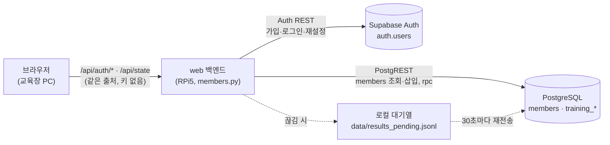
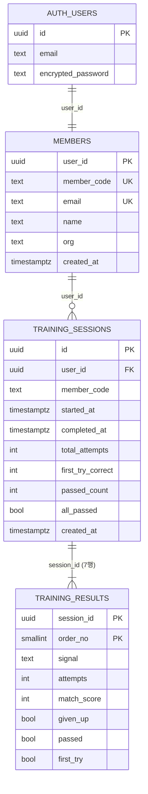

# DB 설계서 — 회원 · 학습 결과 (Supabase)

**팀명**: 심기일전 · **작성**: 이동혁 · **최초 작성**: 2026-09-30 · **버전** v1.0
**대상 코드**: `services/web/supabase/schema.sql`(스키마 원본) · `services/web/backend/members.py`(저장·인증) ·
`services/web/backend/state_machine.py`(저장 시점) · 설정 절차: [`services/web/supabase/README.md`](../services/web/supabase/README.md)

> **이 문서의 범위**: 학습자 회원 정보와 **회원별·수신호별 학습 결과(합격/불합격)** 를 어디에, 어떤 필드로, 언제, 어떻게 안전하게
> 저장하는가. KPI 측정용 시행 로그(판정 한 번 = CSV 1행)는 DB가 아니라 교육장 CSV다 — [판정 타이밍 스펙 §7](proposals/web_판정_타이밍_스펙.md).

---

## 0. 한눈에

| 질문 | 답 |
| --- | --- |
| 어디에 저장하나 | **Supabase**(PostgreSQL 15 + Auth). 키가 없으면 교육장 기기의 로컬 파일(로컬 모드) |
| 누가 DB에 접근하나 | **web 백엔드만** (service_role 키). 브라우저는 DB에 직접 붙지 않는다 |
| 무엇을 저장하나 | 회원(회원코드·이메일·이름·소속), 학습 회차, **회차의 수신호 7종별 시도 횟수·일치율·합격 여부** |
| 무엇을 저장하지 않나 | 카메라 영상, 손 좌표, 판정 한 번 한 번의 기록(→ CSV), 비밀번호 원문(→ Supabase Auth가 해시로 보관) |
| 언제 저장하나 | 7종을 모두 마쳐 SC-05로 넘어가는 순간 1회 (자동) |
| 인터넷이 끊기면 | 로컬 대기열에 쌓았다가 30초마다 재전송. 같은 회차가 두 번 저장되지 않는다 |

## 1. 구성



- 교육 스테이션은 1대 1이라 "지금 로그인한 학습자" 하나를 web 프로세스가 들고 있다(`members.current_member()`).
  브라우저에는 토큰·키가 없다.
- 회원 기록은 **교육을 시작한 학습자**(`/api/start` 시점)에게 저장된다 — 도중에 로그아웃·다른 사람 로그인이 있어도 섞이지 않는다.

## 2. 테이블



### 2-1. `members` — 회원 1명당 1행

| 필드 | 타입 | 제약 | 내용 |
| --- | --- | --- | --- |
| `user_id` | uuid | PK, → `auth.users(id)` 삭제 시 함께 삭제 | 로그인 계정 ID |
| `member_code` | text | UNIQUE, 기본값 | **회원코드 `SS-00001`** — 시퀀스 `member_code_seq`가 가입 순서대로 부여(동시 가입에도 겹치지 않음) |
| `email` | text | UNIQUE | 이메일(소문자) — 로그인 아이디 |
| `name` | text | NOT NULL | 이름(최대 30자, 앱에서 검사) |
| `org` | text | | 소속(선택, 최대 50자) |
| `created_at` | timestamptz | 기본 now() | 가입 시각 |

### 2-2. `training_sessions` — 7종을 끝까지 학습한 1회차당 1행

| 필드 | 타입 | 내용 |
| --- | --- | --- |
| `id` | uuid PK | 회차 ID — **web이 만들어 보낸다**. 재전송해도 같은 ID라 한 번만 저장된다 |
| `user_id` | uuid → `members` | 학습한 회원 |
| `member_code` | text | 회원코드(조회 편의) |
| `started_at` | timestamptz | 교육 시작(`/api/start`) |
| `completed_at` | timestamptz | 7종 완료 |
| `total_attempts` | integer | 7종 시도 횟수 합 |
| `first_try_correct` | integer | 첫 시도에 합격한 수신호 수 |
| `passed_count` | integer | **합격한 수신호 수 (0~7)** — 저장 함수가 결과 행에서 계산 |
| `all_passed` | boolean | **7종 모두 합격** |
| `created_at` | timestamptz | DB 저장 시각(오프라인 대기 후 저장되면 완료 시각보다 늦다) |

### 2-3. `training_results` — 회차의 수신호 1종당 1행 (회차마다 7행)

| 필드 | 타입 | 내용 |
| --- | --- | --- |
| `session_id` | uuid → `training_sessions` | PK 일부 |
| `order_no` | smallint | 커리큘럼 순서 1~7, PK 일부 |
| `signal` | text | 정지 · 서행 · 좌회전_유도 · 우회전_유도 · 확인_완료 · 후진 · 주의 |
| `attempts` | integer | 이 수신호 시도 횟수(1~3) |
| `match_score` | integer | 일치율 0~100 = **분류기가 본 목표 수신호 확률 × 100**(05 §10-8). 불합격이면 마지막 시도의 값 |
| `given_up` | boolean | 시도 상한(3회)을 넘겨 다음으로 넘어갔는가 |
| **`passed`** | boolean, **생성 열** | **합격 = `not given_up`** — DB가 계산하므로 `given_up`과 어긋날 수 없다 |
| `first_try` | boolean, 생성 열 | 첫 시도 합격 = `attempts = 1 and not given_up` |

## 3. 합격 · 불합격 기준

| 결과 | 조건 | 화면(SC-05) |
| --- | --- | --- |
| **합격** | 시도 상한 **3회 안에 정답** | 초록 "합격" |
| **불합격** | 3회 모두 오답 또는 시간 초과(판정 한 번 10초)로 다음 수신호로 넘어감 | 주황 "불합격" |

**정답**의 조건은 모델 쪽에서 이미 엄격하다 — 목표 수신호 확률 ≥ τ(0.75), 소속 게이트 통과, 3프레임 연속(05 §10-6~10-9).
그래서 합격에 일치율 점수 기준을 따로 두지 않는다. 기준이 바뀌면 `training_results.passed`의 생성식 한 곳만 고친다.

## 4. 조회용 뷰 — `member_signal_status` (회원별 · 수신호별 합격 현황)

회원 한 명이 수신호마다 몇 번 합격·불합격했고 가장 최근 결과가 무엇인지 한 줄로 본다.

| 열 | 내용 |
| --- | --- |
| `member_code`, `name`, `signal` | 누구의 어떤 수신호인가 |
| `sessions` | 이 수신호를 학습한 회차 수 |
| `passed_sessions` · `failed_sessions` | 합격 · 불합격 회차 수 |
| `last_passed` | **가장 최근 회차의 합격 여부** |
| `last_completed_at` | 가장 최근 학습 시각 |
| `best_match_score` | 합격했을 때의 최고 일치율 |
| `ever_first_try` | 첫 시도에 합격한 적이 있는가 |

`security_invoker = true`로 만들어, 뷰를 통해 권한을 우회할 수 없다(anon·authenticated는 뷰도 조회 불가).

```sql
-- 한 회원의 수신호별 현황
select signal, sessions, passed_sessions, failed_sessions, last_passed, best_match_score
from member_signal_status where member_code = 'SS-00001' order by signal;

-- 수신호별로 불합격이 많은 순 (교육 내용 보완용)
select signal, sum(failed_sessions) as fails, sum(sessions) as total
from member_signal_status group by signal order by fails desc;
```

## 5. 저장 흐름

| 시점 | 무엇을 | 코드 |
| --- | --- | --- |
| 회원가입 | Auth 관리자 API로 **인증 완료 계정** 생성(교육장에서 인증 메일을 볼 수 없으므로) → `members` 행 삽입(회원코드 부여). 회원 행을 못 만들면 Auth 계정을 되돌린다 | `SupabaseStore.signup` |
| 로그인 | Auth 비밀번호 로그인 → `members` 조회(없으면 만들어 채움) | `SupabaseStore.login` |
| `/api/start` | 이 회차의 학습자를 고정 | `state_machine.start` |
| 7종 완료(SC-05 진입) | `rpc/save_training_session` **한 번** — 회차 1행 + 결과 7행 + 합격 수 계산을 **한 트랜잭션**으로 | `members.save_session_results` |
| 끊김(연결·타임아웃·5xx) | `data/results_pending.jsonl`에 쌓고 30초마다 재전송. SC-05에 "연결되면 자동 저장" | `flush_pending` |
| 거부(4xx) | `data/results_rejected.jsonl`에 오류와 함께 보관(보통 `schema.sql` 미실행) | 〃 |
| 게스트 · 로컬 모드 | 회원 DB에 올리지 않고 `data/results_local.jsonl`에만 | 〃 |

## 6. 보안

### 6-1. 접근 경로와 키

- **브라우저는 Supabase에 직접 접근하지 않는다.** 화면 코드에는 URL·키가 없고, 모든 호출은 web 백엔드를 거친다.
- **service_role 키는 RPi5 환경변수에만** 둔다(git·화면·로그에 나오지 않는다). anon/publishable 키를 잘못 넣으면 기동 때 오류 로그로 알린다.
- **RLS를 켜고 anon·authenticated에는 권한을 주지 않는다**(테이블·뷰·함수 모두 revoke). service_role만 RLS를 우회한다.
  anon 키가 새어도 아무것도 읽을 수 없다.
- 저장 함수는 `set search_path = public`으로 고정했다(다른 스키마의 같은 이름 객체로 바꿔치기 방지 — Supabase 보안 권고).

### 6-2. 계정 보호

| 위협 | 대응 | 코드 |
| --- | --- | --- |
| 비밀번호 무차별 대입 | 로그인 실패 **5회/10분 → 그 이메일·접속 주소를 10분 잠금** | `LOGIN_LIMIT` |
| 약한 비밀번호 | **8자 이상 + 영문과 숫자 포함**, 최대 72자 (화면·서버 둘 다 검사) | `_validate_password` |
| 가입 여부 캐내기 | 로그인 실패는 "이메일 또는 비밀번호가 맞지 않습니다" 하나로. 비밀번호 찾기는 **가입 여부와 관계없이 같은 안내** | `password_request` |
| 인증 코드 추측 | 코드 입력 실패 5회/10분 잠금, 코드 요청 3회/10분 제한(메일 발송 남용 방지) | `VERIFY_LIMIT` · `RESET_LIMIT` |
| 아이디 찾기 남용 | 이름 + 회원코드가 **둘 다** 맞아야 하고, **가린 이메일**(k***@example.com)만 보여 준다. 10회/10분 제한 | `find_id` |
| 큰 입력으로 서버 괴롭히기 | 요청 본문 길이 상한(Pydantic), 화면 입력 `maxlength` | `SignupBody` 등 |
| 공용 PC에 로그인이 남음 | 교육 중이 아닐 때 **5분 입력이 없으면 자동 로그아웃**, 끝내기 = 로그아웃 | `main.js` |

### 6-3. 웹 화면

- **보안 헤더**(모든 응답): `Content-Security-Policy`(같은 출처 스크립트만, 외부 프레임 금지 `frame-ancestors 'none'`),
  `X-Frame-Options: DENY`, `X-Content-Type-Options: nosniff`, `Referrer-Policy: no-referrer`, `Permissions-Policy`.
  `/api/*` 응답은 `Cache-Control: no-store`(회원 정보가 브라우저 캐시에 남지 않게).
- 화면에 넣는 문자열은 모두 이스케이프한다(`main.js` `esc`) — 이름 칸에 HTML을 넣어도 실행되지 않는다.
- CORS는 설정하지 않는다(같은 출처만).

### 6-4. 한계 (알고 쓰기)

- **교육장 LAN은 HTTP다.** PC ↔ RPi5 구간에서 로그인 비밀번호가 암호화되지 않는다(RPi5 ↔ Supabase 구간은 HTTPS).
  시연처럼 직결 케이블·폐쇄망이면 위험이 작지만, 공용망에 둔다면 `uvicorn --ssl-keyfile/--ssl-certfile`로 HTTPS를 켠다.
- 시도 제한은 web 프로세스 메모리에 있다 — web을 재시작하면 초기화된다(스테이션 1대 전제).
- 로컬 모드 회원 파일은 scrypt 해시 + 권한 600(POSIX)이지만, 기기를 가진 사람은 읽을 수 있다 — 개발·리허설용이다.

## 7. 아이디 · 비밀번호 찾기

| 기능 | 흐름 |
| --- | --- |
| **아이디(이메일) 찾기** | 이름 + 회원코드(`SS-00001`) → 둘 다 맞으면 **가린 이메일** 표시 |
| **비밀번호 찾기** | ① 이메일 입력 → Supabase Auth가 **6자리 인증 코드 메일** 발송 ② 교육장 화면에 코드 + 새 비밀번호 → `verify(type=recovery)` 확인 뒤 비밀번호 변경 → 새 비밀번호로 로그인 |

- **메일 속 링크 대신 코드 방식인 이유**: 링크는 사용자가 휴대폰에서 열게 되는데, 교육장 서버는 인터넷 밖에서 열리지 않는다.
  코드는 휴대폰에서 읽고 교육장 화면에 입력하면 끝난다.
- **Supabase 설정 필요**: Auth → Email Templates → *Reset Password* 본문에 `{{ .Token }}`(6자리 코드)을 넣는다. 기본 메일 발송은
  시간당 몇 통으로 제한되므로 실제 운영은 SMTP를 연결한다(`supabase/README.md` §1).
- **로컬 모드**: 메일을 보낼 수 없어 코드를 **서버 로그에만** 찍는다(개발·리허설용, 10분 유효, 한 번만 사용).

## 8. 로컬 모드 · 파일

| 파일 (`services/web/data/`, git 제외) | 내용 |
| --- | --- |
| `members_local.json` | 로컬 모드 회원(회원코드·이메일·이름·소속·scrypt 해시) |
| `results_local.jsonl` | 로컬 모드·게스트 결과 (회차 1줄, 수신호별 `passed` 포함) |
| `results_pending.jsonl` | Supabase 전송 대기열 |
| `results_rejected.jsonl` | Supabase가 거부한 결과(원인 확인용) |

## 9. 개인정보 · 보관

- 저장하는 개인정보: 이메일 · 이름 · 소속. 학습 결과는 회원코드로 묶인다.
- 영상·손 좌표는 저장하지 않는다(라이브 영상은 교육장 안에서만 흐른다).
- 시연·평가가 끝나면 Supabase 프로젝트의 회원·기록을 지우거나 프로젝트를 삭제한다. `service_role` 키가 새면 즉시 재발급한다.

## 10. 변경 이력

| 버전 | 날짜 | 내용 |
| --- | --- | --- |
| v1.0 | 2026-09-30 | 최초 작성 — 테이블 3개 + 합격/불합격(`passed`·`first_try` 생성 열, `passed_count`·`all_passed`), 뷰 `member_signal_status`, 보안(시도 제한·비밀번호 규칙·보안 헤더·키 점검·자동 로그아웃), 아이디·비밀번호 찾기 |
