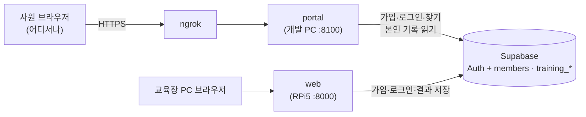

# 회사 웹사이트 구현 보고서 (v1.0)

**팀명**: 심기일전 · **작성**: 이동혁 · **작성일**: 2026-09-30 · **대상**: `services/portal` (커밋 `82f157c`)

> 교육장 키트 화면(`services/web`, RPi5)과 **같은 회원 DB**를 쓰는 두 번째 웹사이트다. 운영 절차의 단일 출처는
> [services/portal/README.md](../services/portal/README.md), DB 구조는 [18_DB설계서](18_DB설계서.md), 교육장 화면은 [14_web_구현보고서](14_web_구현보고서.md).

## 0. 한눈에

| 질문 | 답 |
| --- | --- |
| 무엇인가 | 가상 기업 **주식회사 심기일전**의 회사 사이트 — 회사·제품·교육 과정·검증 결과 소개 + 사원 계정(가입·로그인·찾기) + **내 정보·수료 여부·수료증** |
| 왜 만들었나 | 회원가입이 교육장 web에서만 돼서, 사원 정보를 DB에 넣으려면 **RPi5를 켜야** 했다. 이 사이트로 각자 미리 가입해 두고 시연에서 쓴다 |
| 어디서 도나 | 개발 PC에서 띄우고 **ngrok으로 외부 HTTPS 주소**를 붙인다(2026-09-30 결정). RPi5·카메라가 없어도 된다 |
| DB | 교육장과 **같은 Supabase 프로젝트**. **스키마 변경 없음** — 쓰기는 회원가입뿐, 학습 기록은 본인 것만 읽는다 |
| 카메라 | **받지 않는다.** 교육(시범·판정)은 교육장 키트에서만 한다 |
| 가입한 계정은 | 교육장 키트에서 그대로 로그인된다(같은 Auth·`members`). 교육장에서 마친 결과가 이 사이트 내 정보에 뜬다 |

## 1. 구성



| 부분 | 파일 | 내용 |
| --- | --- | --- |
| 백엔드 | `app/main.py` | FastAPI. 쿠키 세션, CSRF 헤더 검사, 보안 헤더, `/api/auth/*` · `/api/session` · `/api/me` · `/health` · `/health/db` |
| 회원 저장소 | `services/web/backend/members.py` (공유) | 교육장과 **같은 코드** — `LocalStore`·`SupabaseStore`의 가입·로그인·찾기·재설정. 조회용 `get_member`·`list_sessions`·`ping`만 추가(읽기 전용) |
| 화면 | `frontend/index.html` · `portal.css` · `portal.js` | 바닐라 JS, `#/경로`로 화면 전환 |
| 수료증 | `frontend/cert.js` | 교육장 수료증(`web/frontend/main.js drawCertificate`)과 같은 디자인 — 사람·회차를 인자로 받는다 |
| 비밀 키 | 저장소 루트 `.env` (git 제외) | `SUPABASE_URL` · `SUPABASE_SERVICE_ROLE_KEY` · `PORTAL_SESSION_SECRET`. web·portal이 시작할 때 읽는다(`members._load_dotenv`, 셸 값 우선, **테스트는 안 읽음**) |

## 2. 화면

| 경로 | 화면 | 내용 |
| --- | --- | --- |
| `#/` | 홈 | 첫 화면(시스템 구성도: 학습자 손 → RPi5 → AI Hand·micro:bit·picar, 회원 DB), 요약 숫자, **제품**(시범 → 따라 하기 → 판정 → 피드백, 장치 3종), **교육 과정 7종**(손가락 패턴·AI Hand 시범·picar 동작·출처), **검증 결과**(최종 KPI 5개 — 목표선 막대·95% 신뢰구간, 05 §7-3), **회사**(사업 분야·연혁), **문의**. 메뉴는 `#/product` 등으로 해당 절로 이동 |
| `#/login` · `#/signup` · `#/find-id` · `#/reset` · `#/reset-confirm` | 사원 계정 | 교육장 SC-AUTH와 같은 입력·규칙. 가입하면 사원 코드(SS-00001) 발급 후 내 정보로 |
| `#/me` | 내 정보 | 계정(이름·사원 코드·이메일·소속·가입일), **수료 상태**(수료 완료 · 처음 수료 일시 / 미수료 안내), 교육 이력(회차별 합격 수·총 시도·첫 시도 정답), **수신호별 결과**(합격·시도·일치율 막대·**마지막 시도**: 정답 / 오답 · 인식: ○○ / 시간 초과) |
| `#/certificate/<회차 id>` | 수료증 | 7종을 마친 회차만. 수료 일시 = 교육을 마친 시각, 발급 일시 = 오늘. 이미지 저장 · 인쇄 |

**"마지막 시도"** 는 김지훈이 추가한 `training_results.last_outcome` · `last_predicted`(18 §2-3)를 쓴다. `last_predicted`가
`negative`(판정 보류)면 인식 수신호를 적지 않는다.

## 3. API

| 메서드 · 경로 | 로그인 | 내용 |
| --- | --- | --- |
| `POST /api/auth/signup` · `/login` | — | 성공하면 세션 쿠키. 로그인 실패 5회/10분 잠금(교육장과 같은 규칙, 카운터는 서버마다 따로) |
| `POST /api/auth/logout` | — | 쿠키 삭제 |
| `POST /api/auth/find-id` · `/password/request` · `/password/reset` | — | 교육장과 **같은 함수**(`members.find_id` 등) — 횟수 제한·안내 문구 동일 |
| `GET /api/session` | — | `{member: {member_code, name} \| null, store: {backend}}` |
| `GET /api/me` | 필요 | 계정 + `certified`(수료 여부) + `certified_at` + `sessions[]`(회차별 결과). 없으면 401 |
| `GET /health` · `/health/db` | — | 서버 / DB까지 확인(`/health/db`는 회원 행 1개의 코드만 읽고 내용은 내보내지 않는다) |

## 4. DB — 스키마를 바꾸지 않는다

- **쓰기**: 회원가입 한 가지 — 교육장과 같은 경로(Auth 관리자 API로 인증 완료 계정 → `members` 행, 회원코드는 DB 시퀀스).
- **읽기**: `members?user_id=eq.<본인>` · `training_sessions?user_id=eq.<본인>&select=*,training_results(*)`(외래키 조회, 열 `*` — 열이 늘어도 그대로).
  다른 회원의 행은 읽지 않는다(세션 쿠키의 `uid`로만 조회).
- **수료 기준**: 7종 전 과정을 마친 회차(`results` 7개)가 하나라도 있으면 **수료**. 교육장 수료증 문구("이수하였기에")와 같은 기준이며,
  합격 수(`passed_count`)·전부 합격(`all_passed`)은 따로 보여 준다.
- 2026-09-30 실제 Supabase 연결 확인(읽기만): 테이블 3개 · 뷰 · `rpc/save_training_session` 존재, `training_results`에 `last_outcome`·`last_predicted` 열 있음 — 최신 `schema.sql` 적용 상태. 회원 0명.

## 5. 보안

| 위험 | 대응 |
| --- | --- |
| 여러 사람이 동시에 쓴다 | 교육장처럼 "지금 학습자" 전역을 두지 않고 **사람마다 서명된 쿠키**(HMAC-SHA256, `PORTAL_SESSION_SECRET`) — HttpOnly · SameSite=Lax · HTTPS면 Secure, 8시간 |
| 다른 사이트가 쿠키를 싣고 요청(CSRF) | POST는 `X-SafeSign-Portal: 1` 헤더가 있어야 받는다(다른 출처는 사전 확인 없이 붙일 수 없다) |
| 남의 기록 조회 | `/api/me`는 쿠키의 `uid` 행만 — 테스트로 확인 |
| 화면 공격(XSS·클릭재킹) | CSP(`script-src 'self'`, `frame-ancestors 'none'`), 출력 이스케이프, `nosniff`, HTTPS면 HSTS, `/api/*` `no-store` |
| 무차별 대입 | 로그인·찾기·코드 요청·코드 입력 횟수 제한(교육장과 같은 값) |
| ngrok 뒤 접속 주소 | uvicorn 기본값이 같은 PC(127.0.0.1)의 전달 헤더를 믿어 **HTTPS·접속자 IP를 제대로 인식**(쿠키 Secure, IP별 잠금). 서버는 `--host 127.0.0.1`로 띄워 ngrok으로만 들어오게 한다 |
| 키 | `service_role` 키는 루트 `.env`(git 제외)에만. ⚠️ 2026-09-30 키가 채팅에 한 번 노출됐다 — **시연 후 교체** (08 리스크) |

## 6. 운영 — ngrok

```powershell
# 창 1
cd C:\SafeSign_PhysicalAI\services\portal
python -m uvicorn app.main:app --host 127.0.0.1 --port 8100
# 창 2 (고정 주소 권장: ngrok 대시보드 Domains → ngrok http --url=<주소>.ngrok-free.app 8100)
ngrok http 8100
```

- 이 PC와 두 창이 켜져 있는 동안만 열린다(시연 기간 절전 끄기). 무작위 주소는 켤 때마다 바뀐다 → 고정 주소 권장.
- 무료 ngrok은 처음 접속 때 안내 화면이 한 번 뜬다. 사용량 한도가 있다.
- Supabase 무료 프로젝트는 7일 무요청이면 일시 정지 → 시연 전 확인(대시보드에서 재개).
- 다른 방법(상시 서버): Render 무료 + 5분 `/health/db` 모니터 — `render.yaml`, portal README.

## 7. 디자인

교육장 키트는 어두운 **제어실 화면**(HMI, 14 §11), 회사 사이트는 밝은 종이 바탕의 **장비 사양서**다 — 얇은 선과 표, 넓은 여백.
같은 회사로 보이게 교육장에서 **Industrial Black 띠(첫 화면·내 정보 머리·바닥글), 안전 표지 사선 띠, Safety Orange 한 가지 강조색,
SUIT·Inter 글꼴**을 이어받았다. 회사 정보·연혁·연락처는 가상이며 바닥글에 "교육 시연용 가상 기업"이라고 적는다.
연락처 이메일은 예약 도메인(`.example`)이라 실제로 가지 않는다.

## 8. 검증

| 항목 | 결과 |
| --- | --- |
| 단위 테스트 `services/portal/tests` | **10개 통과** — 가입 쿠키·세션, CSRF 헤더 없으면 403, 위조·만료 쿠키 거부, 로그인·로그아웃·틀린 비밀번호, 수료 판정(4종만 마친 회차는 수료 아님)·마지막 시도 필드, **다른 회원 기록 안 보임**, 아이디 찾기·비밀번호 재설정, 보안 헤더, Supabase 조회 형식(외래키 조회·정렬), `/health/db` |
| web 테스트 | 92개 그대로 통과(`members.py` 조회 메서드·`.env` 로드 추가 후) |
| 화면 (Chrome 헤드리스) | 1440×900 · 390×844 — 홈·로그인·가입·내 정보(두 회차)·수료증, 가로 넘침 0 · 콘솔 오류 0 (로컬 모드 예시 계정) |
| 실제 DB | `/health/db` → `{"store":"supabase","db":"ok"}` (읽기만) |

## 9. 남은 것 · 한계

- **교육장 ↔ 회사 사이트 실제 연동 확인**: RPi5에 `.env` 복사(`scp .env …`) → 이 사이트에서 가입한 계정으로 교육장 로그인 → 7종 완료 → 내 정보에 기록·수료증.
- **`service_role` 키 교체**(시연 후) — 채팅 노출.
- `last_predicted`: 시간 초과로 끝나면 문서(18 §2-3 "미검출이면 빈 값")와 달리 `negative`가 저장될 가능성 — 김지훈 확인 대기. 이 사이트는 두 경우를 같게 표시한다.
- 로그인 실패 카운터·세션은 서버 메모리/쿠키라 서버를 여러 대로 늘리면 카운터가 나뉜다(지금은 1대).
- 비밀번호 찾기 메일은 Supabase 기본 메일(시간당 몇 통 제한) — 많이 쓰면 SMTP 설정(supabase/README §1).

## 10. 변경 이력

| 버전 | 날짜 | 내용 |
| --- | --- | --- |
| v1.0 | 2026-09-30 | 최초 작성 — 회사 사이트 구조·화면·API·DB(스키마 변경 없음)·보안·ngrok 운영·검증 |
