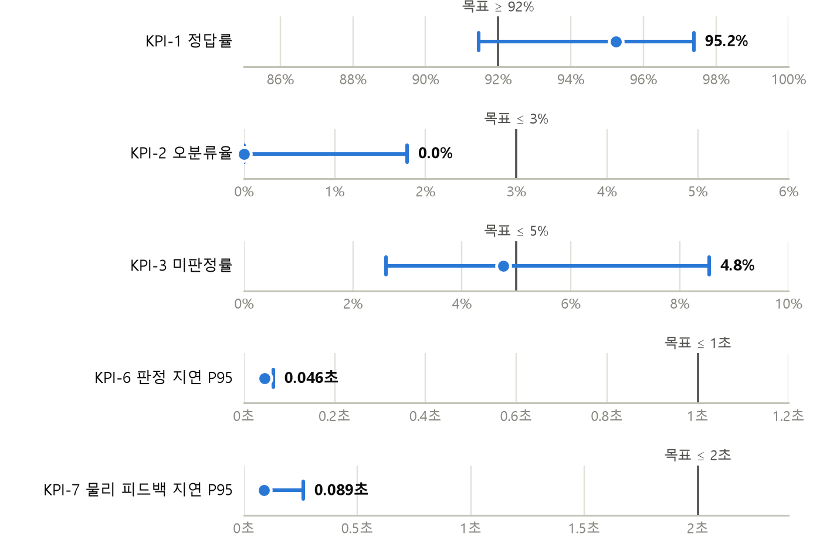
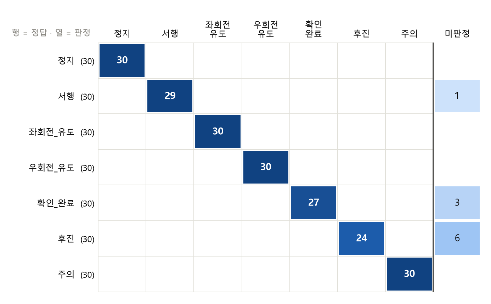
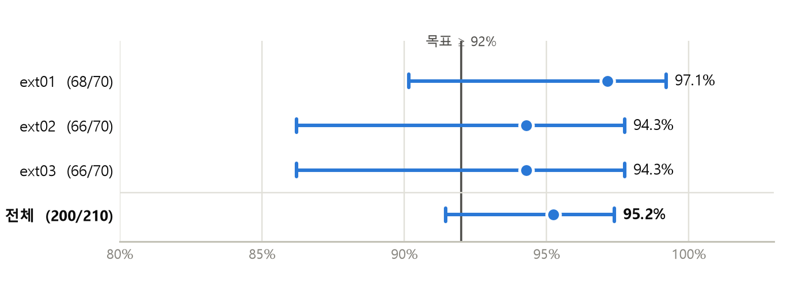
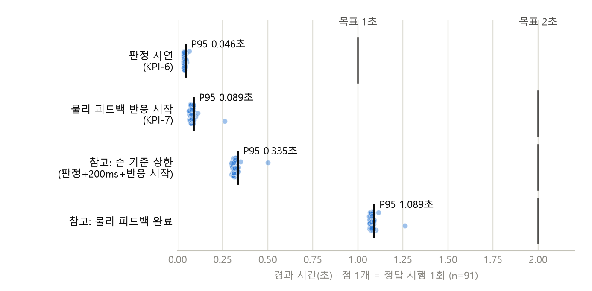

# 결과보고서: SafeSign PhysicalAI

| 항목 | 내용 |
| --- | --- |
| 프로젝트 | SafeSign PhysicalAI (산업 안전 수신호 교육 키트) |
| 버전 | v1.1 (기준 커밋 `dev` `876bbf1`) |
| 수행 기간 | 2026-09-04 ~ 2026-10-12 (W1~W5) |
| 작성자 | 김지훈 (팀 심기일전) |
| 작성 양식 | 협회 실무가이드 PART 5: F25 요약본 + 결과보고서 본문 8항목 |

> 제출본은 같은 내용의 Word 파일 [`20_결과보고서.docx`](20_결과보고서.docx)다. 그림 원본은 [`images/20_결과보고서/`](images/20_결과보고서/).

# F25 결과보고서 요약본

## 핵심 성과 지표

| ID | 지표 | 목표 | 결과 | 판정 |
| --- | --- | --- | --- | --- |
| KPI-1 | 정답률 | ≥ 92% | **95.2%** (200/210, 95% CI 91.5~97.4%) | 달성 |
| KPI-2 | 오분류율 | ≤ 3% | **0.0%** (0/210, 95% 상한 1.8%) | 달성 |
| KPI-3 | 미판정률 | ≤ 5% | **4.8%** (10/210, 95% CI 2.6~8.5%) | 달성 |
| KPI-4 | Macro F1 (7종) | ≥ 0.90 | **0.974** | 달성 |
| KPI-5 | 치명 오분류 (정지 → 다른 신호) | 0건 | **0건** (정지 30시도) | 달성 |
| KPI-6 | 판정 지연 P95 | ≤ 1.0초 | **0.046초** (정답 91시도, 95% 상한 0.065초) | 달성 |
| KPI-7 | 물리 피드백 지연 P95 (반응 시작) | ≤ 2.0초 | **0.089초** (정답 91시도, 95% 상한 0.262초)<br>완료 기준 1.089초 | 달성 |



> 그림 1. KPI 목표 대비 실측값. 점은 실측값, 가로 막대는 95% 신뢰구간이다(지연 2개는 P95에서 P95의 95% 상한까지). 세로선은 목표다. KPI-4(0.974)와 KPI-5(0건)는 표로 대신한다.

**판정 성능 5개**(KPI-1~5)는 오프라인으로 쟀다. 평가용으로 따로 촬영한 팀원 3명 × 70테이크, 모두 210시도다. 판정에는 운영과 같은 공식 규칙(3프레임 연속 동일 판정)을 적용했다. 모델은 공개 데이터로만 학습했고 자체 촬영분은 학습에 넣지 않았다. 느슨한 규칙(최빈값)으로 계산하면 KPI-1~5가 차례로 96.7% · 0.0% · 3.3% · 0.982 · 0건이 나오는데, 표에는 더 엄격한 3프레임 연속 값을 적었다.

**지연 2개**(KPI-6·7)는 2026-10-02에 모든 장치를 실물로 연결한 상태에서 온라인으로 쟀다. 팀원 1명이 7종을 13번씩 돌린 91시도이며 91시도 모두 첫 시도에 정답이 나왔다. 물리 피드백 지연은 09-30 회의 결정에 따라 반응 시작(장치가 명령을 받았다고 응답한 시점)을 기준으로 판정했고, 동작 완료 기준 값도 함께 적었다.

정답률(하한 91.5%)과 미판정률(상한 8.5%)은 95% 신뢰구간이 목표선에 걸친다. 점추정이 목표를 충족해 달성으로 판정했고, 구간이 넓은 점은 한계(본문 §8)에 적었다.

## 과제와 접근방법

**과제 배경.** 산업 현장에서는 작업자마다 안전 수신호를 이해하고 표현하는 방식이 달라서 소통 오류가 사고로 이어질 수 있다. 영상 시청이나 인쇄물 위주의 기존 교육으로는 교육자가 학습자의 습득 정도를 객관적으로 판단할 수 없고, 학습자도 자기가 제대로 하고 있는지 알기 어렵다.

**요구사항.** ① 정답 자세를 보여준다. ② 학습자의 손을 판정한다. ③ 판정 결과를 장치 동작으로 돌려준다. ④ 교육자가 볼 기록을 남긴다.

**해결 방법.** 로봇 손(AI Hand)이 수신호를 시범하고, 카메라가 학습자의 손을 판정하고, 판정 결과를 주행 로봇(picar)과 micro:bit LED의 동작으로 되돌려 주는 닫힌 루프로 만들었다. 화면만으로는 수신호가 실제 장비를 움직인다는 감각을 주기 어렵다고 보고 물리 장치를 교육의 중심에 두었다.

인식에는 **MediaPipe 손 랜드마크 + SVM**을 썼다. 딥러닝 모델보다 학습 데이터가 적게 들고, RPi5에서 실시간으로 돌아가며, 판정 근거(관절 각도·거리)를 설명할 수 있기 때문이다(05 모델카드 §3).

## 최종 결과물

**완성 기능.** 회원가입·로그인부터 수신호 7종 시범·판정, 물리 피드백, 결과 집계, 수료증 발급까지 교육 전 과정이 동작한다.

| 구성 | 내용 |
| --- | --- |
| `services/vision` | 카메라 → 손 랜드마크 21점 → 특징 23차원 → SVM 판정 (τ 0.75 + 3프레임 연속) |
| `services/web` | 교육 진행 상태머신(SC-01~SC-07), 회원·결과 DB(Supabase), 시행 로그 CSV |
| `services/actuation` | AI Hand 7종 시범 제스처 + micro:bit O/X LED (BLE) |
| `services/picar` | 주행·LED 피드백 (별도 보드 RPi4B, Wi-Fi) |
| `services/data` | 학습 데이터 변환·검증 |
| `services/portal` | 회사 소개 웹사이트 (같은 회원 DB 사용) |

**사용 방법.** RPi5에서 `bash scripts/rpi/start_all.sh`를 실행하면 서비스 4개가 함께 켜진다. 학습자는 브라우저에서 가입·로그인한 뒤 "교육 시작"을 누르고, 화면과 AI Hand 시범을 본 다음 **확인**(화면 버튼, Space 키, micro:bit A 버튼 중 하나)을 눌러 판정을 시작한다. 7종을 마치면 집계 화면과 수료증이 나온다.

**규모.** 보드 2대(RPi5 고정, RPi4B 주행), 서비스 6개, 수신호 7종, 자동 테스트 253건(web 113 · vision 55 · picar 45 · actuation 30 · portal 10, 10-03 기준 전부 통과).

## 주요 결과와 근거

**시험 수치**

- 오프라인 210시도 중 **200회 정답**(95.2%), 오분류 0회, 미판정 10회.
- 사람별 최저 **94.3%**(ext02·ext03), 최고 97.1%(ext01)로 세 사람 차이는 2.8%p다.
- **오분류는 세 사람 모두 0%였다.** 다른 신호로 잘못 읽은 경우가 한 번도 없었다.
- 처음 보는 사람의 정답률(95.2%)이 학습 분포의 교차검증 값(공개 데이터, 세션 단위 5겹, 88.68%)보다 높아 과적합 징후는 없다. 공개 데이터 쪽이 낮은 것은 같은 수신호 안에서도 어정쩡한 자세의 샘플이 더 많아서다. 자체 촬영분이 학습에 섞이지 않았다는 점도 확인했다(12 §8-3).
- 온라인 91시도에서 판정 지연 P95는 **0.046초**, 물리 피드백 반응 시작 P95는 **0.089초**였다. 장치 응답 실패는 0건이었다.

**사용자 검토.** 실사용 시험에서 사용성 문제 **5건**을 찾았고 모두 고쳤다(본문 §6). 예를 들어 "AI Hand를 보기도 전에 오답이 떴다"는 문제는 확인 버튼을 넣어(CR-07), "틀리면 다음으로 안 넘어간다"는 문제는 시도를 3회로 제한하고 판정마다 10초 제한을 둬서(CR-08) 해결했다. 두 수정 모두 09-29 실물 재시험을 통과했다. 로봇 손 시범이 헷갈린다는 1건은 AI Hand를 교체해 해결했다. 외부 학습자(현장 작업자) 의견은 아직 받지 못했다. 평가에 참여한 3명은 모두 팀원이다.

**근거 자료.** 화면 캡처 11장(`document/images/web_screens/`), 오프라인 결과 `document/results/kpi_offline_final_20260930.json`, 온라인 시행 로그와 집계 `document/results/kpi_online_20261002/`, 자동 테스트 253건, 테스트·평가 리포트(06) §2-1~2-5.

**성공 조건과 실패 조건**

| 구분 | 조건 |
| --- | --- |
| 성공(합격) | 목표 수신호 확률 ≥ τ(0.75), 소속 게이트 통과, 3프레임 연속 같은 판정을 모두 만족. 시도 3회 이내 |
| 실패(불합격) | 3회 모두 오답, 또는 판정 1회가 10초를 넘김(`timeout`) |
| 미판정 | τ 미달(`below_tau`) 또는 7종 분포 밖(`out_of_distribution`). 오답으로 세지 않고 다시 시도하게 함 |

## 계획 대비 변경

초기 계획에서 바뀐 결정은 **12건**이다(CR-01~CR-12, 본문 §3-2). 성격별로 묶으면 다음과 같다.

1. **하드웨어 구조.** picar를 RPi5에서 떼어 별도 보드로 옮겼다(CR-01). picar가 움직이면 거기 달린 카메라도 함께 움직여 판정을 할 수 없었기 때문이다.
2. **수신호 정의.** 사람이 따라 하기 어렵거나 학습 데이터가 없는 손모양 2종을 바꿨다(CR-03·04). `negative`(기타)는 학습 클래스에서 빼고 τ 미달 미판정으로 처리했다(CR-05).
3. **교육 흐름.** 시범을 보기 전에 오답 처리되던 문제는 확인 버튼으로(CR-07), 끝나지 않던 시도는 3회 상한과 10초 제한으로(CR-08) 해결했다.
4. **범위와 측정 기준.** picar 원격 조종 모드는 넣지 않았다(CR-11). 물리 피드백 지연은 반응 시작 기준으로 판정하고 완료 기준을 함께 적기로 했다(CR-12).

## 한계

- **지연의 측정 구간이 좁다.** 판정 지연은 연속 판정을 확정한 마지막 프레임 1장의 처리 시간만 기록한다. 손을 멈춘 시점부터 계산한 보수적 상한은 P95 0.335초다. 240fps 슬로모션 영상으로 7시도를 직접 세어 보니 손을 멈춘 뒤 반응 시작까지 0.14~0.24초, 동작 완료까지 약 1.11~1.24초로 모두 목표 안이었다. 다만 영상 대조는 7시도뿐이다.
- **온라인 측정은 팀원 1명, 91시도다.** web 로그가 미판정을 기록하지 않아 온라인 미판정률은 낼 수 없다. 판정 성능의 공식 값은 오프라인 210시도를 쓴다.
- **정답률과 미판정률의 신뢰구간이 목표선에 걸친다**(정답률 하한 91.5%, 미판정률 상한 8.5%).
- **외부 학습자 의견을 받지 못했다.** 평가 데이터는 팀원 3명의 것이다.
- **시연 환경은 네이티브 실행만 검증했다.** Docker는 개발 PC mock과 CI에만 쓴다(CR-10).

## 다음 단계

| 순서 | 할 일 | 시점 |
| --- | --- | --- |
| 1 | AI Hand 시연 준비: 펌웨어를 올리고 7종 손모양 확인 | 시연 전 |
| 2 | 시연 운영 규칙 정리: 서보 휴식(2회차마다), 선풍기 사용 | 시연 전 |
| 3 | 외부 참관자 3~5명 대상 사용성 의견 수집(3문항) | 시연·발표 (10-12) |
| 4 | 개인정보(회원 이메일·이름·소속) 삭제 | 평가 종료 후 |

---

# 본문

## 1. 배경과 사용자 문제

**현행 이슈**

- 산업 현장에서는 작업자마다 안전 수신호를 이해하고 표현하는 방식이 달라서, 수신호로 의사를 전할 때 생기는 소통 오류가 안전사고로 이어질 수 있다.
- 기존 교육(교육 영상 시청, 인쇄물)으로는 **교육자**가 여러 학습자의 습득 정도를 객관적으로 판단하기 어렵고, **학습자**도 자기 이해 수준을 알기 어렵다.

**사용자와 문제**

| 사용자 | 문제 |
| --- | --- |
| 신입·현장 작업자 | 수신호를 본 적이 있는지와 실제로 할 수 있는지를 구분해 확인할 방법이 없다 |
| 안전 교육자 | 누가 어떤 수신호에 약한지 숫자로 알 수 없다 |

**기대 변화.** 습득 속도와 정확도가 오르고, 소통 오류로 인한 사고가 줄고, 학습자별로 약한 수신호를 알 수 있고, 기록을 바탕으로 교육 내용을 고칠 수 있다.

## 2. 목표와 범위

**목표.** 안전 수신호 7종을 시범, 따라 하기, 판정, 물리 피드백으로 이어지는 닫힌 루프 안에서 반복 학습하게 하고, 교육자가 쓸 수 있는 정량 기록을 남긴다.

**KPI.** F25 요약본의 7개 지표(01 프로젝트계획서 §목표와 KPI).

**범위에 넣은 것**

- 수신호 7종: 정지 · 서행 · 좌회전 유도 · 우회전 유도 · 확인/완료 · 후진 · 주의
- 손의 **정지 자세** 한 장면 판정 (연속 동작은 판정하지 않음)
- 교육 진행 화면 SC-01~SC-07, 회원·결과 DB, 수료증

**범위에서 뺀 것과 이유**

| 뺀 것 | 이유 |
| --- | --- |
| 연속 제스처·동작 추적 | 정지 자세 판정만으로 교육 목적을 이룰 수 있고, 연속 동작은 데이터와 학습 비용이 크게 늘어난다 |
| 수신호 등록·관리자 화면 | 교육용 고정 커리큘럼 7종이면 충분하다 (03 §6) |
| 중간 이탈 후 이어하기 | 교육 1회가 약 5분으로 짧아 세션 복구에 드는 복잡도가 이득보다 크다 (CR-06) |
| picar 원격 조종 모드 | 교육 루프에 필요 없는 선택 기능이고, W4 일정은 냉각 대책과 KPI 실측이 먼저였다 (CR-11) |

## 3. 수행 과정과 변경

### 3-1. 수행 과정

| 주차 | 기간 | 한 일 |
| --- | --- | --- |
| W1+W2 | 09-04 ~ 09-16 | 문제 정의·목표 설정, 설계, 역할 분담, 파이프라인 방식 확정, 수신호 7종 확정 |
| W3 전반 | 09-16 ~ 09-20 | 학습 데이터 확보 (공개 데이터셋 검토·선정·변환) |
| W3 후반 | 09-22 ~ 09-27 | 분류기 학습, 서비스 통합, 1차 전 구간 통합 테스트 |
| W4 | 09-28 ~ 10-04 | 결함 수정, 판정 타이밍 재설계, 회원 DB 연동, KPI 실측(오프라인 09-29 촬영, 온라인 10-02) |
| W5 | 10-05 ~ 10-12 | 결과보고서·시연 영상·발표 |

### 3-2. 변경 기록 (CR)

팀 문서 곳곳에 흩어져 있던 결정 가운데 계획을 바꾼 것을 골라 CR 번호를 붙였다.

| CR | 날짜 | 변경 | 이유 | 영향 | 결과 |
| --- | --- | --- | --- | --- | --- |
| CR-01 | 09-18 | picar 제어를 RPi5에서 **별도 보드**(RPi4B)로 분리 | picar가 움직이면 거기 달린 카메라도 움직여 판정할 수 없다 | 보드 2대, Wi-Fi 통신 구간 추가 | 고정 카메라 확보. 통신이 끊기면 picar 없이 진행 (03 §5-2) |
| CR-02 | 09-21 | micro:bit 연결을 **USB 시리얼 → BLE**(Nordic UART)로 | micro:bit v2의 하드웨어 UART는 1개뿐인데 확장보드 초기화가 이를 서보 채널로 가져간다 | 무선 구간 추가, 부저 사용 불가(BLE 스택과 충돌) | 서보와 통신을 동시에 사용. 부저는 범위에서 제외 |
| CR-03 | 09-20 | `우회전_유도` 손모양을 **약지 → 소지**로 | 약지만 펴는 동작은 사람이 따라 하기 어렵다 | 서보 각도표·데이터 재매핑 | 학습자 수행 난이도 하락 |
| CR-04 | 09-20 | `확인_완료` 손모양을 **엄지 세우기 → 주먹**으로 | 공개 데이터셋에 엄지 세우기에 해당하는 클래스가 없다 | 펌웨어 제스처 G5 변경 | 학습 데이터 확보 |
| CR-05 | 09-21 | `negative`(기타)를 **학습 클래스에서 제외**, τ 미달은 미판정 | 7종이 아닌 자세는 종류가 끝이 없어 한 클래스로 학습할 수 없고, 공개 데이터의 negative는 0건이었다 | KPI 표를 8클래스에서 7클래스 + 미판정으로 정정 | 미판정률을 별도 지표로 관리 |
| CR-06 | 09-18 | 중간 이탈 후 **이어하기를 구현하지 않음** | 교육 1회가 짧고 세션 복구의 복잡도가 이득보다 크다 | SC-07은 처음부터 다시 하라는 안내만 표시 | 범위 축소 |
| CR-07 | 09-27 | 판정 흐름에 **확인 버튼** 도입 (시범 단계와 판정 단계 분리) | 통합 테스트에서 학습자가 AI Hand 시범을 보기도 전에 오답 처리됐다 | 상태머신·화면 재설계, 인수 테스트 22건 추가 | 09-29 실물 재시험 통과 |
| CR-08 | 09-29 | **시도 상한 3회 + 판정 1회 10초 제한** | 상한이 없어 오답이 이어지면 교육이 끝나지 않았다. 상한만 두면 미판정만 반복될 때 여전히 끝나지 않았다 | `outcome`에 `timeout` 추가 (KPI 집계에서 오답과 구분) | 09-29 실물 재검증 통과 |
| CR-09 | 09-30 | 결과 저장을 **화면 CSV 내려받기 → 회원 DB**(Supabase)로 | 회원별 누적 기록이 필요하고, DB에서 CSV로 내보낼 수 있어 기능이 겹친다 | web의 CSV 버튼 제거, 백엔드·스키마 추가 | 회원별·수신호별 합격 현황 조회 |
| CR-10 | 09-28 | 시연 실행 방식을 **Docker → 네이티브**로 확정 | 카메라(libcamera)·GPIO를 쓰는 vision·picar를 컨테이너로 올리려면 전제 조건이 많고, 시연 전까지 검증할 시간이 없다 | Docker는 개발 PC mock·CI 전용 | 기동 스크립트(`scripts/rpi/`)로 실행 단순화 |
| CR-11 | 09-30 | picar **원격 조종 모드를 넣지 않음** | 교육 루프에 필요 없는 선택 기능이고, W4는 냉각 대책과 KPI 실측이 먼저였다 | 구현 계획만 보관, 조종 API 미구현 | 향후 과제로 넘김 |
| CR-12 | 09-30 | 물리 피드백 지연을 **반응 시작 기준으로 판정**, 완료 기준은 함께 기록 | PRD 정의(가장 늦게 끝나는 장치까지)로는 picar 주행(약 2초) 하나만으로 목표 2.0초를 넘어 구조상 달성할 수 없었다 | KPI 표에 두 값을 함께 적음. 시행 로그가 두 값을 모두 남겨 재측정 불필요 | 10-02 측정: 반응 시작 0.089초, 완료(picar 주행 제외) 1.089초 |

## 4. 최종 결과물

구성과 사용 방법은 F25 요약본 "최종 결과물"에 적었다. 여기서는 판정과 피드백이 이어지는 방식을 보충한다.

**판정 파이프라인**

```text
카메라 → MediaPipe 손 랜드마크 21점 → 좌우손 통일·정규화 → 특징 23차원(관절 각도·거리)
      → SVM(RBF) → 클래스 확률 → τ(0.75) + 소속 게이트 + 3프레임 연속 → 판정 확정
```

**물리 피드백.** 판정이 확정되면 picar(주행·LED), micro:bit(O/X LED), AI Hand 순서로 명령을 보낸다. 이 순서는 09-28에 바꾼 것이다. 그전에는 AI Hand 명령을 먼저 보내서 picar와 micro:bit가 약 0.85초 늦게 반응했다.

**AI Hand는 시범 전용이다.** 판정 뒤 보내는 정답 자세와 재시범은 시범과 같은 제스처라서, 시범을 마친 손은 판정 뒤에 움직이지 않는다. 정답·오답은 micro:bit O/X와 picar가 알린다. 정답 자세를 다른 동작으로 바꾸면 서보 동작 수가 늘어나므로 이대로 두기로 했다. 시행 로그의 `aihand_ms`(약 0.88초)는 손이 실제로 움직인 시간이 아니라 펌웨어가 손가락 5개에 150ms 간격으로 명령을 내리는 시간이다.

**기록.** 회원 DB에는 회차별·수신호별 결과가 쌓이고, KPI 계산용 시행 로그는 CSV로 따로 남는다. 시행 로그 한 행에는 판정 지연, 장치별 응답 시간, 반응 시작·완료 지연이 함께 기록된다.

## 5. 시험 결과

### 5-1. 판정 성능 (오프라인 210시도)

| 구분 | 수치 |
| --- | --- |
| 전체 시도 | **210회** (평가 전용 팀원 3명 × 70테이크, 수신호마다 30시도) |
| 정답 | **200회** (95.2%) |
| 오분류 | **0회** (0.0%) |
| 미판정 | **10회** (4.8%) |
| 치명 오분류 (정지 → 다른 신호) | **0건** (정지 30시도) |
| Macro F1 (7종) | **0.974** |



> 그림 2. 오프라인 혼동행렬(210시도, 공식 규칙 3프레임 연속). 행은 정답 수신호, 열은 판정 결과이고 색이 진할수록 시도 수가 많다. 빈칸은 0이다. 대각선 밖에 값이 있는 칸은 미판정 열뿐이다.

다른 신호로 판정된 시도는 없다. 미판정 10건은 모두 소속 게이트(학습 분포 밖 판정)에 걸렸고 그중 7건은 손을 오른쪽으로 기울인 자세였다. 수신호별로는 후진 6건, 확인_완료 3건, 서행 1건이다. 팀원이 학습 데이터보다 엄지를 더 펴고 손을 기울이는 경향이 원인으로 보인다(05 모델카드 §7-3).

### 5-2. 사람별 평균과 최저

| 대상 | 시도 | 정답률 | 미판정률 | 오분류율 |
| --- | --- | --- | --- | --- |
| ext01 | 70 | 97.1% | 2.9% | 0% |
| ext02 | 70 | **94.3%** (최저) | 5.7% | 0% |
| ext03 | 70 | **94.3%** (최저) | 5.7% | 0% |
| 전체 | 210 | 95.2% | 4.8% | 0% |



> 그림 3. 사람별 정답률과 95% 신뢰구간(Wilson). 오분류가 0이라 정답이 아닌 시도는 모두 미판정이다. 한 사람당 70시도라 구간이 넓다.

최저값 94.3%도 목표 92%를 넘는다. 세 사람 차이는 2.8%p이고 오분류는 세 사람 모두 0%다.

### 5-3. 지연 (온라인 91시도)

2026-10-02 17:50~18:02에 RPi5(vision·actuation·web), micro:bit, AI Hand, RPi4B picar를 모두 실물로 연결하고 측정했다. 팀원 1명이 로그인해 13회차 × 7종 = 91시도를 진행했고 91시도 모두 첫 시도에 정답이었다. 측정 중 RPi5 온도는 최고 70.8°C였고 스로틀링은 없었다. 판정 속도는 평균 29.9fps였다. 냉각은 선풍기로 했다. 라이브 영상은 켜 두었고 picar 바퀴는 바닥에서 띄웠다.

| 항목 | n | 최소 | 중앙값 | P95 | P95 95% 상한 | 최대 | 목표 |
| --- | --- | --- | --- | --- | --- | --- | --- |
| 판정 지연 | 91 | 33 | 37 | **46** | 65 | 65 | ≤ 1000 |
| 물리 피드백 반응 시작 | 91 | 62 | 76 | **89** | 262 | 262 | ≤ 2000 |
| (참고) 손 기준 상한 | 91 | 298 | 313 | 335 | 500 | 500 | - |
| (참고) 물리 피드백 완료 | 91 | 1062 | 1076 | 1089 | 1262 | 1262 | - |

> 단위는 ms다. P95는 정렬한 뒤 ⌈0.95·n⌉번째 값이다. 95% 상한은 실제 P95가 그 값 이하라고 95% 신뢰도로 말할 수 있는 순서통계량이며, 표본이 59개 이상일 때 계산된다. 지연 KPI는 이 상한이 목표 이하일 때 달성으로 본다.



> 그림 4. 온라인 지연 분포(정답 91시도). 점 하나가 시행 1회이고, 검은 세로선이 P95, 회색 세로선이 목표다. 아래 두 줄은 참고값으로, 손 기준 상한은 판정 지연에 web 폴링 대기 최대 200ms와 반응 시작을 더한 값이다.

물리 피드백 반응 시작의 최댓값 262ms는 web을 켜고 나서 첫 시도 한 건에서 나왔다. picar가 첫 명령에만 약 0.2초 늦게 응답했고(나머지 90건은 25~40ms), 첫 LED 명령 때 핀을 초기화하는 시간으로 보고 있다. vision `/reset` 결함(§5-4)을 고친 뒤 다시 잰 14시도에서도 판정 지연 33~47ms, 반응 시작 61~87ms로 같은 수준이었다.

**각 값이 재는 구간.** 기록된 값은 01 계획서의 정의("손을 멈춘 시점부터")보다 좁은 구간을 잰다. 그래서 목표 대비 수치가 매우 작게 나온다.

| 값 | 잰 구간 | 빠진 구간 |
| --- | --- | --- |
| 판정 지연 | 연속 판정을 확정한 **마지막 프레임 1장**의 캡처부터 판정까지 | 3프레임 연속을 채우는 시간(약 0.07초), web 폴링 대기(0~0.2초), 손을 멈춘 뒤 인식이 안정될 때까지(측정 불가) |
| 물리 피드백 반응 시작 | web 판정 확정부터 picar·micro:bit가 명령을 받았다고 응답할 때까지 | 판정 지연 전체, 실제 동작이 끝나는 시점 |
| 물리 피드백 완료 | web 판정 확정부터 micro:bit LED 1초 표시가 끝날 때까지(picar 주행 제외). AI Hand 응답과 비교해 늦은 쪽을 쓰는데, 측정한 105행(91시도 + 재확인 14시도) 모두 LED 쪽이었다 | 판정 지연 전체 |
| 손 기준 상한 | 판정 지연 + 폴링 대기 최대 200ms + 반응 시작 | 3프레임을 채우는 시간, 인식 안정 시간 |

**슬로모션 영상 대조.** 기록값이 빠뜨리는 구간을 확인하려고, `/reset` 수정 뒤 재확인 회차의 7시도를 휴대폰 240fps 슬로모션(1프레임 4.17ms)으로 찍었다. 손, micro:bit LED, picar, AI Hand를 한 화면에 담고 프레임 번호를 새겨 셌다.

| 수신호 | 손 정지 → picar | 손 정지 → LED | 반응 시작(늦은 쪽) | 손 정지 → 판정 확정(추정) |
| --- | --- | --- | --- | --- |
| 정지 | 58 | 142 | **142** | -98 |
| 서행 | 67 | 150 | **150** | 70 |
| 좌회전_유도 | 75 | 142 | **142** | 72 |
| 우회전_유도 | 79 | 142 | **142** | 69 |
| 확인_완료 | 71 | 138 | **138** | 62 |
| 후진 | 150 | 112 | **150** | 40 |
| 주의 | 200 | 238 | **238** | 176 |
| 중앙값 (범위) | 75 (58~200) | 142 (112~238) | **142 (138~238)** | 69 (-98~176) |

> 단위는 ms다. 판정 확정 추정값은 손 정지 → LED에서 같은 시도의 CSV `microbit_ms`(판정 확정 → micro:bit 응답)를 뺀 값이다. 손 정지 프레임은 사람이 고르므로 ±0.1초쯤 흔들릴 수 있다. 정지의 -98ms는 손이 눈으로 보기에 완전히 멈추기 전에 시스템이 자세를 알아본 경우다.

- 손을 멈춘 뒤 반응 시작까지는 **0.14~0.24초**였다. 시스템 기록으로 계산한 손 기준 상한(P95 0.335초)보다 모두 짧아, 그 상한이 실제로 보수적인 값임을 확인했다.
- 손 기준 판정 지연은 대부분 **0.04~0.08초**(최대 0.18초)였다. 새 프레임 3장을 모으는 약 0.07초에 계산 시간을 더한 값과 맞는다.
- 손을 멈춘 뒤 동작 완료까지는 판정 확정 추정값에 CSV `feedback_done_ms`를 더해 **약 1.11~1.24초**다. 계획서의 원래 정의(가장 늦게 끝나는 장치까지, picar 주행 제외)로 계산해도 목표 2.0초 안이다.

### 5-4. 수정 전후 비교

| 항목 | 수정 전 | 수정 후 | 근거 |
| --- | --- | --- | --- |
| 데이터 분할 방식 | 무작위 5겹 **98.81%** | 세션 단위 5겹 **77.57%** (-21.2%p) | 같은 촬영분의 복사본이 학습과 평가 양쪽에 들어가 성능이 부풀려졌다. 기본 분할을 세션 단위 GroupKFold로 고정하고 무작위 분할 점수는 보고에 쓰지 않는다 (05 §9) |
| 판정 타이밍 | 시범 전에 오답 처리 | 확인 버튼 뒤 판정 (CR-07) | 09-29 실물 재시험 통과 |
| 시도 상한 | 없음 (끝나지 않음) | 3회 + 10초 제한 (CR-08) | 09-29 실물 재검증 통과 |
| SC-04 재시도 버튼 | 눌러도 아무 동작 없음 | 시범 단계로 돌아가 AI Hand 재시범 | 회귀 테스트 6건, 09-29 실물 통과 |
| picar LED | 다음 명령까지 켜진 채 남음 | 2초 뒤 자동 소등 | 단위 테스트 통과 |
| vision `/reset` | 확인 직후 확인 전 손모양의 판정을 읽음 (91행 중 2행) | `/reset`이 직전 판정까지 초기화하고 리셋 전 프레임 결과는 버림 | 테스트 4건 추가. 2행을 빼도 지연 P95·상한·최댓값이 같아 재측정 불필요 |

### 5-5. 근거 자료 위치

| 자료 | 위치 |
| --- | --- |
| 화면 캡처 11장 (SC-01~SC-07, SC-03 시범·판정·재시범, SC-03a 정답, SC-03b 오답) | `document/images/web_screens/` |
| 오프라인 판정 성능 결과 (210시도, 모델 메타데이터 포함) | `document/results/kpi_offline_final_20260930.json` |
| 온라인 시행 로그·집계·자원 모니터 기록·슬로모션 프레임 표 | `document/results/kpi_online_20261002/` |
| 자동 테스트 253건 | `services/*/tests/` |
| 테스트·평가 리포트 | `document/06_테스트·평가리포트.md` §1-1~2-5 |
| 통합 테스트·KPI 측정 정의 | `document/16_통합테스트_KPI_CI.md` §5 |

## 6. 사용자 의견

외부 학습자(현장 작업자)에게서는 아직 의견을 받지 못했다. 평가에 참여한 3명은 팀원이다. 아래는 실사용 시험 중 관찰한 사용성 문제와 그 처리 결과다.

| 관찰한 문제 | 처리 |
| --- | --- |
| "AI Hand를 보기도 전에 오답이 떴다" | 확인 버튼 도입 (CR-07) |
| "틀리기만 하면 다음으로 안 넘어간다" | 시도 상한 3회 + 10초 제한 (CR-08) |
| "손을 잠깐 내렸는데 카메라 실패 화면으로 넘어간다" | 시범 단계에서는 손 미검출을 세지 않도록 수정 |
| "카메라 실패 화면에서 재시도를 눌러도 안 돌아간다" | 재시도를 누르면 시범 단계로 돌아가 AI Hand가 다시 시범하도록 재작성 |
| "좌회전인지 후진인지 로봇 손만 봐서는 모르겠다" | AI Hand 교체로 해결 |

**W5 보완 계획.** 시연·발표 자리에서 참관자 3~5명이 5분 동안 체험한 뒤 세 가지를 묻는다. 무엇을 하라는지 알았는가, 틀렸을 때 왜 틀렸는지 알았는가, 다시 해 보고 싶었는가.

## 7. 달성 · 부분 · 미달 판정

**종합 판정: 달성**

| 구분 | 내용 |
| --- | --- |
| 달성 | KPI 7개(KPI-1~7)가 모두 목표를 충족했다. 오분류 0%, 치명 오분류 0건으로 정지를 포함한 어떤 신호도 다른 신호로 읽지 않았다. 전 구간 통합 동작도 실물에서 확인했다 |
| 부분 | KPI 밖 항목인 사용자 의견: 외부 학습자의 의견은 아직 받지 못했다 |
| 미달 | 없음 |

**판정에 붙는 조건**

- 정답률과 미판정률은 점추정으로 목표를 충족하지만 95% 신뢰구간이 목표선에 걸친다(정답률 하한 91.5%, 미판정률 상한 8.5%).
- 지연 2개는 P95의 95% 상한까지 목표 안이지만 기록된 값이 재는 구간은 계획서 정의보다 좁다(§5-3). 슬로모션 7시도로 센 값(반응 시작 0.14~0.24초, 완료 약 1.11~1.24초)도 목표 안이다.
- 판정 성능은 팀원 3명, 지연은 팀원 1명이 측정 대상이었다. 온라인 91시도의 판정 성능(정답 100%)은 미판정을 기록하지 않아 참고값으로만 쓴다.

## 8. 한계와 향후 과제

### 8-1. 한계

| 한계 | 내용 | 영향 |
| --- | --- | --- |
| 지연 측정 구간 | 판정 지연은 마지막 프레임 1장의 처리 시간만 기록한다 | 손을 멈춘 시점부터의 지연은 슬로모션 7시도 대조로만 확인했다(반응 시작 0.14~0.24초, 완료 약 1.11~1.24초) |
| 평가 규모 | 오프라인 210시도(3명), 온라인 91시도(1명) | 오분류율 0%는 "95% 신뢰로 1.8% 이하"로 읽어야 한다. 정답률·미판정률 구간이 목표선에 걸친다 |
| 온라인 미판정 미기록 | web 로그가 τ 미달·분포 밖 판정을 기록하지 않는다 | 온라인 미판정률을 낼 수 없어 오프라인 값만 쓴다 |
| 기울인 손 과차단 | 미판정 10건 중 7건이 오른쪽으로 기울인 손 | 후진 미판정 20%, 확인_완료 10% |
| 외부 사용자 의견 없음 | 평가자 3명이 모두 팀원 | 현장 적합성에 대한 외부 근거가 부족하다 |
| 실행 환경 | 네이티브 실행만 검증, Docker는 mock·CI 전용 | 다른 환경으로의 이식은 검증하지 않았다 |

### 8-2. 향후 과제

| 과제 | 내용 |
| --- | --- |
| 기울인 손 대응 | 기울기 보정이나 게이트 재조정. 개발용 데이터로 조정한 뒤 새 평가 데이터로 다시 잰다(이번 210시도로 조정하면 평가가 오염된다) |
| 측정 규모 확대 | 외부인을 포함해 시행 수를 늘려 신뢰구간을 좁힌다. 1명 70시도만 추가해도 구간이 줄어든다 |
| 지연 측정 보강 | 판정 결과에 연속 판정 첫 프레임의 캡처 시각을 선택 필드로 추가하면 손 기준 지연을 직접 잴 수 있다(스키마 변경이라 이번에는 하지 않음) |
| 온라인 미판정 기록 | 안내 문구가 뜰 때도 시행 로그에 행을 남겨 온라인 미판정률을 계산한다 |
| picar 첫 명령 지연 | picar를 켤 때 LED를 미리 초기화해 첫 동작의 약 0.2초 지연을 없앤다 |
| picar 원격 조종 모드 | 이번 범위에서 뺀 선택 기능 (CR-11) |
| 연속 동작 인식 | 이번 범위에서 뺀 연속 제스처·동작 추적 |
| 운영 전 조건 | 개인정보(이메일·이름·소속) 삭제 절차, `service_role` 키 폐기, 서보 반복 사용 상한 확인 |

## 변경 이력

| 버전 | 날짜 | 내용 |
| --- | --- | --- |
| v0.1 | 2026-10-01 | 초안 작성. 협회 실무가이드 PART 5 양식 적용, KPI-1~5 실측 반영, CR-01~CR-10 부여 |
| v1.0 | 2026-10-02 | KPI-6·7 온라인 실측(10-02) 반영, 종합 판정을 달성으로 갱신, CR-11·12 추가, 5-3 지연 절 신설, 그림 4개 추가, 자동 테스트 수 갱신(248건) |
| v1.1 | 2026-10-03 | AI Hand 교체 반영(사용성 문제 5건 모두 해결), AI Hand를 시범 전용으로 표기, 5-3에 슬로모션 영상 대조 결과 추가, 다음 단계에서 끝난 일 삭제, 자동 테스트 수 갱신(253건) |
