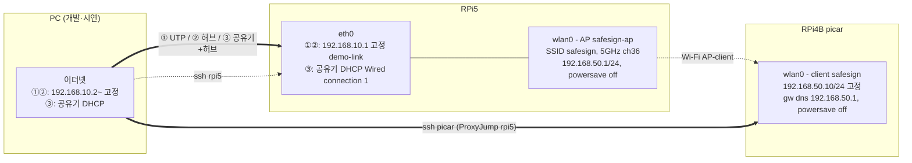

# 네트워크 설정법 — RPi5 AP ↔ RPi4B(picar)

> 담당: 송승호 (하드웨어·로봇동작 R) · 작성: 2026-09-24 · 실물 구축·검증: 2026-09-23
>
> 설계 근거(왜 이 구성인가)는 [11_하드웨어설계서_v1](11_하드웨어설계서_v1.md) §6.1·§6.2에 있다.
> 이 문서는 **실제로 따라 하는 절차**다. 설계서 §6.1의 구축 절차(`nmcli device wifi hotspot`,
> `nmcli device wifi connect`)는 실물 구축 중 함정이 드러나 이 문서의 방식으로 대체한다(§8 참고).

---

## 목차

1. [전체 구성 한눈에 보기](#1-전체-구성-한눈에-보기)
2. [시작 전 준비 — 유선 접속 경로 확보](#2-시작-전-준비--유선-접속-경로-확보)
3. [RPi5를 AP로 설정](#3-rpi5를-ap로-설정)
4. [RPi4B(picar)를 AP에 연결](#4-rpi4bpicar를-ap에-연결)
5. [재부팅 검증](#5-재부팅-검증)
6. [개발 ↔ 시연 구성 전환](#6-개발--시연-구성-전환)
7. [되돌리기 (공유기로 복귀)](#7-되돌리기-공유기로-복귀)
8. [문제 해결 — 실제로 겪은 사례 포함](#8-문제-해결--실제로-겪은-사례-포함)
9. [설정값 요약 · 최종 체크리스트](#9-설정값-요약--최종-체크리스트)

---

## 1. 전체 구성 한눈에 보기

### 1.0 전체 토폴로지



- 실선(`==`)은 SSH가 실제로 경유하는 경로, 점선(`-.`)은 물리 Wi-Fi 링크 또는 참고용 경로다.
- **`wlan0`(AP)과 `eth0`은 RPi5 안에서 별개 인터페이스** — AP를 켜도 유선 SSH 경로는 그대로 산다.
- ③ 구성일 때는 RPi5 `eth0`이 인터넷에 나가고, `ipv4.method shared`(NAT)가 그 인터넷을
  `wlan0` 너머 picar에게도 넘겨준다.

### 1.1 핵심 원리

- RPi5의 **Wi-Fi(`wlan0`)를 AP(액세스 포인트)로** 띄우고, picar(RPi4B)가 거기에 접속한다.
- AP 모드가 차지하는 것은 **`wlan0`뿐**이다. **유선 랜(`eth0`)은 그대로 살아 있으므로** PC는 유선으로
  RPi5에 SSH할 수 있다.
- picar는 달리는 차에 실려 있으므로 **반드시 Wi-Fi**다. 유선·허브에는 연결할 수 없다.
- PC에서 picar로 가려면 **RPi5를 경유(`ProxyJump`)** 한다.

### 1.2 IP 배정 (모두 고정값 — 찾는 것이 아니라 **정해서 넣는** 값)

| 장치 | 인터페이스 | IP | 비고 |
| --- | --- | --- | --- |
| RPi5 | `wlan0` (AP) | **192.168.50.1/24** | SSID `safesign` |
| RPi4B (picar) | `wlan0` (클라이언트) | **192.168.50.10/24** | 데모·web의 `PICAR_URL` 대상 |
| RPi5 | `eth0` (시연) | **192.168.10.1/24** | PC 직결·허브 |
| 시연 PC | 이더넷 | **192.168.10.2/24~** | web 화면 |

```
PICAR_URL=http://192.168.50.10:8000
```

> 설정 직후 한 번, 재부팅 후 한 번만 확인하면 된다. 매번 다시 확인할 필요는 없다.

### 1.3 유선 쪽 구성 3가지

RPi4B 쪽(`RPi5 ··· Wi-Fi AP ··· RPi4B 192.168.50.10`)은 세 구성 모두 동일하다. 달라지는 것은 PC ↔ RPi5 유선 쪽뿐이다.

```
① UTP 직결 (시연, PC 1대)
   PC ──UTP── RPi5 eth0 (192.168.10.1)

② 스위칭 허브만 (시연, PC 2대 이상)
   PC  ─┐
   PC2 ─┼─ 스위칭 허브 ── RPi5 eth0 (192.168.10.1)

③ 공유기 + 허브 (개발 — 추천)
   공유기(인터넷) ── 스위칭 허브 ─┬─ RPi5 eth0 (공유기 DHCP)
                                 └─ PC       (공유기 DHCP)
```

| 구성 | 인터넷 | 주소 방식 | 용도 |
| --- | --- | --- | --- |
| ① UTP 직결 | ❌ | 전부 고정 | 시연 (PC 1대) |
| ② 허브만 | ❌ | 전부 고정 (허브엔 DHCP 없음) | 시연 (PC 2대 이상) |
| ③ 공유기 + 허브 | ✅ RPi5·picar 모두 | `eth0`·PC는 공유기 DHCP | **개발** |

- ③에서는 RPi5가 `eth0`으로 인터넷에 나가고, AP 설정(`ipv4.method shared`)이 NAT를 해 주므로
  **picar도 RPi5를 거쳐 인터넷에 나간다**(`pip install` 가능). 설계서 §6.1의 "AP 모드면 인터넷 없음"
  트레이드오프가 해소된다.
- 시연장에서는 외부 인프라를 빼야 하므로 ① 또는 ②를 쓴다(설계서 §6.1 "왜 공유기를 쓰지 않는가").
- 요즘 랜 포트는 자동 MDI-X라 **PC 1대는 허브 없이 직결**해도 된다.

---

## 2. 시작 전 준비 — 유선 접속 경로 확보

> 🔴 **AP를 켜는 순간 RPi5는 공유기 Wi-Fi에서 빠진다.** Wi-Fi로 SSH 중이었다면 세션이 끊기고,
> 유선 경로가 없으면 모니터·키보드를 직접 꽂는 수밖에 없다. **반드시 이 절을 먼저 끝낼 것.**

### 2.1 인터넷이 필요한 작업을 먼저 끝낸다

①·② 구성에서는 AP 전환 후 인터넷이 없다. `apt install`, `pip install -r requirements.txt` 등을
**RPi5·RPi4B 양쪽 모두** 미리 끝낸다. (③ 구성이면 생략 가능)

### 2.2 RPi5 `eth0` 설정

**③ 개발 구성**이면 기본 DHCP 프로파일을 그대로 쓴다. 공유기 관리 화면에서 RPi5 MAC에 **IP 예약**을
걸어 두면 SSH 주소가 바뀌지 않는다.

**①·② 시연 구성**용 고정 IP 프로파일은 지금 만들어 두되 **평소엔 꺼 둔다**:

```bash
# RPi5 — 공유기로 접속된 상태에서 실행
nmcli connection show                # 기존 유선 프로파일 이름 확인 (보통 "Wired connection 1")

sudo nmcli connection add type ethernet ifname eth0 con-name demo-link \
     ipv4.method manual ipv4.addresses 192.168.10.1/24 \
     connection.autoconnect no
```

전환 방법은 [§6](#6-개발--시연-구성-전환) 참고.

### 2.3 PC 유선 고정 IP (①·② 구성일 때)

Windows **설정 → 네트워크 및 인터넷 → 이더넷 → IP 할당 → 편집 → 수동 → IPv4 켜기**

| 항목 | 값 |
| --- | --- |
| IP 주소 | `192.168.10.2` (두 번째 PC는 `.3`, …) |
| 서브넷 마스크 | `255.255.255.0` |
| 게이트웨이 | **비워 둔다** — 비워야 PC 인터넷은 기존 Wi-Fi로 계속 나간다 |

또는 관리자 PowerShell:

```powershell
netsh interface ipv4 set address name="이더넷" static 192.168.10.2 255.255.255.0
```

### 2.4 PC SSH 설정 (`C:\Users\<사용자>\.ssh\config`)

```
Host rpi5
    HostName 192.168.10.1          # ③ 개발 구성이면 공유기가 준 RPi5 IP
    User <rpi5 계정>

Host picar
    HostName 192.168.50.10
    User <rpi4b 계정>
    ProxyJump rpi5
```

- 이후 `ssh rpi5`, `ssh picar`로 바로 접속한다. VS Code Remote-SSH도 이 설정을 그대로 쓴다.
- `ProxyJump`는 RPi5를 **TCP 경유지**로만 쓰므로 RPi5에 라우팅(IP 포워딩) 설정이 필요 없다.
- 설정 파일 없이 한 번만: `ssh -J <rpi5 계정>@<rpi5 IP> <rpi4b 계정>@192.168.50.10`

### 2.5 현재 접속 경로 확인

```bash
# RPi5에서
ip -4 addr show eth0     # 여기 IP로 SSH 중이어야 안전
ip -4 addr show wlan0    # 여기 IP로 SSH 중이면 → 2.2~2.4를 먼저 끝낼 것
```

---

## 3. RPi5를 AP로 설정

> 기준: Raspberry Pi OS **Bookworm** (NetworkManager). 모든 명령은 **RPi5**에서 실행.

### 3.1 환경 확인

```bash
cat /etc/os-release | grep VERSION_CODENAME   # bookworm
systemctl is-active NetworkManager            # active
nmcli device status                           # wlan0 이 wifi 로 보이는지
```

NetworkManager가 `active`가 아니면(구버전 dhcpcd 방식) 이 문서의 명령이 동작하지 않는다.

### 3.2 국가 코드 · 무선 차단 해제

국가 코드가 없으면 AP가 안 뜨거나 5GHz 채널이 막힌다.

```bash
sudo raspi-config nonint do_wifi_country KR
iw reg get | head -3            # country KR 확인
rfkill list                     # "Wireless LAN ... Soft blocked: yes" 이면 ↓
sudo rfkill unblock wifi
```

### 3.3 AP 지원 · 5GHz 사용 가능 여부 확인

```bash
iw list | grep -A8 "Supported interface modes"   # "* AP" 가 있어야 함
iw list | grep -A20 "Band 2" | grep MHz          # 5GHz 채널 목록
```

- 채널 옆에 `no IR` 또는 `disabled`가 붙은 채널로는 AP를 띄울 수 없다.
- **36번(5180 MHz)** 이 깨끗하면 5GHz, 아니면 2.4GHz(`band bg`, `channel 6`)를 쓴다.
- 결과는 설계서 §6.1 "⬜ 미확인: 5GHz 지원 여부" 항목에 기록한다.

### 3.4 AP 연결 프로파일 생성

`hotspot` 단축 명령 대신 **이름과 설정을 직접 지정**한다.
(`hotspot`은 프로파일 이름이 `Hotspot`으로 고정되고, 기본 주소가 **10.42.0.1**로 잡힌다 — §8.2 참고)

```bash
sudo nmcli connection add type wifi ifname wlan0 con-name safesign-ap \
     autoconnect yes ssid safesign \
     802-11-wireless.mode ap \
     802-11-wireless.band a \
     802-11-wireless.channel 36 \
     802-11-wireless.powersave 2 \
     wifi-sec.key-mgmt wpa-psk \
     wifi-sec.psk '<8자 이상 비밀번호>' \
     ipv4.method shared \
     ipv4.addresses 192.168.50.1/24 \
     ipv6.method disabled \
     connection.autoconnect-priority 100
```

| 설정 | 의미 |
| --- | --- |
| `mode ap` | 클라이언트가 아닌 AP로 동작 |
| `band a` / `channel 36` | 5GHz 36번. 3.3에서 안 되면 **`band bg` / `channel 6`** |
| **`powersave 2`** | **Wi-Fi 절전 끄기.** 켜 두면 패킷이 수십~수백 ms씩 묶여 picar 500ms 예산을 잠식한다 |
| `wpa-psk` / `psk` | WPA2 비밀번호 (8자 이상) |
| `ipv4.method shared` | DHCP·DNS·NAT를 NetworkManager가 처리 (③ 구성에서 picar 인터넷 공유) |
| `ipv4.addresses 192.168.50.1/24` | RPi5 AP 주소 |
| `autoconnect-priority 100` | 부팅 시 다른 Wi-Fi 프로파일보다 먼저 선택 |

> 🔒 **비밀번호를 저장소(문서·코드)에 적지 말 것.** 문서에는 `<8자 이상 비밀번호>` 자리표시자만 둔다.

### 3.5 기존 공유기 Wi-Fi 프로파일의 자동 연결 끄기

```bash
nmcli -f NAME,TYPE,AUTOCONNECT connection        # 기존 wifi 프로파일 이름 확인
sudo nmcli connection modify "<공유기 프로파일>" connection.autoconnect no
```

- 끄지 않으면 부팅 시 `wlan0`이 공유기에 먼저 붙어 AP가 안 뜬다.
- 프로파일은 **지우지 않는다** — 되돌릴 때(§7) 필요하다.
- 라즈베리파이 이미저로 Wi-Fi를 설정했다면 `preconfigured` 프로파일이 있을 수 있다. **`safesign-ap`을 제외한 모든 wifi 프로파일**을 끈다.

### 3.6 AP 켜기

```bash
sudo nmcli connection up safesign-ap
```

Wi-Fi로 SSH 중이었다면 여기서 끊긴다(그래서 §2가 선행이다).

### 3.7 동작 확인

```bash
nmcli device status              # wlan0  wifi  connected  safesign-ap
ip -4 addr show wlan0            # inet 192.168.50.1/24
ip route | grep 192.168.50       # 192.168.50.0/24 dev wlan0 ...
iw dev wlan0 info                # type AP / channel 36 (5180 MHz)
iw dev wlan0 get power_save      # Power save: off
ps aux | grep [d]nsmasq          # --dhcp-range=192.168.50.x,... ← DHCP 범위 확인
```

- 휴대폰 Wi-Fi 목록에 `safesign`이 보이고 접속되면 AP 정상. **확인 후 휴대폰 연결은 끊는다**
  (`.10`을 받아 가면 picar와 충돌할 수 있다 — §8.5).
- `dnsmasq`의 `--dhcp-range`가 **`192.168.50.10`부터** 시작하는지 기록해 둔다(§8.5).

---

## 4. RPi4B(picar)를 AP에 연결

> 목표: 부팅하면 **RPi5 AP에 자동으로 붙고**, 주소는 **항상 192.168.50.10**, 공유기가 근처에 있어도
> **AP만** 잡는다.
>
> 전제: §3의 RPi5 AP가 켜져 있을 것. 명령은 표시가 없으면 **RPi4B**에서 실행.

### 4.0 순서가 중요한 이유

RPi4B는 지금 공유기 Wi-Fi로 SSH 중일 것이다. **AP에 붙는 순간 공유기에서 빠지므로 그 세션은 반드시
끊긴다.** 이후에는 RPi5를 경유해서만 들어갈 수 있다. 그래서:

1. 공유기에 붙은 상태에서 **설정만 미리 만든다** (아직 켜지 않음) — 4.3
2. 실패에 대비해 **자동 복구를 예약한다** — 4.4
3. AP로 **전환**한다 — 4.5
4. **RPi5에서** 접속해 확인하고 예약을 취소한다 — 4.6

### 4.1 환경 확인

```bash
cat /etc/os-release | grep VERSION_CODENAME   # bookworm
systemctl is-active NetworkManager            # active
sudo raspi-config nonint do_wifi_country KR   # RPi5와 같은 국가 코드
rfkill list                                    # 막혀 있으면 sudo rfkill unblock wifi
```

### 4.2 AP가 보이는지 확인

```bash
sudo nmcli device wifi rescan
nmcli device wifi list | grep safesign
```

```
   safesign   Infra  36  54 Mbit/s  80  ▂▄▆_  WPA2
```

안 보이면 RPi5 AP가 꺼졌거나 5GHz 채널 문제 → RPi5를 `band bg channel 6`으로 바꿔 본다.

### 4.3 연결 프로파일 생성 (아직 켜지 않음)

`nmcli device wifi connect`는 **실행 즉시 전환**되므로 쓰지 않는다. `connection add`로 설정만 만든다.

```bash
sudo nmcli connection add type wifi ifname wlan0 con-name safesign \
     autoconnect yes ssid safesign \
     802-11-wireless.powersave 2 \
     wifi-sec.key-mgmt wpa-psk \
     wifi-sec.psk '<RPi5 AP와 같은 비밀번호>' \
     ipv4.method manual \
     ipv4.addresses 192.168.50.10/24 \
     ipv4.gateway 192.168.50.1 \
     ipv4.dns 192.168.50.1 \
     ipv6.method disabled \
     connection.autoconnect-priority 100 \
     connection.autoconnect-retries 0
```

| 설정 | 의미 |
| --- | --- |
| `ipv4.method manual` | **고정 IP** — DHCP로 받지 않는다 |
| `ipv4.addresses 192.168.50.10/24` | picar 주소 (`PICAR_URL` 대상) |
| `ipv4.gateway 192.168.50.1` | 외부로 나가는 출구 = RPi5 (③ 구성에서 인터넷) |
| `ipv4.dns 192.168.50.1` | 이름 조회를 RPi5에 위임 (`shared` 모드가 DNS 중계). 없으면 인터넷이 IP로만 됨 |
| **`powersave 2`** | **절전 끄기.** picar는 명령을 **받는 쪽**이라 절전 시 수신이 수백 ms 늦어질 수 있다. 가장 중요 |
| `autoconnect yes` | 부팅 시 자동 연결 |
| `autoconnect-priority 100` | 부팅 시 공유기(기본 0)보다 먼저 선택 |
| **`autoconnect-retries 0`** | **무한 재시도.** 기본은 4회 실패 후 약 5분간 재시도를 멈춘다 — RPi5 부팅이 늦으면 picar가 한참 오프라인으로 남는다 |

#### 우선순위(priority)의 한계

- priority는 **"처음 고를 때"만** 쓰인다. 이미 연결된 상태에서는 더 높은 쪽으로 **갈아타지 않는다.**
- 그래서 RPi5 AP가 잠깐 꺼진 사이 RPi4B가 공유기로 넘어가면, AP가 다시 떠도 **공유기에 그대로 머문다**
  (2026-09-23 실제 발생 — §8.4).
- → priority만으로는 막을 수 없고, **공유기 프로파일의 자동 연결을 꺼야 한다**(4.5).

### 4.4 안전장치 — 자동 복구 예약

전환이 실패하면(비밀번호 오타 등) RPi4B에 **접속할 경로가 사라진다.** 전환 전에 "N분 뒤 공유기로
되돌리기"를 예약한다.

```bash
nmcli -f NAME,TYPE,AUTOCONNECT connection      # 공유기 프로파일 이름 확인 (예: test)
sudo systemd-run --on-active=5min nmcli connection up "<공유기 프로파일>"
# → Running timer as unit: run-r1234abcd.timer   ← 이 이름을 적어 둔다
```

- **5분**으로 둔다. 3분으로 했을 때 확인 전에 먼저 발동해 공유기로 돌아간 적이 있다(§8.3).
- 성공하면 4.6에서 취소한다. 실패하면 5분 뒤 자동으로 공유기로 돌아오므로 공유기 IP로 다시 SSH한다.

### 4.5 공유기 자동 연결 끄기 → AP로 전환

```bash
sudo nmcli connection modify "<공유기 프로파일>" connection.autoconnect no
# preconfigured 등 다른 wifi 프로파일이 있으면 모두 같은 방식으로 끈다
sudo nmcli connection up safesign
```

여기서 SSH 세션이 **끊기는 것이 정상**이다.

### 4.6 확인 (5분 안에, **RPi5 터미널에서**)

> ⚠️ **PC에서 바로 `ssh 192.168.50.10`을 하면 `No route to host`가 정상이다.** PC는 `192.168.50.x`
> 망을 모른다. RPi5에서 하거나 `ssh picar`(ProxyJump)를 쓴다.

```bash
# RPi5에서
iw dev wlan0 station dump | grep Station   # RPi4B MAC이 보여야 함
ping -c3 192.168.50.10
ssh <rpi4b 계정>@192.168.50.10
```

접속되면 **RPi4B 안에서** 상태를 확인하고 **예약을 취소**한다:

```bash
ip -4 addr show wlan0          # inet 192.168.50.10/24
ip route                       # default via 192.168.50.1
iw dev wlan0 get power_save    # Power save: off
iw dev wlan0 link              # SSID: safesign / freq: 5180(5GHz일 때) / signal
nmcli -f NAME,AUTOCONNECT,AUTOCONNECT-PRIORITY connection
#   safesign  yes  100
#   <공유기>  no   0      ← 반드시 no
ping -c3 8.8.8.8               # ③ 구성이면 성공, ①·②면 실패가 정상

systemctl list-timers | grep run-
sudo systemctl stop run-r1234abcd.timer    # ← 4.4 예약 취소 (잊지 말 것!)
```

> 🔴 **예약을 취소하지 않으면 5분 뒤 공유기로 돌아간다.** 공유기 자동 연결을 꺼 뒀어도 이 예약은
> 연결을 **직접 켜는** 명령이라 실행된다.

마지막으로 picar 서비스가 RPi5에서 보이는지 확인한다:

```bash
# RPi4B — picar 서비스 기동 (--host 0.0.0.0 필수: 없으면 RPi5에서 접속 불가)
cd services/picar
MOCK_HARDWARE=false uvicorn app:app --app-dir src --host 0.0.0.0 --port 8000

# RPi5
curl http://192.168.50.10:8000/health     # "status":"ok", "i2c":{"reachable":true}
```

---

## 5. 재부팅 검증

두 경우를 **각각** 확인한다. 둘 다 통과해야 시연 당일 전원 투입 순서를 신경 쓰지 않아도 된다.

| 시나리오 | 방법 | 통과 기준 |
| --- | --- | --- |
| **RPi4B만 재부팅** | RPi4B `sudo reboot` → RPi5에서 30초~1분 뒤 `ping -c3 192.168.50.10` | 응답 옴 |
| **RPi5만 재부팅** | RPi5 `sudo reboot` → AP가 뜬 뒤 1분 대기 → RPi5에서 `ping -c3 192.168.50.10` | 응답 옴, RPi4B가 **공유기로 가지 않음** |

추가로 RPi5 쪽 AP 주소가 유지되는지 확인:

```bash
# RPi5 재부팅 후
nmcli device status              # wlan0 → safesign-ap
ip -4 addr show wlan0            # 192.168.50.1/24
```

---

## 6. 개발 ↔ 시연 구성 전환

RPi5 `eth0`만 바꾸면 된다. `wlan0`(AP)과 RPi4B는 그대로다.

```bash
# 시연: 고정 192.168.10.1 (①·② 구성)
sudo nmcli connection up demo-link

# 개발 복귀: 공유기 DHCP (③ 구성)
sudo nmcli connection up "Wired connection 1"     # 기본 유선 프로파일 이름 (nmcli connection show로 확인)
```

시연 당일 부팅 시부터 고정 IP로 올라오게 하려면:

```bash
sudo nmcli connection modify demo-link connection.autoconnect yes
sudo nmcli connection modify "Wired connection 1" connection.autoconnect no
```

> 전환하면 RPi5의 SSH 주소가 바뀐다. PC의 `~/.ssh/config`에서 `rpi5`의 `HostName`도 함께 바꾼다.

데모 스크립트는 두 구성 모두 동일하다:

```bash
python3 services/actuation/scripts/aihand_picar_demo.py \
  --aihand http://127.0.0.1:8002 --picar http://192.168.50.10:8000
```

> 같은 RPi5 안의 actuation은 `localhost`보다 **`127.0.0.1`** 로 부른다. `localhost`는 IPv6(::1)를
> 먼저 시도해 요청마다 약 500ms가 더 걸린 사례가 있다(Windows 로컬 테스트).

---

## 7. 되돌리기 (공유기로 복귀)

### 7.1 RPi4B

RPi5를 경유해 접속한 상태에서:

```bash
sudo nmcli connection modify "<공유기 프로파일>" connection.autoconnect yes
sudo nmcli connection modify safesign connection.autoconnect no
sudo nmcli connection up "<공유기 프로파일>"      # 여기서 세션 끊김 → 공유기 IP로 재접속
```

### 7.2 RPi5

```bash
sudo nmcli connection down safesign-ap
sudo nmcli connection up "<공유기 프로파일>"
# 부팅 때도 공유기를 쓰려면
sudo nmcli connection modify safesign-ap connection.autoconnect no
sudo nmcli connection modify "<공유기 프로파일>" connection.autoconnect yes
```

> 순서: **RPi4B를 먼저** 되돌린다. RPi5 AP를 먼저 끄면 RPi4B에 접속할 경로가 사라진다.

---

## 8. 문제 해결 — 실제로 겪은 사례 포함

### 8.1 증상별 조치표

| 증상 | 원인 / 조치 |
| --- | --- |
| RPi5 `connection up`에서 `No suitable device` | `rfkill` 차단 → `sudo rfkill unblock wifi` |
| 5GHz로 AP가 안 뜸 / 휴대폰에 안 보임 | 채널 규제 → `band bg channel 6`으로 바꾸고 `down` → `up` |
| AP가 켜졌다가 곧 꺼짐 | 공유기 프로파일이 `wlan0`을 뺏음 → §3.5 |
| 휴대폰은 붙는데 IP를 못 받음 | `ipv4.method shared` 누락 → `journalctl -u NetworkManager -b \| grep -i dnsmasq` |
| **PC에서** `ssh 192.168.50.10` → `No route to host` | **정상.** PC는 50.x 망을 모름 → RPi5에서 하거나 `ssh picar` |
| **RPi5에서** `No route to host` | §8.2 · §8.3 순서로 진단 |
| RPi4B가 AP에 못 붙음, 로그에 `secrets were required` 반복 후 실패 | 비밀번호 불일치 → `sudo nmcli connection modify safesign wifi-sec.psk '<비밀번호>'` |
| RPi4B가 AP에 붙었는데 `.10`이 응답 없음 | 고정 IP 오타 또는 DHCP로 받음 → §8.6 |
| 가끔 끊겼다 붙음 | `.10` 주소 충돌(§8.5) 또는 신호 약함 → `iw dev wlan0 link`의 signal |
| 인터넷이 IP로는 되는데 이름으로는 안 됨 | RPi4B `ipv4.dns 192.168.50.1` 누락 |
| picar 응답이 들쭉날쭉 느림 | `iw dev wlan0 get power_save`가 `on` → `powersave 2` 재적용 후 `down`/`up` |
| **RPi5 재부팅 후 RPi4B가 공유기로 붙음** | §8.4 |

설정을 바꾼 뒤에는 `sudo nmcli connection down <프로파일> && sudo nmcli connection up <프로파일>`로
다시 적용한다. **RPi4B에서 이 명령을 칠 때도 SSH가 끊길 수 있으니 §4.4 예약을 먼저 건다.**

### 8.2 RPi5 AP 주소가 192.168.50.1이 아님 (10.42.0.1)

- **원인**: 설계서 §6.1의 `nmcli device wifi hotspot`으로 AP를 만들면 기본 주소가 **10.42.0.1**이다.
  이후 `ipv4.addresses`를 바꿔도 **`down` → `up`을 하지 않으면 옛 주소가 남는다.** RPi5가 50.x 망에
  없으므로 `No route to host`가 난다.
- **확인**: RPi5에서 `ip -4 addr show wlan0`
- **조치**:
  ```bash
  nmcli connection show                         # AP 프로파일 이름 (Hotspot 또는 safesign-ap)
  sudo nmcli connection modify <AP 프로파일> ipv4.method shared ipv4.addresses 192.168.50.1/24
  sudo nmcli connection down <AP 프로파일> && sudo nmcli connection up <AP 프로파일>
  ```

### 8.3 [사례 2026-09-23] AP 접속은 성공했는데 SSH 전에 공유기로 돌아감

- **증상**: RPi5·PC에서 `ssh 192.168.50.10` → `No route to host`. 나중에 공유기로 RPi4B에 접속해 로그를 보니:
  ```
  23:18:54  starting connection 'safesign'
  23:19:00  Connected to wireless network "safesign"            ← AP 접속 성공
  23:19:00  policy: set 'safesign' (wlan0) as default for IPv4  ← 고정 IP·게이트웨이 적용
  23:21:12  access point 'test' ...                             ← 공유기(test)로 복귀
  ```
- **원인**: AP 접속 자체는 성공했지만, 확인하기 전에 **3분 자동 복구 예약이 먼저 발동**했다.
  23:19~23:21 사이의 SSH 실패는 PC에서 직접 시도했거나(§8.1), RPi5 AP 주소 문제(§8.2)였다.
- **조치**: 예약을 **5분**으로 늘리고, 확인은 **RPi5 터미널에서** 한다 → 접속 성공.
- **진단 명령** (RPi4B, 공유기로 접속한 상태):
  ```bash
  journalctl -u NetworkManager -b | grep -iE "safesign|secrets|fail" | tail -20
  ```

### 8.4 [사례 2026-09-23] RPi5 재부팅 후 RPi4B가 기존 공유기에 자동 연결됨

- **원인**:
  1. RPi5 재부팅 → AP 소멸 → RPi4B 연결 끊김
  2. NetworkManager가 **자동 연결이 켜진, 지금 보이는 다른 Wi-Fi**(공유기 `test`)에 붙음
  3. RPi5 AP가 다시 떠도 **이미 연결된 상태라 갈아타지 않음** (priority는 처음 고를 때만 적용)
- **조치** (RPi4B, 공유기로 접속한 상태):
  ```bash
  nmcli -f NAME,TYPE,AUTOCONNECT,AUTOCONNECT-PRIORITY connection   # safesign 외 wifi는 전부 no여야 함
  sudo nmcli connection modify test connection.autoconnect no      # 다른 wifi 프로파일도 모두
  sudo nmcli connection modify safesign connection.autoconnect-retries 0
  sudo systemd-run --on-active=5min nmcli connection up test       # 안전장치
  sudo nmcli connection up safesign
  # → RPi5에서 접속 확인 후 예약 취소 (§4.6)
  ```
- **트레이드오프**: 공유기 자동 연결을 끄면 **RPi5 AP가 꺼져 있을 때 RPi4B는 네트워크가 전혀 없다**
  (SSH도 불가). **시연용으로는 이것이 올바른 동작**이다 — 차가 엉뚱한 망에 붙어 조용히 사라지는 것보다
  AP만 기다리는 편이 낫다. 개발 중 인터넷이 필요하면 RPi4B를 공유기로 되돌리지 말고 **③ 구성**을 쓴다.

### 8.5 `.10` 주소 충돌

- `ipv4.method shared`는 NetworkManager가 dnsmasq로 DHCP를 돌린다. §3.7에서 본 `--dhcp-range`가
  **`192.168.50.10`부터** 시작하면 다음이 가능하다:
  > picar가 꺼진 동안 휴대폰이 AP에 붙음 → 휴대폰이 `.10`을 받음 → picar 켜짐 → **같은 주소 2대** →
  > picar 통신이 끊겼다 붙었다 함
- AP에 **picar만** 붙인다면 그대로 써도 된다.
- 디버깅용 기기를 자주 붙인다면 picar를 **범위 밖 주소**(예: `192.168.50.200`)로 옮긴다. 이 경우
  4.3의 `ipv4.addresses`, 설계서 §6.1, web `.env`의 `PICAR_URL`, 데모 스크립트 `--picar`를 함께 바꾼다.

### 8.6 RPi4B가 AP에는 붙었는데 주소를 모를 때 (RPi5에서)

```bash
iw dev wlan0 station dump | grep -E "Station|signal"   # 붙어 있는 기기
ip neigh show dev wlan0                                # 주소 ↔ MAC 대응 (FAILED는 응답 없음)
cat /var/lib/NetworkManager/dnsmasq-wlan0.leases       # DHCP로 받아 간 기기
```

| station dump | ip neigh / leases | 원인 |
| --- | --- | --- |
| 비어 있음 | — | RPi4B가 AP에 접속 못 함 → §8.3 진단 명령 |
| 기기 있음 | leases에 기기 있음 | 고정 IP가 아닌 **DHCP**로 받음 → leases의 IP로 접속해 `ipv4.method manual` 재설정 |
| 기기 있음 | `.10` FAILED, leases 비어 있음 | 고정 IP **오타** → 설정 확인 |

RPi4B에서 설정 확인·수정:

```bash
nmcli -f ipv4.method,ipv4.addresses,ipv4.gateway connection show safesign
sudo nmcli connection modify safesign ipv4.method manual \
     ipv4.addresses 192.168.50.10/24 ipv4.gateway 192.168.50.1 ipv4.dns 192.168.50.1
sudo nmcli connection down safesign && sudo nmcli connection up safesign
```

---

## 9. 설정값 요약 · 최종 체크리스트

### 9.1 프로파일 요약

| 보드 | 프로파일 | 핵심 설정 | autoconnect |
| --- | --- | --- | --- |
| RPi5 | `safesign-ap` | `mode ap`, SSID `safesign`, 5GHz ch36(또는 2.4GHz ch6), `shared`, `192.168.50.1/24`, `powersave 2`, priority 100 | yes |
| RPi5 | `demo-link` | `eth0`, `manual`, `192.168.10.1/24` | no (시연 때만 yes) |
| RPi5 | `Wired connection 1` | `eth0`, DHCP (③ 개발) | yes (시연 때 no) |
| RPi5 | 기존 공유기 Wi-Fi | — | **no** |
| RPi4B | `safesign` | SSID `safesign`, `manual 192.168.50.10/24`, gw·dns `192.168.50.1`, `powersave 2`, priority 100, `autoconnect-retries 0` | yes |
| RPi4B | 기존 공유기 Wi-Fi (`test` 등) | — | **no** |

### 9.2 체크리스트

**준비**
- [ ] 인터넷이 필요한 설치 작업 완료 (RPi5·RPi4B)
- [ ] RPi5 `eth0` 유선 접속 경로 확보, `demo-link` 프로파일 생성
- [ ] PC `~/.ssh/config`에 `rpi5` / `picar`(ProxyJump) 등록

**RPi5 AP**
- [ ] 국가 코드 `KR`, `rfkill` 해제
- [ ] 5GHz 36번 사용 가능 여부 확인 → 설계서 §6.1 "⬜ 미확인" 갱신
- [ ] `safesign-ap` 생성·기동, `wlan0 = 192.168.50.1/24`, `Power save: off`
- [ ] 공유기 Wi-Fi 프로파일 autoconnect `no`
- [ ] dnsmasq DHCP 범위 기록 (`.10` 포함 여부)

**RPi4B**
- [ ] `safesign` 생성 (고정 IP, 절전 off, priority 100, retries 0)
- [ ] 공유기 Wi-Fi 프로파일 전부 autoconnect `no`
- [ ] 전환 후 RPi5에서 `ping` / `ssh` 성공
- [ ] **자동 복구 예약(`run-*.timer`) 취소**
- [ ] `curl http://192.168.50.10:8000/health` → `ok`

**재부팅**
- [ ] RPi4B만 재부팅 → 자동 복귀
- [ ] RPi5만 재부팅 → RPi4B가 공유기로 가지 않고 AP로 복귀

### 9.3 검증 기록

| 날짜 | 항목 | 결과 |
| --- | --- | --- |
| 2026-09-23 | RPi5 AP ↔ RPi4B 고정 IP 접속, RPi5 경유 SSH | ✅ |
| 2026-09-23 | RPi5 재부팅 시 RPi4B 공유기 이탈 → §8.4 조치 | ✅ 조치 |
| 2026-09-24 | `aihand_picar_demo.py` 7종 연동 (바퀴 띄운 벤치) — picar 링크 **13~21ms**, aihand 793~809ms, 입력→차 반응 약 0.82초, 실패 0건 | ✅ |
| — | 5GHz AP 지원 여부 | ⬜ 미기록 |
| — | 바닥 주행(부하) 상태 링크 지연 | ⬜ 미시행 |
