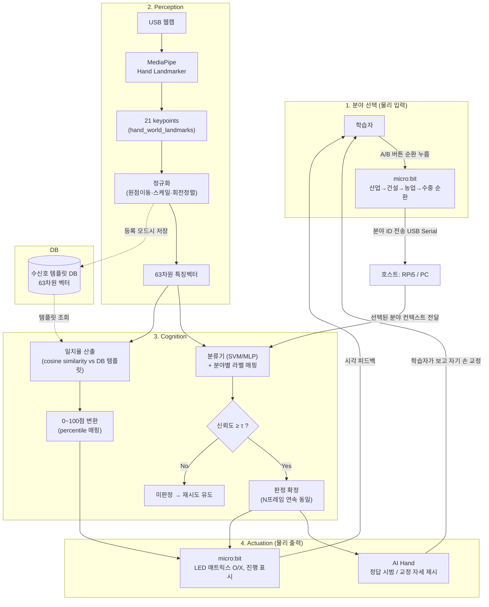

# 시스템 구성도 (초안)

**팀명**: 심기일전 · **작성일**: 2026-09-15 (W2) · **작성자**: (담당자 기입)

---

## 1. 문서 목적

프로젝트계획서_v2.md에 있던 폐루프(Perception→Cognition→Actuation) 다이어그램을 기반으로, 최근 논의된 **① 분야 선택(4개 도메인) 단계**와 **② micro:bit 버튼 순환 로직**을 반영해 구성도를 개정한 초안입니다.

> ⚠️ 아래 다이어그램은 팀 논의 내용을 바탕으로 한 초안이며, 실제 하드웨어(카메라 기종, 서보 제어 방식 등) 확정 전까지는 변경될 수 있습니다.
> 

---

## 2. 전체 구성도

---

## 3. 모듈 경계 설명

| 모듈 | 담당 하드웨어/SW | 입력 | 출력 |
| --- | --- | --- | --- |
| 분야 선택 | micro:bit (A/B 버튼) | 학습자 버튼 입력 | 분야 ID (USB Serial) |
| Perception | USB 웹캠 + MediaPipe (RPi5) | 프레임 | 63차원 정규화 벡터 |
| Cognition - 분류 | SVM/MLP + 분야별 라벨 매핑 | 63차원 벡터 + 분야 ID | 클래스 + confidence |
| Cognition - 일치율 | Cosine similarity | 63차원 벡터 + DB 템플릿 | 0~100점 |
| DB | 로컬/경량 DB | 등록 시 벡터 저장 | 템플릿 조회 |
| Actuation | AI Hand, micro:bit | 판정 결과 | 물리 시범 동작, LED 피드백 |

---

## 4. 이전 버전 대비 변경점

- **추가**: 분야 선택 단계 (micro:bit 버튼 순환 방식) — 기존 계획서 다이어그램에는 없던 부분
- **추가**: 분야 ID가 Cognition 단계의 “라벨 매핑”에 컨텍스트로 전달되는 흐름
- **유지**: Perception→Cognition→Actuation 폐루프 구조 자체는 기존 계획서와 동일

---

## 5. 확정지어야 할 사항

- [ ]  분야 선택을 **micro:bit 버튼 순환**으로 최종 확정할지, 대안(로고 터치 센서 V2 등)을 검토할지
- [ ]  분류기 구조: **분야별 독립 분류기 4개** vs **단일 분류기 + 라벨 매핑** 중 확정 (수신호 표준 대조표 결과 및 클래스 구조 결정과 연동)
- [ ]  카메라 기종 확정: WonderCam(온보드 자체 분류) vs 일반 USB 웹캠 — 계획서 리스크 표에 있던 미해결 항목 (송승호 확인 건)
- [ ]  micro:bit ↔︎ RPi5 통신 프로토콜 상세 (`RESULT:OK:87\n` 외에 분야 ID 전송 포맷도 함께 정의 필요) — 인터페이스 계약서와 연동
- [ ]  DB 등록 흐름(신규 수신호 촬영→저장) 다이어그램 내 표시 수준 — 별도 시퀀스 다이어그램으로 분리할지 이 구성도에 포함할지