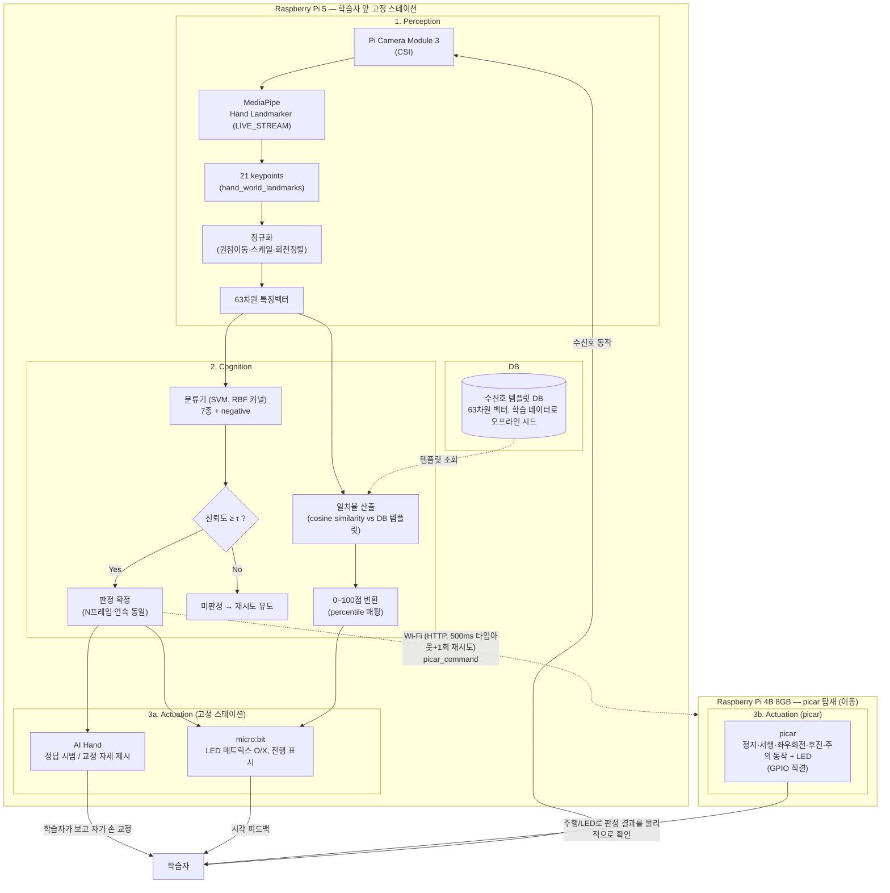

# 시스템 구성도 (초안 v3)

**팀명**: 심기일전 · **작성일**: 2026-09-18 (W2) · **작성자**: (담당자 기입)

---

## 1. 문서 목적

기존 v1(분야 선택 4개 도메인 + micro:bit 버튼 순환 구조)은 폐기하고 통합 7종 수신호 + picar 물리 출력
구조(v2)로 바꿨었습니다. 이번 v3은 **컴퓨트 보드 배치를 2대로 분리**한 변경을 반영합니다: picar가
움직이면 그 위의 카메라도 함께 이동해 학습자가 카메라를 따라가야 하는 문제가 있어, **Raspberry Pi 5
(카메라·AI Hand·micro:bit, 고정)** 와 **Raspberry Pi 4B 8GB(picar 탑재, 이동)** 로 나누고 **Wi-Fi**로
연결했습니다.

> ⚠️ 아래 다이어그램은 팀 논의 내용을 바탕으로 한 초안이며, 실제 하드웨어(서보 제어 방식, Wi-Fi
> IP 구성 등) 확정 전까지는 변경될 수 있습니다.

---

## 2. 전체 구성도

---

## 3. 모듈 경계 설명

| 모듈 | 담당 하드웨어/SW | 입력 | 출력 |
| --- | --- | --- | --- |
| Perception | Pi Camera Module 3(CSI) + MediaPipe LIVE_STREAM (**RPi5**, 고정) | 프레임 | 63차원 정규화 벡터 |
| Cognition - 분류 | SVM(RBF) (RPi5) | 63차원 벡터 | 클래스(7종+negative) + confidence |
| Cognition - 일치율 | Cosine similarity (RPi5) | 63차원 벡터 + DB 템플릿 | 0~100점 |
| DB | 로컬/경량 DB (RPi5) | (오프라인) 학습 데이터로 템플릿 시드 | 템플릿 조회 |
| Actuation - AI Hand | 서보 5+1 (RPi5 직결) | 판정 결과 | 수신호 물리 시범 |
| Actuation - micro:bit | LED 매트릭스, 버튼 (RPi5, USB 시리얼) | 판정 결과 | O/X 표시, 진행 표시 |
| Actuation - picar | 모터(전진/후진/좌우회전), LED(적색×2, 황색×2) — **RPi4B 8GB가 GPIO로 직접 구동** | 판정 결과 (RPi5로부터 Wi-Fi 수신) | 수신호 의미에 맞는 실제 주행 + LED (05_모델카드_v3, 02_설계문서_v2 §4 참고) |

---

## 4. 변경 이력

**v2 → v3 (2026-09-18)**

- **분리**: picar 컴퓨트 보드를 **RPi5에서 RPi4B 8GB로 분리**. picar가 주행하면 카메라(RPi5에 고정)도
  함께 이동해버려 학습자가 카메라 앞을 벗어나는 문제를 해결하기 위함 (02_설계문서_v2 §1-1).
- **변경**: RPi5 → picar 통신을 "같은 프로세스 내 GPIO 함수 호출"에서 **"Wi-Fi(HTTP POST) 네트워크
  호출"**로 정정 — 03_인터페이스계약서_v2 §5-2 참고. 타임아웃 500ms + 1회 재시도, 실패 시 picar
  없이 진행(§7 폴백).
- **해소**: "RPi5 한 대가 카메라 추론 + picar 모터 제어를 동시 수행 → 리소스 경합" 리스크는 보드
  분리로 자연히 해소됨 (08_리스크레지스터).
- **신규 리스크**: RPi5↔RPi4B Wi-Fi 통신 지연/끊김 (08_리스크레지스터 참고).

**v1 → v2**

- **삭제**: 분야 선택 단계(micro:bit 버튼 순환, 산업→건설→농업→수중) — 통합 7종 단일 커리큘럼으로 전환하면서 더 이상 필요 없음
- **삭제**: Cognition의 "분야별 라벨 매핑" — 분류기는 이제 분야 구분 없이 7종+negative만 판정
- **추가**: Actuation에 **picar** — AI Hand의 물리적 시범에 더해, picar가 실제 주행 동작(정지/서행/좌회전/우회전/후진/주의)과 LED로 판정 결과를 보여주는 두 번째 물리 출력 채널
- **삭제(2026-09-18)**: 사용자 대상 **수신호 등록(실시간 추가)** 기능/등록 모드 — 경량 분류기(SVM)는 학습
  시점에 고정된 클래스만 예측 가능해 재학습 없는 실시간 등록이 불가능함. DB 템플릿은 이제 학습 데이터로
  **오프라인 시드**되며, 런타임에는 조회만 발생 (03_인터페이스계약서_v2 §6 참고)
- **유지**: Perception→Cognition→Actuation 폐루프 구조 자체, DB 템플릿 조회 흐름

---

## 5. 확정지어야 할 사항

- [x]  ~~picar ↔︎ RPi5 제어 인터페이스~~ → **정정: RPi4B 8GB GPIO 직결 + RPi5와 Wi-Fi 통신**으로
  확정 (02_설계문서_v2 §1-1, 03_인터페이스계약서_v2 §5-2, 2026-09-18)
- [x]  ~~RPi5 한 대가 카메라 추론 + picar 모터 제어를 동시 수행 시 리소스 경합~~ → **해소**: 보드
  분리로 RPi5는 카메라 추론만 전담 (2026-09-18)
- [ ]  picar 전원 계통 분리 여부 (모터 노이즈가 RPi4B 자체 Wi-Fi 모듈에 영향 주는지 실물 테스트 필요) —
  큰 노이즈는 없을 것으로 예상하지만, 카메라·picar가 아직 도착 전이라 지금은 판단할 수 없음. **개발
  착수를 막는 선결 조건은 아니므로**, picar 하드웨어 연동을 실제로 구현하는 담당자가 실물 조립 후
  직접 측정해 판단하는 것으로 남겨둔다 (2026-09-18).
- [ ]  RPi5 ↔ RPi4B Wi-Fi IP 구성(고정 IP 또는 mDNS) 확정 — 실물 네트워크 구성 후
- [x]  ~~"서행"과 "후진"의 AiHand 표현이 동일~~ → 후진을 "검지만 펴기"로 재설계하여 해결 (2026-09-17)
- [x]  ~~"우회전 유도" picar 동작 오탈자~~ → "오른쪽으로 회전한다"로 정정 완료 (2026-09-17)
- [ ]  micro:bit와 picar가 판정 결과를 동시에 받을 때의 지연/동기화 처리 (물리 피드백 지연 P95 ≤ 2.0초 KPI, 03_인터페이스계약서_v2 §5-4) — picar는 이제 Wi-Fi를 거치므로 지연 편차가 더 커질 수 있음
