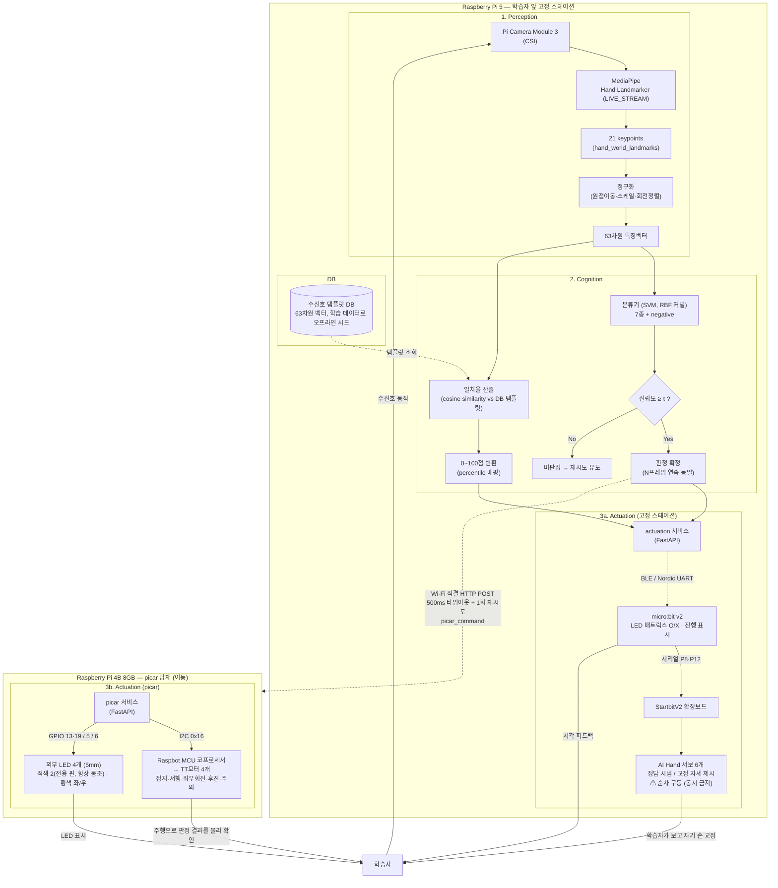

# 시스템 구성도 (초안 v5)

**팀명**: 심기일전 · **최초 작성일**: 2026-09-18 (W2)
**최종 갱신**: 2026-09-22 (W3) · **갱신자**: 송승호 (하드웨어·로봇동작 R)

---

## 1. 문서 목적

기존 v1(분야 선택 4개 도메인 + micro:bit 버튼 순환 구조)은 폐기하고 통합 7종 수신호 + picar 물리 출력
구조(v2)로 바꿨었습니다. v3은 **컴퓨트 보드 배치를 2대로 분리**한 변경을 반영했습니다: picar가
움직이면 그 위의 카메라도 함께 이동해 학습자가 카메라를 따라가야 하는 문제가 있어, **Raspberry Pi 5
(카메라·AI Hand·micro:bit, 고정)** 와 **Raspberry Pi 4B 8GB(picar 탑재, 이동)** 로 나누고 **Wi-Fi**로
연결했습니다.

이번 **v4는 실제 제어 경로를 실물 기준으로 정정**합니다. v3까지의 다이어그램은 "RPi5가 서보를 직결
구동하고 micro:bit와 USB 시리얼로 통신하며 picar 모터를 GPIO로 돌린다"고 그려져 있었는데, 실제
구현은 **세 가지 모두 다릅니다**(§3 하단 정정표). 구현·실측으로 확정된 경로로 교체했습니다.

**v5(2026-09-22)**: RPi4B와 카메라가 입수되어 **전 부품 보유** 상태가 됐습니다. 부품 대기용으로
두었던 §6 임시 구성을 폐지했습니다.

> ⚠️ 이 문서는 **논리 구성도**입니다. 배선·핀 번호·전원 계통 등 물리 설계는
> `11_하드웨어설계서_v1.md`가 단일 출처이며, 충돌 시 그쪽이 우선합니다.

---

## 2. 전체 구성도

### 2.1 제어 경로 요약 (다이어그램 압축)

| 구간 | 매체 | 비고 |
| --- | --- | --- |
| RPi5 → micro:bit | **BLE (Nordic UART Service)** | USB 시리얼 아님. micro:bit v2의 하드웨어 UART가 1개뿐이라 AI Hand 서보 초기화 시 USB 시리얼이 죽어 BLE로 전환 (2026-09-21) |
| micro:bit → AI Hand 서보 | 확장보드 경유 시리얼(P8·P12) | RPi5가 서보를 직접 잡지 않는다 |
| RPi5 → picar | **Wi-Fi 1:1 직결** (RPi5가 AP) | 고정 IP — RPi5 `192.168.50.1`, picar `192.168.50.10` |
| picar → 모터 | **I2C 슬레이브 `0x16`** | GPIO 직결 아님. Raspbot MCU가 PWM을 대신 만든다 |
| picar → LED | GPIO 4핀 (BCM 13·19 / 5 / 6) | 외부 LED만 GPIO 직결. 적색 2개는 전용 핀이지만 스키마상 `red` 1채널 |

---

## 3. 모듈 경계 설명

| 모듈 | 담당 하드웨어/SW | 입력 | 출력 |
| --- | --- | --- | --- |
| Perception | Pi Camera Module 3(CSI) + MediaPipe LIVE_STREAM (**RPi5**, 고정) | 프레임 | 63차원 정규화 벡터 |
| Cognition - 분류 | SVM(RBF) (RPi5) | 63차원 벡터 | 클래스(7종+negative) + confidence |
| Cognition - 일치율 | Cosine similarity (RPi5) | 63차원 벡터 + DB 템플릿 | 0~100점 |
| DB | 로컬/경량 DB (RPi5) | (오프라인) 학습 데이터로 템플릿 시드 | 템플릿 조회 |
| Actuation - AI Hand | 서보 6개 — **micro:bit + StartbitV2 확장보드가 구동** (RPi5 직결 아님) | 판정 결과 | 수신호 물리 시범 |
| Actuation - micro:bit | LED 매트릭스, 버튼 — **RPi5와 BLE(NUS)로 통신** | 판정 결과 | O/X 표시, 진행 표시 |
| Actuation - picar | 모터 — **I2C 코프로세서(`0x16`) 경유** / 외부 LED 4개 — RPi4B GPIO 직결 | 판정 결과 (RPi5로부터 Wi-Fi 수신) | 수신호 의미에 맞는 실제 주행 + LED (05_모델카드_v3, 02_설계문서_v2 §4 참고) |

> 🔴 **v3에서 정정된 3건** — 아래는 v3 표의 기술이 실물과 달랐던 부분입니다. 옛 문서·발표자료를
> 참조할 때 주의하십시오.
>
> | v3 기술 (틀림) | v4 정정 (실물) | 확인 경로 |
> | --- | --- | --- |
> | AI Hand 서보 "RPi5 직결" | micro:bit + 확장보드가 구동 | `11_하드웨어설계서_v1.md` §4.1 |
> | micro:bit "USB 시리얼" | **BLE (NUS)** | 같은 문서 §4.5 · 실물 검증 완료 |
> | picar 모터 "GPIO 직접 구동" | **I2C `0x16` 코프로세서** | 같은 문서 §5.2 · §5.5.2 |

---

## 4. 변경 이력

**v4 → v5 (2026-09-22)**

- **폐지**: §6 1차 구현 임시 구성 — **RPi4B·카메라 입수로 전제 소멸**. 전 부품 보유 상태가 되어
  §2 정식 구성으로 바로 진행한다.
- **유지**: picar 전원 계통 분리와 헤더 5V 백피드 확인은 보드와 무관하게 유효하므로 남긴다.

**v3 → v4 (2026-09-22)**

- **정정**: 제어 경로 3건을 실물 기준으로 교체 (§3 정정표 참고) — AI Hand 서보 구동 주체, micro:bit
  통신 매체, picar 모터 제어 방식. v3 다이어그램은 셋 다 실제와 달랐다.
- **확정 반영**: RPi5 ↔ picar 링크를 **공유기 없는 1:1 무선 직결(RPi5가 AP) + 고정 IP**로 확정
  (`11_하드웨어설계서_v1.md` §6.1, 2026-09-21).
- **추가**: §2.1 제어 경로 요약표 — 다이어그램만 보고 매체를 오해하는 것을 막기 위함.
- **추가**: §6 1차 구현 임시 구성 (`11_하드웨어설계서_v1.md` §1.4) — **v5에서 폐지됨**.
- **주의 문구**: 물리 설계의 단일 출처는 `11_하드웨어설계서_v1.md`임을 명시.

**v2 → v3 (2026-09-18)**

- **분리**: picar 컴퓨트 보드를 **RPi5에서 RPi4B 8GB로 분리**. picar가 주행하면 카메라(RPi5에 고정)도
  함께 이동해버려 학습자가 카메라 앞을 벗어나는 문제를 해결하기 위함 (02_설계문서_v2 §1-1).
- **변경**: RPi5 → picar 통신을 "같은 프로세스 내 GPIO 함수 호출"에서 **"Wi-Fi(HTTP POST) 네트워크
  호출"**로 정정 — 03_인터페이스계약서_v2 §5-2 참고. 타임아웃 500ms + 1회 재시도, 실패 시 picar
  없이 진행(§7 폴백).
- **해소**: "RPi5 한 대가 카메라 추론 + picar 모터 제어를 동시 수행 → 리소스 경합" 리스크는 보드
  분리로 자연히 해소됨 (08_리스크레지스터).
- **신규 리스크**: RPi5↔RPi4B Wi-Fi 통신 지연/끊김 (08_리스크레지스터 참고).

**v1 → v2**

- **삭제**: 분야 선택 단계(micro:bit 버튼 순환, 산업→건설→농업→수중) — 통합 7종 단일 커리큘럼으로 전환하면서 더 이상 필요 없음
- **삭제**: Cognition의 "분야별 라벨 매핑" — 분류기는 이제 분야 구분 없이 7종+negative만 판정
- **추가**: Actuation에 **picar** — AI Hand의 물리적 시범에 더해, picar가 실제 주행 동작(정지/서행/좌회전/우회전/후진/주의)과 LED로 판정 결과를 보여주는 두 번째 물리 출력 채널
- **삭제(2026-09-18)**: 사용자 대상 **수신호 등록(실시간 추가)** 기능/등록 모드 — 경량 분류기(SVM)는 학습
  시점에 고정된 클래스만 예측 가능해 재학습 없는 실시간 등록이 불가능함. DB 템플릿은 이제 학습 데이터로
  **오프라인 시드**되며, 런타임에는 조회만 발생 (03_인터페이스계약서_v2 §6 참고)
- **유지**: Perception→Cognition→Actuation 폐루프 구조 자체, DB 템플릿 조회 흐름

---

## 5. 확정지어야 할 사항

- [x]  ~~picar ↔︎ RPi5 제어 인터페이스~~ → **정정: RPi4B가 I2C 코프로세서(`0x16`)로 모터를, GPIO로
  외부 LED를 구동하고 RPi5와는 Wi-Fi로 통신**하는 구조로 확정 (02_설계문서_v2 §1-1,
  03_인터페이스계약서_v2 §5-2, `11_하드웨어설계서_v1.md` §5.2 — 2026-09-18 결정 / 2026-09-21 구현)
- [x]  ~~RPi5 한 대가 카메라 추론 + picar 모터 제어를 동시 수행 시 리소스 경합~~ → **해소**: 보드
  분리로 RPi5는 카메라 추론만 전담 (2026-09-18)
- [x]  ~~RPi5 ↔ RPi4B Wi-Fi IP 구성(고정 IP 또는 mDNS) 확정~~ → **공유기 없이 RPi5를 AP로 띄우는
  1:1 무선 직결 + 고정 IP**로 확정 (RPi5 `192.168.50.1`, picar `192.168.50.10`). 발표장 공용 Wi-Fi
  같은 통제 밖 변수를 시연 경로에서 제거하기 위함 — `11_하드웨어설계서_v1.md` §6.1 (2026-09-21)
- [x]  ~~"서행"과 "후진"의 AiHand 표현이 동일~~ → 후진을 "검지만 펴기"로 재설계하여 해결 (2026-09-17)
- [x]  ~~"우회전 유도" picar 동작 오탈자~~ → "오른쪽으로 회전한다"로 정정 완료 (2026-09-17)
- [x]  picar 전원 계통 — **차체 배터리 단일 계통으로 확정** (2026-09-22): 배터리(3S 11.1V,
  2200mAh)가 차체 강압을 거쳐 **GPIO 헤더 5V로 RPi4B까지 공급**한다. RPi4B는 별도 어댑터를 쓰지
  않는다. 어댑터 테더링이 없어 **주행 시연이 가능**하다 — `11_하드웨어설계서_v1.md` §7.1
  > ⚠️ 같은 날 오전의 "계통 분리" 결정을 **번복한 것**이다. 그래서 아래 항목이 **되살아났다.**
- [ ]  **모터 노이즈가 RPi4B의 Wi-Fi 모듈에 영향을 주는지** — 단일 계통이라 레일을 공유하므로
  경로가 존재한다. 벤치 테스트에서 **모터 구동 중 Wi-Fi 왕복과 `vcgencmd get_throttled`**를
  실측해 판단한다 (`11_하드웨어설계서_v1.md` §7.1.2·§7.1.3)
  > 🔴 배선 규칙도 반전됐다 — 헤더 5V는 **차단 대상이 아니라 급전 경로**다. 대신 그 상태에서
  > **USB-C 어댑터를 동시에 꽂으면 안 된다**(헤더 5V 핀에는 역류 방지가 없음).
- [ ]  micro:bit와 picar가 판정 결과를 동시에 받을 때의 지연/동기화 처리 (물리 피드백 지연 P95 ≤ 2.0초 KPI,
  03_인터페이스계약서_v2 §5-4) — picar는 이제 Wi-Fi를 거치므로 지연 편차가 더 커질 수 있음.
  → **KPI 정의 자체에 재검토 요청이 올라가 있음**: "완료" 기준으로 측정하면 서보 순차 구동(150ms 간격,
  실측 0.80초)과 LED 표시 1초가 더해져 약 3.0초로 달성 불가(2026-09-23 실측 반영, 최초 계산 4.2초) — `picar_주행시간_스키마_변경안.md` 결정 2, **팀 검토 대기**
- [ ]  picar 주행 지속 시간 및 스키마 `duration_ms` 추가 여부 (현재 자동 정지 2초 잠정값) —
  `picar_주행시간_스키마_변경안.md` 결정 1, **팀 검토 대기**

---

## 6. ~~1차 구현 임시 구성~~ — 폐지 (2026-09-22)

**RPi4B(8GB)와 Pi Camera Module 3가 입수되어 전 부품 보유 상태가 됐습니다.** §2 정식 구성으로
바로 진행합니다.

한때의 구성(기록): RPi4B 미도착 기간에 picar를 RPi5에 올리고 고정 스테이션은 PC가 대행(USB 웹캠)
하려 했습니다. 상세와 폐지 경위는 `11_하드웨어설계서_v1.md` §1.4.

> ⚠️ **폐지 대상이 아닌 것**: picar **전원 계통 분리**(모터=배터리 / Pi=별도 어댑터)와 조립 전
> **헤더 5V 백피드 확인**은 RPi4B에도 그대로 유효합니다 — `11_하드웨어설계서_v1.md` §7.1.
