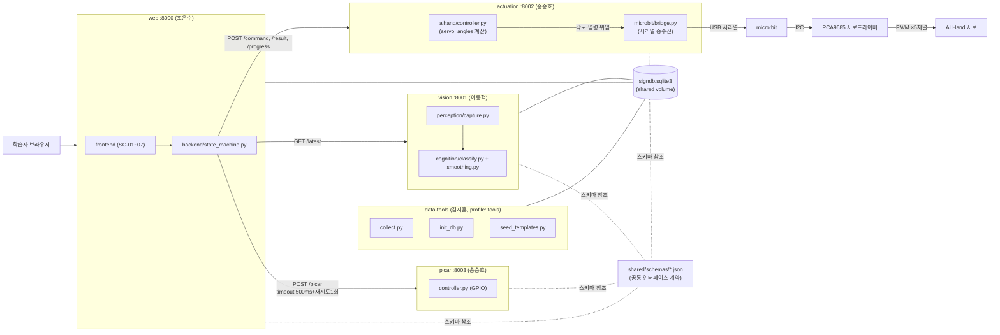
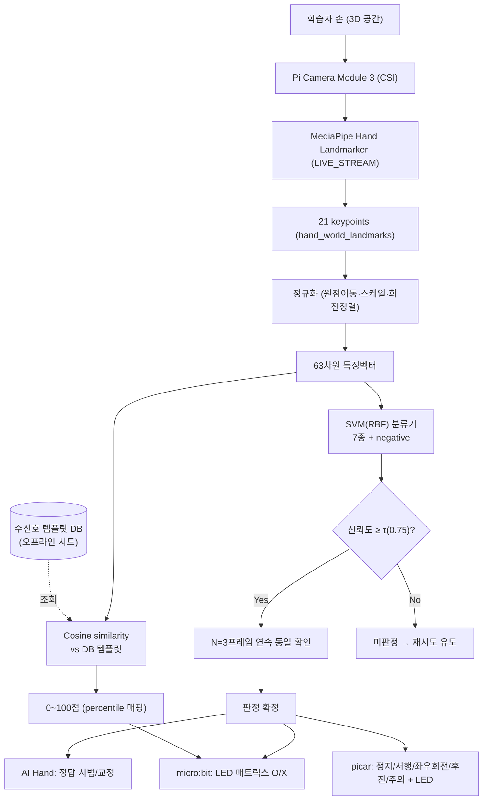
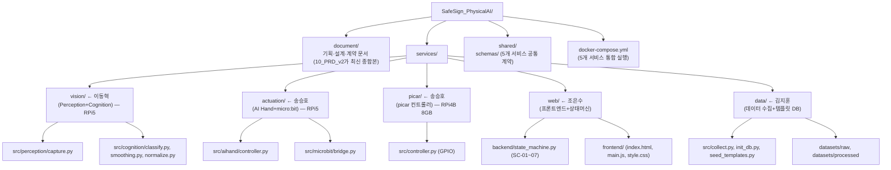
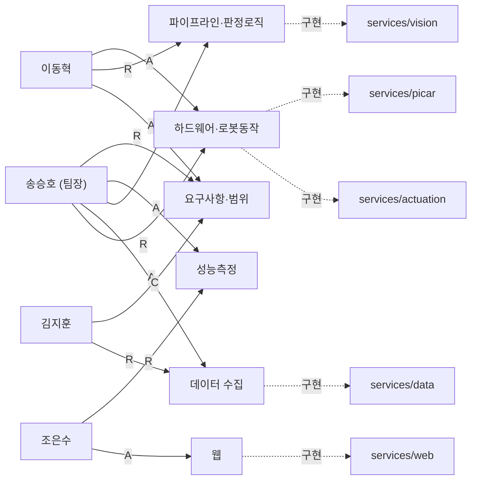
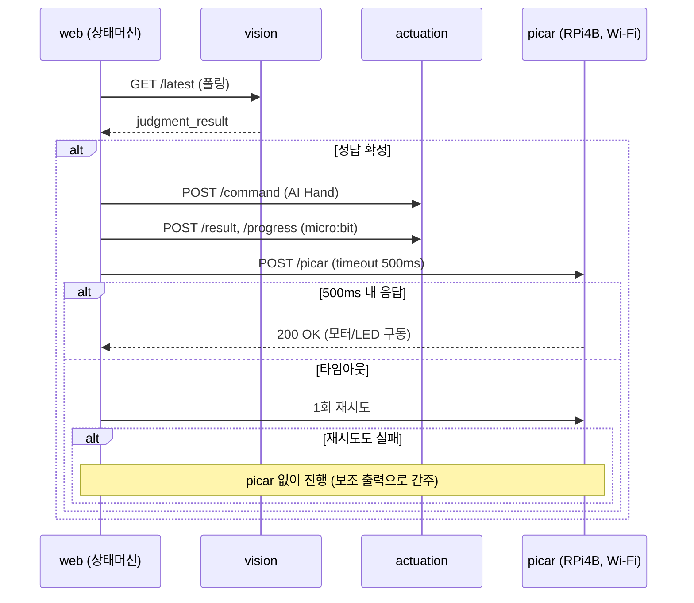

# SafeSign PhysicalAI 프로젝트 구성 다이어그램

> 작성일 2026-09-18. 출처: [README.md](README.md), [document/10_PRD_v2.md](document/10_PRD_v2.md),
> [document/02_설계문서_v2.md](document/02_설계문서_v2.md), [document/시스템_구성도_초안.md](document/시스템_구성도_초안.md),
> [docker-compose.yml](docker-compose.yml), [document/역할 및 책임표.md](document/역할%20및%20책임표.md)

---

## 1. 하드웨어/보드 배치

picar가 주행하면 카메라도 함께 이동해버리는 문제 때문에 컴퓨트 보드를 2대로 분리했다.

```mermaid
flowchart TB
    subgraph RPI5["🖥️ Raspberry Pi 5 — 학습자 앞 고정 스테이션"]
        CAM["Pi Camera Module 3 (CSI)"]
        MICROBIT["micro:bit<br/>(USB 시리얼로 각도 수신)"]
        PCA["PCA9685 서보드라이버<br/>(I2C 슬레이브, 주소 미확인)"]
        AIHAND["AI Hand 서보<br/>(손목 LD-1501MG + 손가락 LFD-01×4)"]
        SVC_VISION["services/vision"]
        SVC_ACT["services/actuation"]
        CAM --> SVC_VISION
        SVC_ACT -->|USB 시리얼: 각도 명령| MICROBIT
        MICROBIT -->|I2C| PCA
        PCA -->|PWM ×5채널| AIHAND
    end

    subgraph RPI4B["🚗 Raspberry Pi 4B 8GB — picar 탑재 (이동)"]
        SVC_PICAR["services/picar"]
        MOTOR["모터 (전/후진, 좌/우회전)"]
        LED["LED (적색×2, 황색×2)"]
        SVC_PICAR --> MOTOR
        SVC_PICAR --> LED
    end

    SVC_VISION -->|판정 결과| SVC_ACT
    SVC_ACT -.Wi-Fi HTTP POST /picar<br/>timeout 500ms + 1회 재시도.-> SVC_PICAR

    LEARNER["🧑 학습자"] -->|수신호 동작| CAM
    AIHAND -->|시범/교정| LEARNER
    MICROBIT -->|O/X, 진행 표시(LED 매트릭스)| LEARNER
    MOTOR -->|주행 반응| LEARNER
    LED -->|점등/점멸| LEARNER
```

> ⚠️ **기존 문서와의 차이**: [document/02_설계문서_v2.md](document/02_설계문서_v2.md) §1-1과
> [services/actuation/src/aihand/controller.py](services/actuation/src/aihand/controller.py)의 TODO는
> "RPi5가 gpiozero/PCA9685로 AI Hand 서보를 **직접** 구동"하는 구조를 가정하고 있었다. 하지만 실제로는
> **RPi5(actuation) → USB 시리얼 → micro:bit → I2C → PCA9685 서보드라이버 → PWM → AI Hand 서보**
> 순으로, micro:bit가 PCA9685의 I2C 마스터이자 각도 명령의 최종 수신자다(RPi5는 I2C를 직접 잡지 않음).
> 이 다이어그램은 정정된 구조로 반영했으며, 공식 문서(02_설계문서_v2, 03_인터페이스계약서_v2)와
> `controller.py`/`microbit_protocol.md`는 아직 이전 가정(RPi5 직접 제어) 그대로이므로 함께 갱신이 필요하다.

---

## 2. 서비스 아키텍처 (docker-compose 기준)

5개 서비스로 분리, 담당자별 폴더 분리 원칙([README.md](README.md) §1).



---

## 3. 판정 파이프라인 (Perception → Cognition → Actuation)



---

## 4. 디렉터리 구조



---

## 5. 담당자 ↔ RACI ↔ 서비스 매핑

[document/역할 및 책임표.md](document/역할%20및%20책임표.md) 기준.



---

## 6. 통신 정책 요약



---

## 갱신 규칙

- 서비스 구조/포트가 바뀌면 → [docker-compose.yml](docker-compose.yml)과 이 파일의 §2, §4를 함께 갱신
- 하드웨어 배치가 바뀌면 → [document/시스템_구성도_초안.md](document/시스템_구성도_초안.md)(원본)과 이 파일의 §1을 함께 갱신
- 수신호/판정 로직이 바뀌면 → [document/02_설계문서_v2.md](document/02_설계문서_v2.md) §4(원본)와 이 파일의 §3을 함께 갱신
